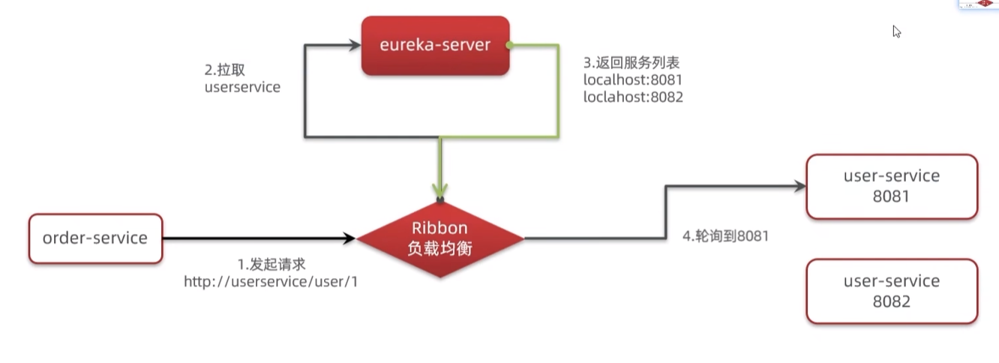
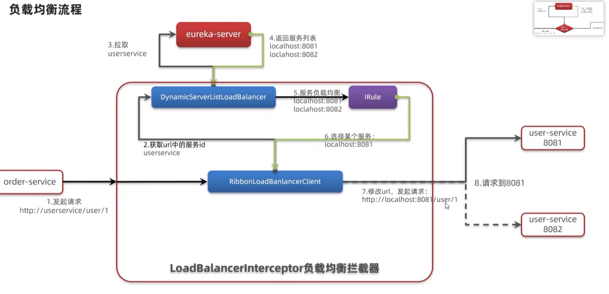
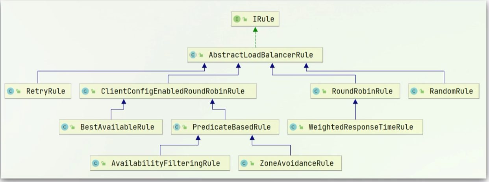
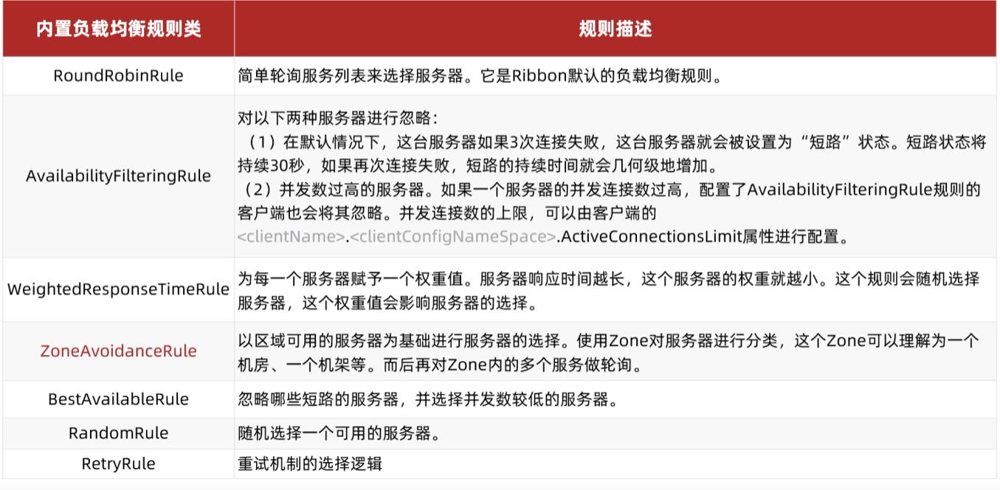
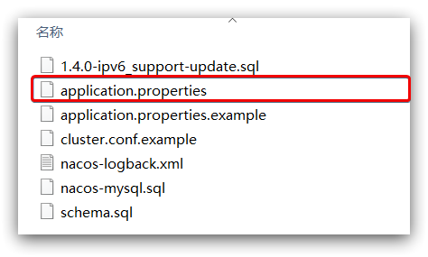
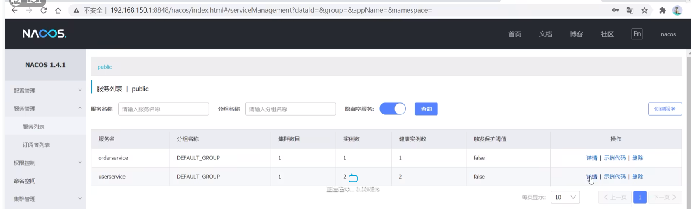
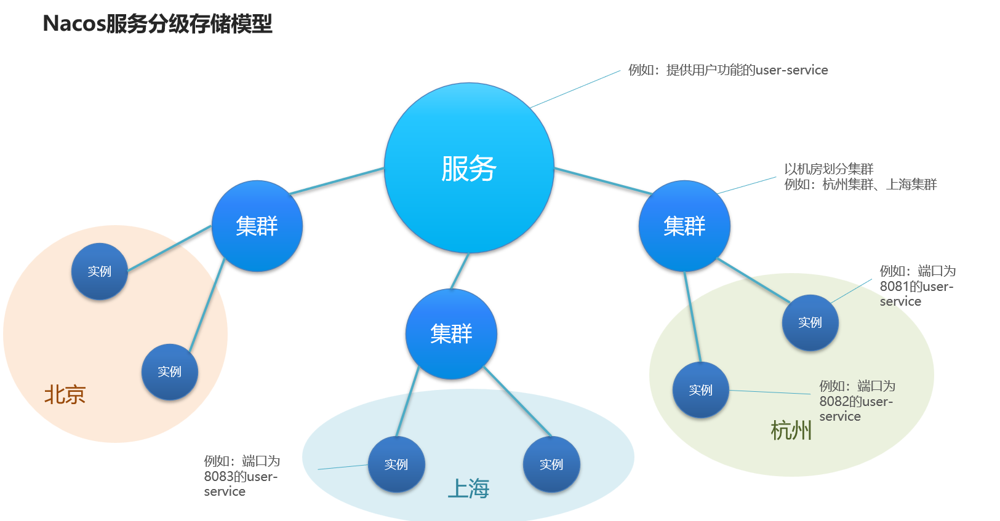

# 知识图谱

1. Spring Cloud 概念：Spring Cloud 的定义、功能、特点等。
2. 服务注册与发现：服务注册与发现的概念、服务注册中心、服务提供者、服务消费者等。
3. 负载均衡：负载均衡的概念、负载均衡算法、Ribbon 负载均衡器等。
4. 服务调用：服务调用的概念、服务调用方式、Feign 客户端等。
5. 服务容错：服务容错的概念、服务容错方法、Hystrix 容错框架等。
6. 配置中心：配置中心的概念、配置中心的实现、Spring Cloud Config 等。
7. API 网关：API 网关的概念、API 网关的实现、Zuul 网关等。
8. 分布式追踪与链路追踪：分布式追踪的概念、链路追踪的实现、Spring Cloud Sleuth 等。
9. 服务网格：服务网格的概念、服务网格的实现、Istio 等。
10. 分布式事务：分布式事务的概念、分布式事务的实现、Spring Cloud Alibaba 分布式事务等。
11. 服务监控与管理：服务监控的概念、服务监控的实现、Spring Cloud Bus 等。
12. 微服务架构实践：微服务的拆分、微服务的治理、微服务的部署等。
13. Spring Cloud 生态圈：Spring Cloud Netflix、Spring Cloud Alibaba、Spring Cloud AWS 等。
14. Spring Cloud 与 Spring Boot：Spring Cloud 与 Spring Boot 的关系、Spring Cloud 的启动方式、Spring Cloud 的配置等。
15. Spring Cloud 最佳实践：Spring Cloud 微服务架构的最佳实践、常见问题及解决方法等。

# spring cloud 简介

Spring Cloud 是一系列框架的有序集合，它利用 Spring Boot 的开发便利性简化了分布式系统的开发，比如服务发现、服务网关、服务路由、链路追踪等。Spring Cloud 并不重复造轮子，而是将市面上开发得比较好的模块集成进去，进行封装，从而减少了各模块的开发成本。换句话说：Spring Cloud 提供了构建分布式系统所需的“全家桶”。

[官方文档](https://docs.spring.io/spring-cloud/docs/current/reference/html/)

# 服务拆分

注意事项：

1. 不同微服务，不要重复开发相同业务
2. 微服务数据独立，不要访问其他微服务的数据库
3. 微服务科技将自己的业务暴露为接口，供其他业务使用

# 服务注册发现

spring cloud common 定义了接口规范

## Eureka

1. 注册中心 eureka-server
    1. 记录服务信息
    2. 心跳监控
2. eureka-client（消费者和提供者）
    1. Provider 服务提供者
        1. 注册自己的信息到 EurekaServer
        2. 每隔 30s 向 EurekaServer 发送心跳
    2. consumer 服务消费者
        1. 根据服务名称从 EurekaServer 拉去服务列表
        2. 基于服务列表做负载君和，选中一个微服务后发起远程调用

### 1. 搭建服务注册中心

1. 引入依赖 server
2. 启动类`@EnableEurekaServer`
3. 配置地址信息

```xml
<dependencies>
    <!--为服务注册中心引入 Eureka Server 的依赖-->
    <dependency>
        <groupId>org.springframework.cloud</groupId>
        <artifactId>spring-cloud-starter-netflix-eureka-server</artifactId>
        <!-- 3.1.4 -->
    </dependency>
    ....
</dependencies>
```

```yaml
server:
    port: 7001 #该 Module 的端口号
spring:
    application:
        name: eurekaserver # 服务名称
eureka:
    # instance:
    #     hostname: localhost #eureka服务端的实例名称，
    client:
        # register-with-eureka: false #false表示不向注册中心注册自己。
        # fetch-registry: false #false表示自己端就是注册中心，我的职责就是维护服务实例，并不需要去检索服务
        service-url:
            defaultZone: http://${eureka.instance.hostname}:${server.port}/eureka/ #单机版服务注册中心
            # defaultZone: http://eureka7002.com:7002/eureka/,http://eureka7003.com:7003/eureka/ #集群版 将当前的 Eureka Server 注册到 7003 和 7003 上，形成一组互相注册的 Eureka Server 集群
```

```java
@SpringBootApplication
@EnableEurekaServer //开启 Eureka server,接受其他微服务的注册
public class EurekeApplication {
    public static void main(String[] args) {
        SpringApplication.run(EurekeApplication.class,args);
    }
}
```

### 2. 服务注册

1. 引入依赖 client
2. 配置地址

```xml
<!--引入 Eureka Client 的依赖，将服务注册到 Eureka Server-->
<dependency>
    <groupId>org.springframework.cloud</groupId>
    <artifactId>spring-cloud-starter-netflix-eureka-client</artifactId>
</dependency>
```

```yaml
server:
    port: 8001 #服务端口号
spring:
    application:
        name: providerservice # 消费者 consumerservice
eureka:
    client: #将客户端注册到 eureka 服务列表内
        service-url:
            defaultZone: http://localhost:7001/eureka #这个地址是 7001注册中心在 application.yml 中暴露出来额注册地址 （单机版）
```

```java
@SpringBootApplication
@EnableEurekaClient // Spring cloud Eureka 客户端，自动将本服务注册到 Eureka Server 注册中心中
public class ProviderApplication {
    public static void main(String[] args) {
        SpringApplication.run(ProviderApplication.class,args);
    }
}

```

### 3. 服务拉取

1. 引入 client 依赖
2. 配置 eureka 地址
3. 修改 url 路径,使用服务名 providerservice 代替 ip|port
4. 在 RestTemplate 等客户端添加负载均衡注解`@LoadBalance`

### Ribbon 负载均衡组件



`@LoadBalance` 将使用 ribbon 拦截 httpclient 发送请求



负载均衡策略




调整负载均衡策略:

方案 1. 在消费者中定义一个新的 IRule,针对全体服务

    ```java
    @Bean
    public IRule randomRule(){
        return new RandomRule();
    }
    ```

方案 2. 配置文件方式,在消费者 application.yaml 中添加:针对某个服务

    ```yml
    providerservice:
        ribbon:
            NFLoadBanlancerRuleClassName: com.netflix.loadbalance.RandomRule # 负载均衡规则
    ```

Ribbon 默认使用懒加载,第一次加载时耗时较长,加载策略修改

```yml
ribbon:
    eager-load:
        enable: true #开启饥饿加载
        clients: #指定饥饿加载的服务名称
            - providerservice
```

## Nacos(阿里巴巴)

### 认识和安装 Nacos

[Nacos](https://nacos.io/)是阿里巴巴的产品，现在是[SpringCloud](https://spring.io/projects/spring-cloud)中的一个组件。相比[Eureka](https://github.com/Netflix/eureka)功能更加丰富，在国内受欢迎程度较高。

#### 1.Windows 安装 Nacos

开发阶段采用单机安装即可。

##### 1.1.下载安装包

在 Nacos 的 GitHub 页面，提供有下载链接，可以下载编译好的 Nacos 服务端或者源代码：

GitHub 主页：https://github.com/alibaba/nacos

GitHub 的 Release 下载页：https://github.com/alibaba/nacos/releases

如图：


本课程采用 1.4.1.版本的 Nacos，课前资料已经准备了安装包：


windows 版本使用`nacos-server-1.4.1.zip`包即可。

##### 1.2.解压

将这个包解压到任意非中文目录下，如图：


目录说明：

-   bin：启动脚本
-   conf：配置文件

##### 1.3.端口配置

Nacos 的默认端口是 8848，如果你电脑上的其它进程占用了 8848 端口，请先尝试关闭该进程。

**如果无法关闭占用 8848 端口的进程**，也可以进入 nacos 的 conf 目录，修改配置文件中的端口：



修改其中的内容：


##### 1.4.启动

启动非常简单，进入 bin 目录，结构如下：


然后执行命令即可：

-   windows 命令：

    ```
    startup.cmd -m standalone
    ```

执行后的效果如图：


##### 1.5.访问

在浏览器输入地址：http://127.0.0.1:8848/nacos即可：


默认的账号和密码都是 nacos，进入后：


#### 2.Linux 安装 nacos

Linux 或者 Mac 安装方式与 Windows 类似。

##### 2.1.安装 JDK

Nacos 依赖于 JDK 运行，索引 Linux 上也需要安装 JDK 才行。

上传 jdk 安装包：


上传到某个目录，例如：`/usr/local/`

然后解压缩：

```sh
tar -xvf jdk-8u144-linux-x64.tar.gz
```

然后重命名为 java

配置环境变量：

```sh
export JAVA_HOME=/usr/local/java
export PATH=$PATH:$JAVA_HOME/bin
```

设置环境变量：

```sh
source /etc/profile
```

##### 2.2.上传安装包

如图：


也可以直接使用课前资料中的 tar.gz：


上传到 Linux 服务器的某个目录，例如`/usr/local/src`目录下：


##### 2.3.解压

命令解压缩安装包：

```sh
tar -xvf nacos-server-1.4.1.tar.gz
```

然后删除安装包：

```sh
rm -rf nacos-server-1.4.1.tar.gz
```

目录中最终样式：


目录内部：


##### 2.4.端口配置

与 windows 中类似

##### 2.5.启动

在 nacos/bin 目录中，输入命令启动 Nacos：

```sh
sh startup.sh -m standalone
```

### Nacos 快速入门

Nacos 的依赖

父工程：

```xml
<dependency>
    <groupId>com.alibaba.cloud</groupId>
    <artifactId>spring-cloud-alibaba-dependencies</artifactId>
    <version>2.2.5.RELEASE</version>
    <type>pom</type>
    <scope>import</scope>
</dependency>
```

客户端：

```xml
<!-- nacos客户端依赖包 -->
<dependency>
    <groupId>com.alibaba.cloud</groupId>
    <artifactId>spring-cloud-starter-alibaba-nacos-discovery</artifactId>
</dependency>

```

#### 1）引入依赖

在 cloud-demo 父工程的 pom 文件中的`<dependencyManagement>`中引入 SpringCloudAlibaba 的依赖：

```xml
<dependency>
    <groupId>com.alibaba.cloud</groupId>
    <artifactId>spring-cloud-alibaba-dependencies</artifactId>
    <version>2.2.6.RELEASE</version>
    <type>pom</type>
    <scope>import</scope>
</dependency>
```

然后在 user-service 和 order-service 中的 pom 文件中引入 nacos-discovery 依赖：

```xml
<dependency>
    <groupId>com.alibaba.cloud</groupId>
    <artifactId>spring-cloud-starter-alibaba-nacos-discovery</artifactId>
</dependency>
```

> **注意**：不要忘了注释掉 eureka 的依赖。

#### 2）配置 nacos 地址

在 user-service 和 order-service 的 application.yml 中添加 nacos 地址：

```yaml
spring:
    cloud:
        nacos:
            server-addr: localhost:8848
```

> **注意**：不要忘了注释掉 eureka 的地址

#### 3）重启

重启微服务后，登录 nacos 管理页面，可以看到微服务信息：



### nacos 服务分级存储模型
Nacos服务分级存储模型
一级是服务，例如userservice
二级是集群，例如杭州或上海
三级是实例，例如杭州机房的某台部署了userservice的服务器

一个服务多个实例，同个机房的多个实例为一个集群



服务集群设置
1. 修改application.yaml
2. 进入nacos页面:服务-详情-集群


```yaml
spring:
    cloud:
        nacos:
            server-addr: localhost:8848
            discovery:
                cluster-name: HZ # 配置集群名称,也就是机房位置
```

### nacos 环境隔离

## Consul

# 服务远程调用

1. spring 默认的 RestTemplate，注入 bean 后使用

## OpenFeign

## Dubbo

# 服务链路监控

## Zipkin

## Sleuth

# 统一配置管理

## SpringCloudConfig

## Nacos

# 统一网关路由

## SpringCloudGateway

## Zuul

# 流控、降级、保护

## Hystis

## Sentinel

# Spring Cloud Netflix

常用组件:

`Spring Cloud Netflix Eureka` 服务治理组件，包含服务注册中心、服务注册与发现机制的实现。
`Spring Cloud Netflix Ribbon` 服务调用和客户端负载均衡组件。
`Spring Cloud Netflix Hystrix` 熔断器,服务异常处理
`Spring Cloud Netflix Feign` 声明式的 HTTP 客户端,服务消费者,自带 Hystrix,但可能需要手动开启
`Spring Cloud Netflix Zuul` 基于 Ribbon 的网关,负载均衡
目前 除 Eureka 外,其他组件不在更新,被 spring cloud 官方移除

# Spring Cloud Gateway 网关

对于服务数量众多、复杂度较高、规模比较大的系统来说，使用 API 网关具有以下好处：
客户端通过 API 网关与微服务交互时，客户端只需要知道 API 网关地址即可，而不需要维护大量的服务地址，简化了客户端的开发。
客户端直接与 API 网关通信，能够减少客户端与各个服务的交互次数。
客户端与后端的服务耦合度降低。
节省流量，提高性能，提升用户体验。
API 网关还提供了安全、流控、过滤、缓存、计费以及监控等 API 管理功能。

常见的 API 网关实现方案主要有以下 5 种：
Spring Cloud Gateway
Spring Cloud Netflix Zuul
Kong
Nginx+Lua
Traefik

Spring Cloud GateWay 最主要的功能就是路由转发，而在定义转发规则时主要涉及了以下三个核心概念，

`Route（路由）` 网关最基本的模块。它由一个 ID、一个目标 URI、一组断言（Predicate）和一组过滤器（Filter）组成。
`Predicate（断言）` 路由转发的判断条件，我们可以通过 Predicate 对 HTTP 请求进行匹配，例如请求方式、请求路径、请求头、参数等，如果请求与断言匹配成功，则将请求转发到相应的服务。
`Filter（过滤器）` 过滤器，我们可以使用它对请求进行拦截和修改，还可以使用它对上文的响应进行再处理。
注意：其中 Route 和 Predicate 必须同时声明。

# Spring Cloud Config 配置管理

# Spring Cloud Bus 事件与消息总监

# Spring Cloud Stream 消息中间件

# Spring Cloud Sleuth

# Spring Cloud Alibaba

[example](https://github.com/alibaba/spring-cloud-alibaba/tree/2.2.x/spring-cloud-alibaba-examples)

```xml
<dependencyManagement>
    <dependencies>
        <dependency>
            <groupId>com.alibaba.cloud</groupId>
            <artifactId>spring-cloud-alibaba-dependencies</artifactId>
            <version>2021.0.4.0</version>
            <type>pom</type>
            <scope>import</scope>
        </dependency>
    </dependencies>
</dependencyManagement>
```

## Nacos 服务发现与注册

Nacos 是一个易于使用的动态服务发现、配置和服务管理平台，用于构建云原生应用程序。

通过 Spring Cloud Alibaba Nacos Discovery，您可以快速访问基于 Spring Cloud 编程模型的 Nacos 服务注册功能。

```xml
<dependency>
    <groupId>com.alibaba.cloud</groupId>
    <artifactId>spring-cloud-starter-alibaba-nacos-discovery</artifactId>
</dependency>
```

[Nacos 快速开始](https://nacos.io/zh-cn/docs/v2/quickstart/quick-start.html)

```sh
git clone https://github.com/alibaba/nacos.git
cd nacos/
mvn -Prelease-nacos -Dmaven.test.skip=true clean install -U
ls -al distribution/target/

# change the $version to your actual path
cd distribution/target/nacos-server-$version/nacos/bin

# standalone 单机运行
sh startup.sh -m standalone
# ubuntu
bash startup.sh -m standalone
# windows
startup.cmd -m standalone

#服务注册
curl -X POST 'http://127.0.0.1:8848/nacos/v1/ns/instance?serviceName=nacos.naming.serviceName&ip=20.18.7.10&port=8080'
#服务发现
curl -X GET 'http://127.0.0.1:8848/nacos/v1/ns/instance/list?serviceName=nacos.naming.serviceName'
#发布配置
curl -X POST "http://127.0.0.1:8848/nacos/v1/cs/configs?dataId=nacos.cfg.dataId&group=test&content=HelloWorld"
#获取配置
curl -X GET "http://127.0.0.1:8848/nacos/v1/cs/configs?dataId=nacos.cfg.dataId&group=test"

# Linux/Unix/Mac
sh shutdown.sh
#Windows
shutdown.cmd
```
