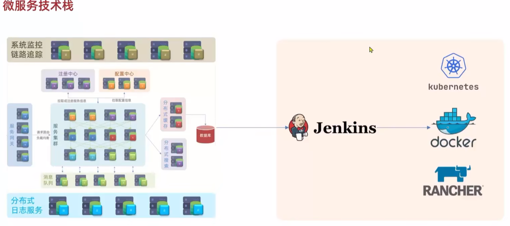

# 技术栈结构图

https://www.bilibili.com/video/BV1LQ4y127n4?p=2&vd_source=d5fad407fb5ab3d96e8009734dc4bc20

# 微服务的演化

1. 单体架构： 业务的所有功能集中在一个项目中开发，打包成一个包部署。优点：架构简单、部署成本低；缺点：耦合度搞、不利于大型项目开发
2. 分布式架构：根据业务功能对系统进行拆分，每个业务模块作为独立项目开发，称为服务
   1. 优点：耦合度低、有利于服务升级
   2. 缺点：
      1. 服务拆分力度如何？
      2. 服务集群地址如何维护？
      3. 服务之间如何远程调用？
      4. 服务健康状态如何感知？
3. 微服务： 一种经过良好架构设计的分布式架构方案，微服务架构特征：
   1. 单一职责：微服务拆分粒度更小，每个服务都对应唯一的业务能力，做到单一职责，避免重复业务开发
   2. 面向服务：对外暴露业务接口
   3. 自治：团队独立、技术独立、数据独立、部署独立
   4. 隔离性强：服务调用做好隔离、容错、降级，避免出现级联问题

# 微服务结构

1. springCloud
2. 阿里巴巴的Dubbo
3. SpringCloudAlibab

差异：

