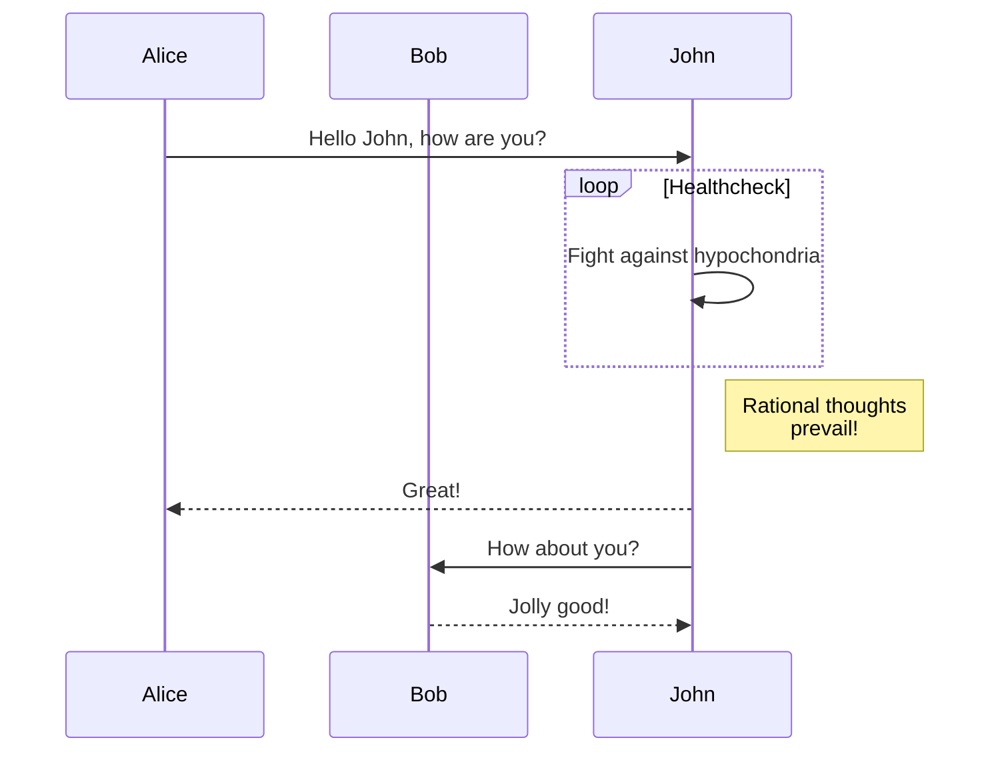
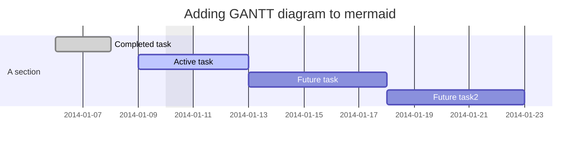
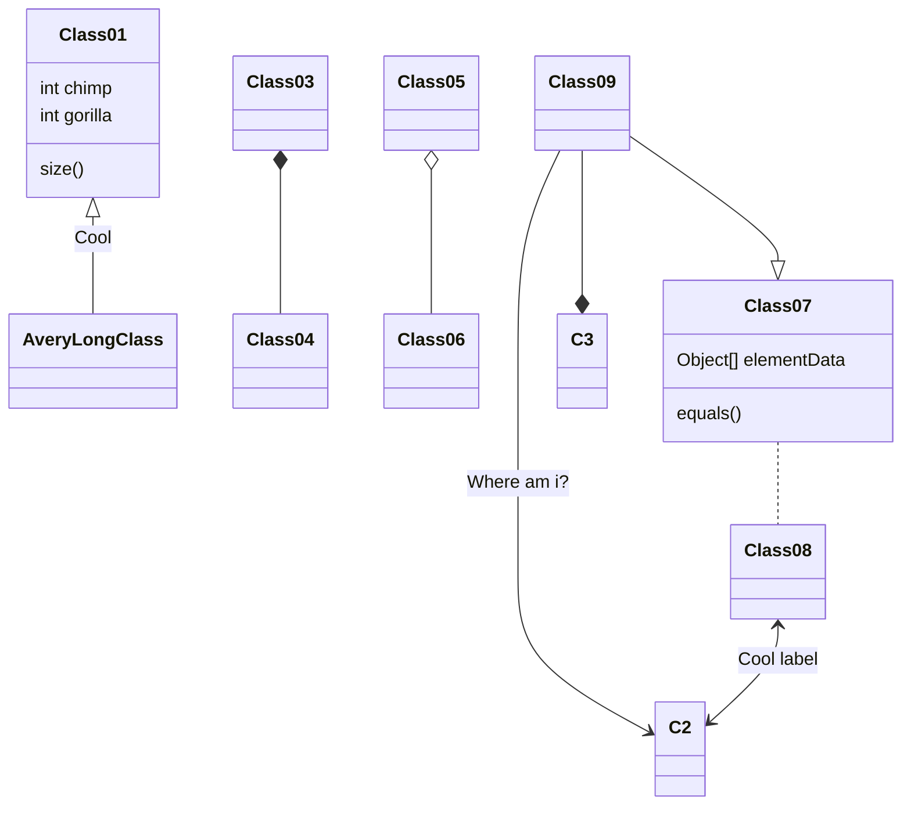
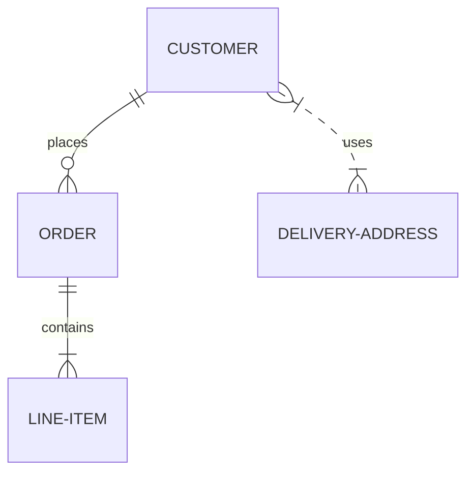
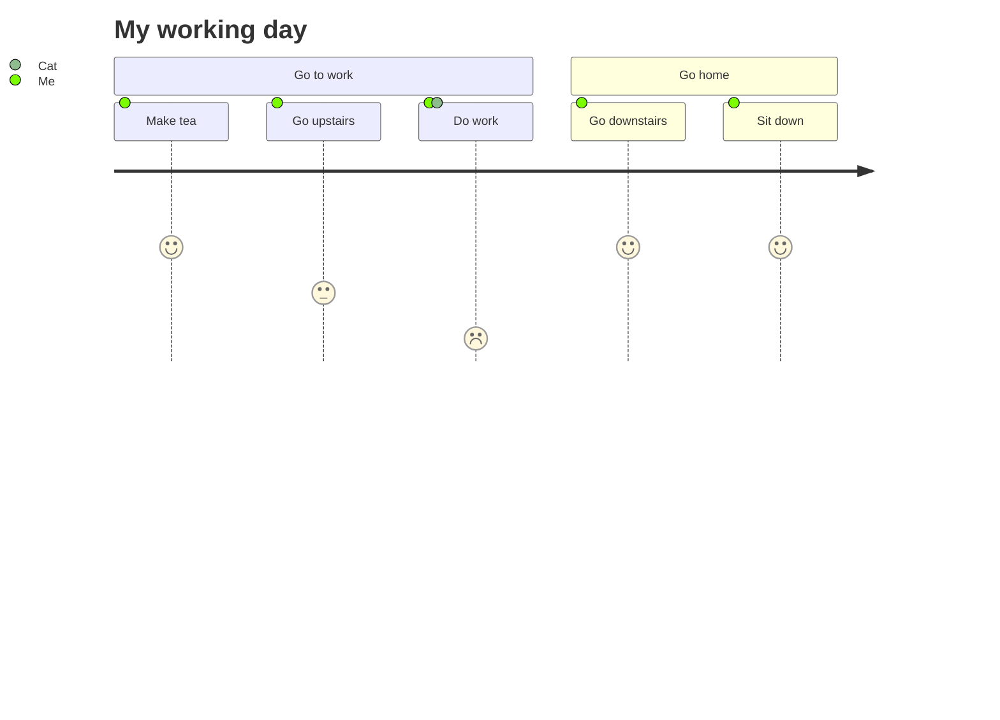

# 引入

## cdn

```
https://unpkg.com/mermaid@<version>/dist/
```

Latest Version: https://unpkg.com/browse/mermaid@8.8.0/

## 部署

node v16，npm

```
1. yarn add mermaid
2. yarn add --dev mermaid
```

## api

```html
<script src="https://cdn.jsdelivr.net/npm/mermaid/dist/mermaid.min.js"></script>
<script>mermaid.initialize({startOnLoad:true});
</script>
<div class="mermaid">
  graph TD;
    A-->B;
    A-->C;
    B-->D;
    C-->D;
</div>
```

# 流程图

## 标识

`flowchart `

## 结构


## 流程图导向

- TB - top to bottom  自上而下
- TD - top-down/ same as top to bottom 自上而下
- BT - bottom to top 自下至上
- RL - right to left 自右到左
- LR - left to right 自左到右

## 节点形状

```mermaid
flowchart TD
    [id --> id2{ss}
```


# 时序图




# 甘特图



# 类图



# git 图-实验


# 	实体关系图——实验



# 用户旅行图

