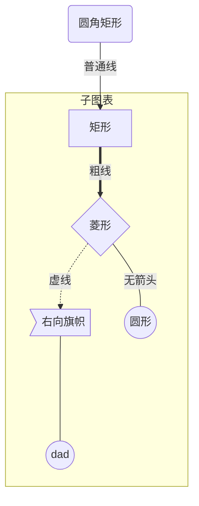

# markdown

1. 文本文件的可读性强
2. 文本存储在带有 `.md`或 `.markdown`扩展名的纯文本文件中
3. 可转化为 html 或 pdf
4. 适合记笔记
5. 几乎所有 Markdown 应用程序都支持 John Gruber 原始设计文档中概述的基本语法
6. 可以将 HTML 标签添加到任何 Markdown 文件

## 资料

http://markdown.p2hp.com/getting-started/

[MarkDown 指南](https://github.com/mattcone/markdown-guide)

[Atom 文本编辑器](https://atom.io/)
[Dillinger 在线 Markdown 编辑器](https://dillinger.io/)

[网站](http://markdown.p2hp.com/getting-started/index.html#websites)
[文档](http://markdown.p2hp.com/getting-started/index.html#documents)
[便笺](http://markdown.p2hp.com/getting-started/index.html#notes)
[书籍](http://markdown.p2hp.com/getting-started/index.html#books)
[演示文稿](http://markdown.p2hp.com/getting-started/index.html#presentations)
[电子邮件](http://markdown.p2hp.com/getting-started/index.html#email)
[技术文档](http://markdown.p2hp.com/getting-started/index.html#documentation)

**使用 Markdown 文件创建网站**
[blot.im](https://blot.im/)
[smallvictori.es](https://smallvictori.es/)
[Jekyll 静态网站生成器](http://markdown.p2hp.com/tools/jekyll/index.html)
[其他可用的静态站点生成器之一](https://www.staticgen.com/)

### Markdown 文档创作应用程序

**Mac**
[MacDown](http://markdown.p2hp.com/tools/macdown/index.html)
[iA Writer](http://markdown.p2hp.com/tools/ia-writer/index.html)
[Marked](https://marked2app.com/)
**iOS / Android**
[iA Writer](http://markdown.p2hp.com/tools/ia-writer/index.html)
**Windows**
[Ghostwriter](https://wereturtle.github.io/ghostwriter/)
[Markdown Monster](https://markdownmonster.west-wind.com/)
**Linux 操作系统**
[ReText](https://github.com/retext-project/retext)
[代笔](https://wereturtle.github.io/ghostwriter/)
**网址**
[Dillinger](http://markdown.p2hp.com/tools/dillinger/index.html)
[StackEdit](http://markdown.p2hp.com/tools/stackedit/index.html)

### 记笔记应用

**当前不支持 Markdown**
[Evernote](https://evernote.com/)
[OneNote](https://www.onenote.com/)

**支持 Markdown**

[Simplenote](http://markdown.p2hp.com/tools/simplenote/index.html)是适用于每个平台的免费的准系统笔记应用程序。
[notable](http://markdown.p2hp.com/tools/notable/index.html)是可以在各种平台上运行的笔记应用程序。
[bear](http://markdown.p2hp.com/tools/bear/index.html)是适用于 Mac 和 iOS 设备的类似 Evernote 的应用程序。默认情况下，它并不专门使用 Markdown，但是您可以启用 Markdown 兼容模式。
[Boostnote](http://markdown.p2hp.com/tools/boostnote/index.html)自称是“专为程序员设计的开源笔记应用程序”。

### 文档转换

**将 Markdown 格式的文件转换为电子书 PDF,EPUB 和 MOBI**
[Leanpub](https://leanpub.com/)
**pdf=>创建书籍的平装本**
[Kindle Direct Publishing](https://kdp.amazon.com/)
**md=>pdf**
[pandoc](`C:\Program Files\Pandoc\pandoc.exe`) markdown 与其他文件互转;开源地址:`https://github.com/jgm/pandoc`,用户手册:`https://pandoc.org/MANUAL.html`

```bat
pandoc.exe test.md -f markdown -t pdf -s -o test.pdf
```

### vscode 插件

- `Markdown All in One` 语法提示
- `Markdown Preview Github` 不太好用
- `office preview` 所见即所得,不太好用
- `learn-markdown` alt+m 插入命令
- `Markdown Preview Mermaid Support` 支持 Mermaid 预览
- `Markdown Preview Enhanced` 预览加强,强大的自定义语法;https://shd101wyy.github.io/markdown-preview-enhanced/#/zh-cn/usages

### 其他资源

您可以使用很多资源来学习 Markdown。以下是一些其他介绍性资源：

- [John Gruber 的 Markdown 文档](https://daringfireball.net/projects/markdown/)。Markdown 的创建者编写的原始指南。
- [MarkDown 教程](https://www.markdowntutorial.com/)。一个开放源代码的网站，允许您在 Web 浏览器中尝试 Markdown。
- [很棒的 Markdown](https://github.com/mundimark/awesome-markdown)。Markdown 工具和学习资源列表。
- [排版 Markdown](https://dave.autonoma.ca/blog/2019/05/22/typesetting-markdown-part-1)。一个由多个部分组成的系列，介绍了使用[pandoc](https://pandoc.org/)和[ConTeXt](https://www.contextgarden.net/)对 Markdown 文档进行排版的生态系统。

## 语法

markdown 可以嵌套 html 语法使用.

### 目录

### 标题

要创建标题，请 `#`在单词或短语的前面添加数字符号（）。您使用的数字符号的数量应与标题级别相对应。例如，要创建标题级别三（`<h3>`），请使用三个数字符号（例如 `### My Header`）。

| Markdown                 | HTML                       | 渲染输出   |
| ------------------------ | -------------------------- | ---------- |
| `# Heading level 1`      | `<h1>Heading level 1</h1>` | 标题等级 1 |
| `## Heading level 2`     | `<h2>Heading level 2</h2>` | 标题等级 2 |
| `### Heading level 3`    | `<h3>Heading level 3</h3>` | 标题级别 3 |
| `#### Heading level 4`   | `<h4>Heading level 4</h4>` | 标题级别 4 |
| `##### Heading level 5`  | `<h5>Heading level 5</h5>` | 标题 5     |
| `###### Heading level 6` | `<h6>Heading level 6</h6>` | 标题等级 6 |

或者，在文本下方的行上，添加任意数量的 `==`标题级别 1 的 `--`字符或标题级别 2 的字符。

| Markdown                         | HTML                       | 渲染输出   |
| -------------------------------- | -------------------------- | ---------- |
| `Heading level 1===============` | `<h1>Heading level 1</h1>` | 标题等级 1 |
| `Heading level 2---------------` | `<h2>Heading level 2</h2>` | 标题等级 2 |

### 段落与换行

要创建段落，请使用空白行分隔一行或多行文本。您不应缩进带有空格或制表符的段落。

要创建换行符`<br>`请以两个或多个空格结束一行

### 文本修饰

**粗体**
**粗体**
_斜体_
_斜体_
**_粗斜体_**
**_粗斜体_**
**_粗斜体_**
**_粗斜体_**
~~删除线~~

### 块引用与注释

要创建 blockquote，请 `>`在段落前面添加一个。

> 桃乐丝（Dorothy）跟着她走过了她城堡中许多美丽的房间。

块引用可以包含多个段落。`>`在段落之间的空白行上添加一个。

> Dorothy followed her through many of the beautiful rooms in her castle.
>
> The Witch bade her clean the pots and kettles and sweep the floor and keep the fire fed with wood.

块引用可以嵌套。`>>`在要嵌套的段落前面添加一个。

> Dorothy followed her through many of the beautiful rooms in her castle.
>
> > The Witch bade her clean the pots and kettles and sweep the floor and keep the fire fed with wood.

块引用可以包含其他 Markdown 格式的元素。并非所有元素都可以使用-您需要进行实验以查看哪些元素有效。

> `####` The quarterly results look great!
>
> - Revenue was off the chart.
> - Profits were higher than ever.
>
>   _Everything_ is going according to **plan**.

### 列表

**有序列表**

1. 1
2. 2
3. 3
4. 4
   **无序列表**
   要创建无序列表，请在订单项前添加破折号`-`星号`*`或加号`+`,缩进一个或多个项目以创建嵌套列表

- 1
- 2
- 3
- 4
  要在保留列表连续性的同时在列表中添加另一个元素,请将该元素缩进四个空格或一个制表符
- 这是第一个列表项。
- 这是第二个列表项。

  我需要在第二个列表项下面添加另一段。

- 这是第三个列表项。

### 代码块

**单行** `xxxxxx`
**多行代码块**
Markdown 基本语法允许您通过将行缩进四个空格或一个制表符来创建代码块,如果发现不方便,请尝试使用受保护的代码块。根据 Markdown 处理器或编辑器的不同,您将在代码块之前和之后的行上使用三个刻度线（`\`）或三个波浪号（`~~~`）

```js
console.log("hello world !");
```

语法高亮

### 水平线(分割线)

要创建水平线,请单独在一行上使用三个或更多的星号`***`破折号`---`或下划线`___`

---

---

---

### 链接

超链接 `[连接文本](链接地址 "鼠标悬停提示文本")`

要将 URL 或电子邮件地址快速转换为链接，请将其括在尖括号中
<https://markdown.p2hp.com>
<fake@example.com>

**格式化链接**
I love supporting the **[EFF](https://eff.org)**.
This is the _[Markdown Guide](https://markdown.p2hp.com)_.

**参考样式链接**

In a hole in the ground there lived a hobbit. Not a nasty, dirty, wet hole, filled with the ends
of worms and an oozy smell, nor yet a dry, bare, sandy hole with nothing in it to sit down on or to
eat: it was a [hobbit-hole][1], and that means comfort.

[1]: https://en.wikipedia.org/wiki/Hobbit#Lifestyle "Hobbit lifestyles"

### 图片

``


要向图像添加链接，请将图像的 Markdown 括在方括号中，然后在括号中添加链接。

[](https://www.flickr.com/photos/beaurogers/31833779864/in/photolist-Qv3rFw-34mt9F-a9Cmfy-5Ha3Zi-9msKdv-o3hgjr-hWpUte-4WMsJ1-KUQ8N-deshUb-vssBD-6CQci6-8AFCiD-zsJWT-nNfsgB-dPDwZJ-bn9JGn-5HtSXY-6CUhAL-a4UTXB-ugPum-KUPSo-fBLNm-6CUmpy-4WMsc9-8a7D3T-83KJev-6CQ2bK-nNusHJ-a78rQH-nw3NvT-7aq2qf-8wwBso-3nNceh-ugSKP-4mh4kh-bbeeqH-a7biME-q3PtTf-brFpgb-cg38zw-bXMZc-nJPELD-f58Lmo-bXMYG-bz8AAi-bxNtNT-bXMYi-bXMY6-bXMYv)

### 转义字符

要显示原义字符，否则将用于设置 Markdown 文档中的文本格式 `\`，请在字符前面添加反斜杠（）。

### 表格

要添加表，请使用三个或多个连字符（`---`）创建每列的标题，并使用管道（`|`）分隔每列。您可以选择在表的任一端添加管道。

| 句法 | 描述 |
| ---- | ---- |
| 标头 | 标题 |
| 段   | 文本 |

像元宽度可以变化，如下所示。呈现的输出将看起来相同。

| Syntax    | Description |
| --------- | ----------- |
| Header    | Title       |
| Paragraph | Text        |

> **提示** 使用连字符和管道创建表可能很麻烦。为了加快这一过程，请尝试使用[Markdown Tables Generator](http://www.tablesgenerator.com/markdown_tables)。使用图形界面构建表，然后将生成的 Markdown 格式的文本复制到文件中。

**对齐**

您可以通过 `:`在标题行内的连字符的左侧，右侧或两侧添加一个冒号`:`，以使列中的文本左，右或居中对齐。

| 句法 | 描述 | 测试文字 |
| :--- | :--: | -------: |
| 标头 | 标题 | 这是这个 |
| 段   | 文本 |   和更多 |

**格式化表格中的文字**

可以添加链接,代码,强调

**在表中转义管道字符**

您可以 `|`使用表格的 HTML 字符代码`&#124;`在表中显示竖线字符

### 脚注

脚注使您可以添加注释和参考，而不会使文档正文混乱。创建脚注时，带有脚注引用的链接将出现带有链接的上标编号。读者可以单击链接跳至页面底部的脚注内容。

要创建脚注参考，请在方括号（`[^1]`）内添加插入符号和标识符。标识符可以是数字或文字，但他们不能包含空格或制表符。标识符仅将脚注参考与脚注本身相关联-在输出中，脚注按顺序编号。

在括号内使用另一个插入符号和数字添加脚注，并用冒号和文本（`[^1]: My footnote.`）括起来。您不必在文档末尾添加脚注。你可以把他们的任何地方，除了像列表一样，块报价，和表格等元素里面

缩进段落可以包括在脚注中

Here's a simple footnote,[^1] and here's a longer one.[^bignote]

[^1]: This is the first footnote.
[^bignote]: Here's one with multiple paragraphs and code.

    Indent paragraphs to include them in the footnote.

    `{ my code }`

    Add as many paragraphs as you like.

### 链接到标题 {#1}

[Heading IDs](#1)

通过创建带有数字符号和自定义标题 ID 的标准链接,可以链接到文件中具有自定义 ID `#`的标题。

### 定义清单

一些 Markdown 处理器允许您创建*自定义列表*和术语及其相应的定义。要创建定义列表，请在第一行上键入术语。下一行，键入一个冒号后跟一个空格和定义。

First Term
: This is the definition of the first term.

Second Term
: This is one definition of the second term.
: This is another definition of the second term.

HTML 看起来像这样：

```html
<dl>
	<dt>First Term</dt>
	<dd>This is the definition of the first term.</dd>
	<dt>Second Term</dt>
	<dd>This is one definition of the second term.</dd>
	<dd>This is another definition of the second term.</dd>
</dl>
```

### 任务清单

- [x] Write the press release
- [ ] Update the website
- [ ] Contact the media

### Mermaid js 渲染流程图

Mermaid 是一个用于画流程图、状态图、时序图、甘特图的库，使用 JS 进行本地渲染，广泛集成于许多 Markdown 编辑器中。Mermaid 作为一个使用 JS 渲染的库，生成的不是一个“图片”，而是一段 HTML 代码，因此安全许多。

- [Mermaid 使用教程](https://blog.csdn.net/fenghuizhidao/article/details/79440583)
- [官网](https://mermaidjs.github.io/)
- [Github 项目地址](https://github.com/knsv/mermaid)


