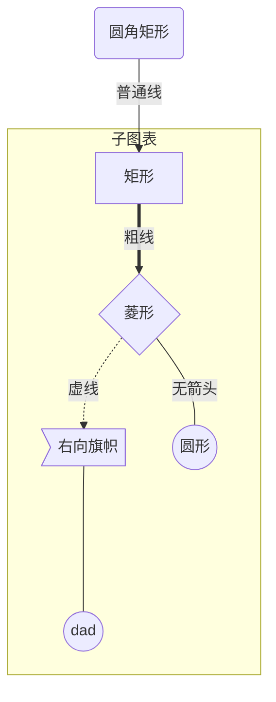

# 外链

http://markdown.p2hp.com/getting-started/

# Markdown 入门

Markdown 概述, 它是如何工作的, 以及你可以用它做什么。

## MarkDown 是什么？

Markdown 是一种轻量级的标记语言，可用于将格式设置元素添加到纯文本文档中。Markdown 由[John Gruber](https://daringfireball.net/projects/markdown/)于 2004 年创建，如今已成为世界上最受欢迎的标记语言之一。

使用 Markdown 与使用[WYSIWYG](https://en.wikipedia.org/wiki/WYSIWYG)编辑器不同。在 Microsoft Word 之类的应用程序中，单击按钮以设置单词和短语的格式，更改立即可见。Markdown 不是那样的。当您创建 Markdown 格式的文件时，可以在文本中添加 Markdown 语法，以指示哪些单词和短语看起来应该有所不同。

例如，要表示标题，请在其前面添加一个数字符号（例如 `# Heading One`）。或将短语加粗，可在其前后添加两个星号（例如 `**this text is bold**`）。可能需要一段时间才能习惯于在文本中看到 Markdown 语法，特别是如果您习惯于所见即所得的应用程序。下面的屏幕截图显示了[Atom 文本编辑器](https://atom.io/)中显示的 Markdown 文件。


您可以使用文本编辑器应用程序将 Markdown 格式元素添加到纯文本文件。或者，您可以将多种 Markdown 应用程序之一用于 macOS，Windows，Linux，iOS 和 Android 操作系统。还有一些基于 Web 的应用程序专门用于 Markdown 编写。

根据您使用的应用程序，您可能无法实时预览格式化的文档。但这没关系。[根据 Gruber 的说法](http://daringfireball.net/projects/markdown/)，Markdown 语法被设计为可读性强且不显眼，因此即使未呈现 Markdown 文件中的文本也可以读取。

> Markdown 格式化语法的首要设计目标是使其更具可读性。这个想法是 Markdown 格式的文档应该以纯文本的形式原样发布，而不会看起来像被标签或格式说明所标记。

## 为什么要使用 Markdown？

您可能想知道为什么人们使用 Markdown 而不是 WYSIWYG 编辑器。当您可以按下界面中的按钮来设置文本格式时，为什么还要使用 Markdown 书写？事实证明，人们使用 Markdown 而不是 WYSIWYG 编辑器的原因有两个。

-   Markdown 可以用于一切。人们使用它来创建[网站](http://markdown.p2hp.com/getting-started/index.html#websites)，[文档](http://markdown.p2hp.com/getting-started/index.html#documents)，[便笺](http://markdown.p2hp.com/getting-started/index.html#notes)，[书籍](http://markdown.p2hp.com/getting-started/index.html#books)，[演示文稿](http://markdown.p2hp.com/getting-started/index.html#presentations)，[电子邮件](http://markdown.p2hp.com/getting-started/index.html#email)和[技术文档](http://markdown.p2hp.com/getting-started/index.html#documentation)。
-   Markdown 是便携式的。几乎可以使用任何应用程序打开包含 Markdown 格式文本的文件。如果您决定不喜欢当前使用的 Markdown 应用程序，则可以将 Markdown 文件导入另一个 Markdown 应用程序。这与 Microsoft Word 等文字处理应用程序形成了鲜明的对比，Microsoft Word 将文字内容锁定为专有文件格式。
-   Markdown 是独立于平台的。您可以在运行任何操作系统的任何设备上创建 Markdown 格式的文本。
-   MarkDown 是未来的证明。即使您正在使用的应用程序将来会在某个时候停止工作，您仍然可以使用文本编辑应用程序读取 Markdown 格式的文本。当涉及需要无限期保存的书籍，大学论文和其他里程碑文件时，这是一个重要的考虑因素。
-   Markdown 无处不在。Reddit 和 GitHub 等网站都支持 Markdown，许多桌面和基于 Web 的应用程序都支持它。

## 开始尝试

Markdown 入门的最佳方法是使用它。有了各种免费工具，这比以往任何时候都容易。

您甚至都不需要下载任何内容。您可以使用几种在线 Markdown 编辑器来尝试在 Markdown 中编写。[Dillinger](https://dillinger.io/)是最好的在线 Markdown 编辑器之一。只需打开站点并开始在左窗格中输入即可。呈现的文档的预览出现在右窗格中。


阅读本指南时，您可能希望保持 Dillinger 网站的打开状态。这样，您就可以在学习语法时尝试使用它。熟悉 Markdown 之后，您可能想使用可以安装在台式计算机或移动设备上的 Markdown 应用程序。

## 它是如何工作的？

Dillinger 使 Markdown 的编写变得容易，因为它隐藏了幕后发生的事情，但是值得探索该过程的总体工作方式。

在 Markdown 中书写时，文本存储在带有 `.md`或 `.markdown`扩展名的纯文本文件中。但是那又怎样呢？您的 Markdown 格式的文件如何转换为 HTML 或可打印的文档？

简短的答案是，您需要一个能够处理 Markdown 文件的*Markdown 应用程序*。有许多应用程序可用—从简单脚本到类似于 Microsoft Word 的桌面应用程序，应有尽有。尽管它们在视觉上有所不同，但所有应用程序都执行相同的操作。像 Dillinger 一样，它们都将 Markdown 格式的文本转换为 HTML，以便可以在 Web 浏览器中显示。

Markdown 应用程序使用一种称为*Markdown 处理器*（也通常称为“解析器”或“实现”）的东西来获取 Markdown 格式的文本并将其输出为 HTML 格式。此时，可以在 Web 浏览器中查看您的文档，或者将其与样式表组合并打印。您可以在下面看到此过程的直观表示。

**注意：** Markdown 应用程序和处理器是两个单独的组件。为了简洁起见，在下图中，我将它们组合为一个元素（“ Markdown 应用程序”）。


总而言之，这是一个四部分的过程：

1. 使用文本编辑器或专用的 Markdown 应用程序创建 Markdown 文件。该文件应带有 `.md`或 `.markdown`扩展名。
2. 在 Markdown 应用程序中打开 Markdown 文件。
3. 使用 Markdown 应用程序将 Markdown 文件转换为 HTML 文档。
4. 在网络浏览器中查看 HTML 文件，或使用 Markdown 应用程序将其转换为其他文件格式，例如 PDF。

从您的角度来看，该过程将根据您使用的应用程序而有所不同。例如，Dillinger 本质上将第 1-3 步组合到一个无缝的界面中，您要做的就是在左窗格中键入内容，并且呈现的输出神奇地出现在右窗格中。但是，如果您使用其他工具（例如带有静态网站生成器的文本编辑器），则会发现该过程更为可见。

## Markdown 有什么用处？

Markdown 是记笔记，为网站创建内容以及生成可打印文档的快速简便的方法。

学习 Markdown 语法并不需要很长时间，一旦您知道如何使用它，就可以在几乎所有地方使用 Markdown 进行编写。大多数人都使用 Markdown 来创建 Web 内容，但是 Markdown 可以很好地格式化从电子邮件到购物清单的所有内容。

这是您可以使用 Markdown 进行操作的一些示例。

### 网站

Markdown 是为网络设计的，因此，有很多专门用于创建网站内容的应用程序不足为奇。

如果您正在寻找使用 Markdown 文件创建网站的最简单方法，请查看[blot.im](https://blot.im/)和[smallvictori.es](https://smallvictori.es/)。在您注册这些服务之一之后，它们将在您的计算机上创建一个 Dropbox 文件夹。只需将 Markdown 文件拖放到该文件夹中，然后-po！-它们在您的网站上。再简单不过了。

如果您熟悉 HTML，CSS 和版本控制，请查看[Jekyll](http://markdown.p2hp.com/tools/jekyll/index.html)，这是一个受欢迎的静态网站生成器，它使用 Markdown 文件并构建 HTML 网站。这种方法的优势之一是[GitHub Pages](http://markdown.p2hp.com/tools/github-pages/index.html)为 Jekyll 生成的网站提供免费托管。如果 Jekyll 不是您的理想之选，请选择[其他可用的静态站点生成器之一](https://www.staticgen.com/)。

**注意：**我使用 Jekyll 来创建《_MarkDown 指南》_。您可以在[GitHub 上](https://github.com/mattcone/markdown-guide)查看源代码。

如果您想使用内容管理系统（CMS）来为网站提供动力，请查看[Ghost](https://ghost.org/)。这是一个免费的开源博客平台，具有出色的 Markdown 编辑器。如果您是 WordPress 用户，您将很高兴知道 WordPress.com 上托管的网站有[Markdown 支持](https://en.support.wordpress.com/markdown/)。自托管的 WordPress 网站可以使用[Jetpack 插件](https://jetpack.com/support/markdown/)。

### 文件资料

Markdown 没有像 Microsoft Word 这样的文字处理程序的所有功能，但是对于创建基本文件（如作业和字母）已经足够了。您可以使用 Markdown 文档创作应用程序来创建 Markdown 格式的文档并将其导出为 PDF 或 HTML 文件格式。PDF 部分是关键，因为一旦有了 PDF 文档，您就可以使用它进行任何操作-打印，通过电子邮件发送或将其上传到网站。

这是我推荐的一些 Markdown 文档创作应用程序：

-   **Mac：** [MacDown](http://markdown.p2hp.com/tools/macdown/index.html)，[iA Writer](http://markdown.p2hp.com/tools/ia-writer/index.html)或[Marked](https://marked2app.com/)
-   **iOS / Android：** [iA Writer](http://markdown.p2hp.com/tools/ia-writer/index.html)
-   **Windows：** [Ghostwriter](https://wereturtle.github.io/ghostwriter/)或[Markdown Monster](https://markdownmonster.west-wind.com/)
-   **Linux 操作系统：** [ReText](https://github.com/retext-project/retext)或[代笔](https://wereturtle.github.io/ghostwriter/)
-   **网址：** [Dillinger](http://markdown.p2hp.com/tools/dillinger/index.html)或[StackEdit](http://markdown.p2hp.com/tools/stackedit/index.html)

    **提示：** [iA Writer](https://ia.net/writer/templates/)提供了用于预览，打印和导出 Markdown 格式的文档的模板。例如，“ Academic – MLA 样式”模板使段落缩进并添加双句间距。

### 笔记

在几乎所有方面，Markdown 都是记笔记的理想语法。不幸的是，两个最受欢迎的笔记应用程序[Evernote](https://evernote.com/)和[OneNote](https://www.onenote.com/)当前不支持 Markdown。好消息是，其他一些笔记应用程序*也*支持 Markdown：

-   [Simplenote](http://markdown.p2hp.com/tools/simplenote/index.html)是适用于每个平台的免费的准系统笔记应用程序。
-   [值得注意的](http://markdown.p2hp.com/tools/notable/index.html)是可以在各种平台上运行的笔记应用程序。
-   [熊](http://markdown.p2hp.com/tools/bear/index.html)是适用于 Mac 和 iOS 设备的类似 Evernote 的应用程序。默认情况下，它并不专门使用 Markdown，但是您可以启用 Markdown 兼容模式。
-   [Boostnote](http://markdown.p2hp.com/tools/boostnote/index.html)自称是“专为程序员设计的开源笔记应用程序”。

如果您不能退出 Evernote，请查看 Evernote 的基于订阅的 Markdown 编辑器[Marxico](https://marxi.co/)，或在 Evernote 网站上使用[Markdown Here](http://markdown.p2hp.com/tools/markdown-here/index.html)。

### 图书

想要自行出版小说？尝试使用[Leanpub](https://leanpub.com/)，该服务可将您的 Markdown 格式的文件转换为电子书。Leanpub 以 PDF，EPUB 和 MOBI 文件格式输出您的图书。如果您要创建书籍的平装本，可以将 PDF 文件上传到[Kindle Direct Publishing](https://kdp.amazon.com/)等其他服务。要了解有关使用 Markdown 编写和自行出版书籍的更多信息，请阅读[此博客文章](https://medium.com/techspiration-ideas-making-it-happen/how-i-wrote-and-published-my-novel-using-only-open-source-tools-5cdfbd7c00ca)。

### 简报

信不信由你，您可以从 Markdown 格式的文件生成演示文稿。在 Markdown 中创建演示文稿需要一点时间来适应，但是一旦掌握了它，它比使用 PowerPoint 或 Keynote 之类的应用程序更快，更容易。[Remark](https://remarkjs.com/)（[GitHub 项目](https://github.com/gnab/remark)）和[Cleaver](https://jdan.github.io/cleaver/)（[GitHub 项目](https://github.com/jdan/cleaver)）一样，是一种基于浏览器的流行 Markdown 幻灯片工具。如果您使用的是 Mac，并且希望使用某个应用程序，请查看[Deckset](https://www.decksetapp.com/)或[Marked](https://marked2app.com/)。

### 电子邮件

如果您发送大量电子邮件，并且对大多数电子邮件提供商网站上可用的格式设置控件感到厌倦，那么您将很高兴地发现有一种使用 Markdown 编写电子邮件的简便方法。[Markdown 这](http://markdown.p2hp.com/tools/markdown-here/index.html)是一个免费的开放源代码浏览器扩展程序，可将 Markdown 格式的文本转换为可发送的 HTML。

### 文献资料

Markdown 非常适合技术文档。像 GitHub 这样的公司越来越多地转向 Markdown 来获取其文档-请查看其[博客文章，](https://github.com/blog/1939-how-github-uses-github-to-document-github)了解如何将其 Markdown 格式的文档迁移到[Jekyll](http://markdown.p2hp.com/tools/jekyll/index.html)。如果您编写产品或服务的文档，请查看以下便捷工具：

-   [阅读文档](https://readthedocs.org/)可以从您的开源 Markdown 文件生成文档网站。只需将您的 GitHub 存储库连接到他们的服务并进行推送-阅读文档即可完成其余工作。他们还[为商业实体提供服务](https://readthedocs.com/)。
-   [MkDocs](https://www.mkdocs.org/)是一种快速简单的静态站点生成器，专门用于构建项目文档。文档源文件使用 Markdown 编写，并使用单个 YAML 配置文件进行配置。MkDocs 具有多个[内置主题](https://www.mkdocs.org/user-guide/styling-your-docs/)，包括与 MkDocs 一起使用的[Read the Docs](https://readthedocs.org/)文档主题的端口。最新主题之一是[MkDocs Material](https://squidfunk.github.io/mkdocs-material/)。
-   [Docusaurus](http://markdown.p2hp.com/tools/docusaurus/index.html)是一个静态网站生成器，专门用于创建文档网站。它支持翻译，搜索和版本控制。
-   [VuePress](https://vuepress.vuejs.org/)是由[Vue](https://vuejs.org/)提供支持的静态站点生成器，并针对编写技术文档进行了优化。
-   [Jekyll](http://markdown.p2hp.com/tools/jekyll/index.html)在网站上的该部分中前面提到过，但是它也是从 Markdown 文件生成文档网站的一个不错的选择。如果您走这条路，请务必查看[Jekyll 文档主题](https://idratherbewriting.com/documentation-theme-jekyll/)。

## MarkDown 的味道

使用 Markdown 的最令人困惑的方面之一是，实际上每个 Markdown 应用程序都实现了稍有不同的 Markdown 版本。Markdown 的这些变体通常称为*口味*。掌握应用程序实现的 Markdown 风格是您的工作。

为了让您了解 Markdown 风味的概念，将其视为语言方言可能会有所帮助。华雷斯城的人说西班牙语，就像巴塞罗那的人一样，但是两个城市使用的方言之间有很大的不同。使用不同 Markdown 应用程序的人也是如此。使用[Dillinger](http://markdown.p2hp.com/tools/dillinger/index.html)与 Markdown 写作与使用[Ulysses](http://markdown.p2hp.com/tools/ulysses/index.html)有着截然不同的经历。

实际上，这意味着当他们说支持“ Markdown”时，您永远不会确切知道公司的意思。他们是在谈论[基本语法元素](http://markdown.p2hp.com/basic-syntax/index.html)，还是所有[基本语法](http://markdown.p2hp.com/basic-syntax/index.html)和[扩展语法元素的](http://markdown.p2hp.com/extended-syntax/index.html)组合，还是语法元素的任意组合？在阅读文档或开始使用该应用程序之前，您不知道。

如果您刚刚起步，我能给您的最好建议是选择一个具有良好 Markdown 支持的 Markdown 应用程序。这将对维持 Markdown 文件的可移植性大有帮助。您可能想要在其他应用程序中存储和使用 Markdown 文件，并且为此需要从提供良好支持的应用程序开始。您可以使用[工具目录](http://markdown.p2hp.com/tools/index.html)查找适合该账单的应用程序。

## 其他资源

您可以使用很多资源来学习 Markdown。以下是一些其他介绍性资源：

-   [John Gruber 的 Markdown 文档](https://daringfireball.net/projects/markdown/)。Markdown 的创建者编写的原始指南。
-   [MarkDown 教程](https://www.markdowntutorial.com/)。一个开放源代码的网站，允许您在 Web 浏览器中尝试 Markdown。
-   [很棒的 Markdown](https://github.com/mundimark/awesome-markdown)。Markdown 工具和学习资源列表。
-   [排版 Markdown](https://dave.autonoma.ca/blog/2019/05/22/typesetting-markdown-part-1)。一个由多个部分组成的系列，介绍了使用[pandoc](https://pandoc.org/)和[ConTeXt](https://www.contextgarden.net/)对 Markdown 文档进行排版的生态系统。

# Markdown 基本语法

约翰·格鲁伯设计文档中概述的 Markdown 元素。

## 总览

几乎所有 Markdown 应用程序都支持 John Gruber 原始设计文档中概述的基本语法。Markdown 处理器之间存在细微的差异和差异-尽可能在线内注明。

**注意：**使用 Markdown 并不意味着您也不能使用 HTML。您可以将 HTML 标签添加到任何 Markdown 文件中。如果您更喜欢某些 HTML 标记而不是 Markdown 语法，这将很有帮助。例如，有些人发现将 HTML 标签用于图像更容易。

## 标题

要创建标题，请 `#`在单词或短语的前面添加数字符号（）。您使用的数字符号的数量应与标题级别相对应。例如，要创建标题级别三（`<h3>`），请使用三个数字符号（例如 `### My Header`）。

| Markdown                 | HTML                       | 渲染输出   |
| ------------------------ | -------------------------- | ---------- |
| `# Heading level 1`      | `<h1>Heading level 1</h1>` | 标题等级 1 |
| `## Heading level 2`     | `<h2>Heading level 2</h2>` | 标题等级 2 |
| `### Heading level 3`    | `<h3>Heading level 3</h3>` | 标题级别 3 |
| `#### Heading level 4`   | `<h4>Heading level 4</h4>` | 标题级别 4 |
| `##### Heading level 5`  | `<h5>Heading level 5</h5>` | 标题 5     |
| `###### Heading level 6` | `<h6>Heading level 6</h6>` | 标题等级 6 |

### 替代语法

或者，在文本下方的行上，添加任意数量的 `==`标题级别 1 的 `--`字符或标题级别 2 的字符。

| Markdown                         | HTML                       | 渲染输出   |
| -------------------------------- | -------------------------- | ---------- |
| `Heading level 1===============` | `<h1>Heading level 1</h1>` | 标题等级 1 |
| `Heading level 2---------------` | `<h2>Heading level 2</h2>` | 标题等级 2 |

## 段落

要创建段落，请使用空白行分隔一行或多行文本。您不应缩进带有空格或制表符的段落。

| Markdown                                                                                      | HTML                                                                                                        | 渲染输出                                                                |
| --------------------------------------------------------------------------------------------- | ----------------------------------------------------------------------------------------------------------- | ----------------------------------------------------------------------- |
| `I really like using Markdown.I think I'll use it to format all of my documents from now on.` | `<p>I really like using Markdown.</p><p>I think I'll use it to format all of my documents from now on.</p>` | 我真的很喜欢使用 Markdown。我想从现在开始，我将使用它来格式化所有文档。 |

## 换行

要创建换行符（`<br>`），请以两个或多个空格结束一行，然后键入 return。

| Markdown                                                | HTML                                                             | 渲染输出                  |
| ------------------------------------------------------- | ---------------------------------------------------------------- | ------------------------- |
| `This is the first line.  And this is the second line.` | `<p>This is the first line.<br>And this is the second line.</p>` | 这是第一行。 这是第二行。 |

## 着重

您可以通过使文本变为粗体或斜体来增加着重。

### 粗体

要加粗文本，请在单词或短语的前后添加两个星号或下划线。要加粗一个单词的中部以强调，请在字母周围添加两个星号，且各空格之间不加空格。

| Markdown                     | HTML                                      | 渲染输出             |
| ---------------------------- | ----------------------------------------- | -------------------- |
| `I just love **bold text**.` | `I just love <strong>bold text</strong>.` | 我只喜欢**粗体字**。 |
| `I just love __bold text__.` | `I just love <strong>bold text</strong>.` | 我只喜欢**粗体字**。 |
| `Love**is**bold`             | `Love<strong>is</strong>bold`             | 爱**是**大胆的       |

### 斜体

要斜体显示文本，请在单词或短语的前后添加一个星号或下划线。要斜体突出单词的中间部分，请在字母周围添加一个星号，中间不要带空格。

| Markdown                               | HTML                                          | 渲染输出               |
| -------------------------------------- | --------------------------------------------- | ---------------------- |
| `Italicized text is the *cat's meow*.` | `Italicized text is the <em>cat's meow</em>.` | 斜体文字是*猫的叫声*。 |
| `Italicized text is the _cat's meow_.` | `Italicized text is the <em>cat's meow</em>.` | 斜体文字是*猫的叫声*。 |
| `A*cat*meow`                           | `A<em>cat</em>meow`                           | 一个*猫*喵             |

### 粗体和斜体

要同时突出显示带有粗体和斜体的文本，请在单词或短语的前后添加三个星号或下划线。

| Markdown                               | HTML                                                       | 渲染输出                 |
| -------------------------------------- | ---------------------------------------------------------- | ------------------------ |
| `This text is ***really important***.` | `This text is <strong><em>really important</em></strong>.` | 这段文字**真的很重要**。 |
| `This text is ___really important___.` | `This text is <strong><em>really important</em></strong>.` | 这段文字**真的很重要**。 |
| `This text is __*really important*__.` | `This text is <strong><em>really important</em></strong>.` | 这段文字**真的很重要**。 |
| `This text is **_really important_**.` | `This text is <strong><em>really important</em></strong>.` | 这段文字**真的很重要**。 |

## 块引用

要创建 blockquote，请 `>`在段落前面添加一个。

```
> Dorothy followed her through many of the beautiful rooms in her castle.
```

呈现的输出如下所示：

> 桃乐丝（Dorothy）跟着她走过了她城堡中许多美丽的房间。

### 具有多个段落的块引用

块引用可以包含多个段落。`>`在段落之间的空白行上添加一个。

```
> Dorothy followed her through many of the beautiful rooms in her castle.
>
> The Witch bade her clean the pots and kettles and sweep the floor and keep the fire fed with wood.
```

呈现的输出如下所示：

> 桃乐丝（Dorothy）跟着她走过了她城堡中许多美丽的房间。
>
> 女巫请她清洗锅碗瓢盆，扫地，并用木柴取火。

### 嵌套块引用

块引用可以嵌套。`>>`在要嵌套的段落前面添加一个。

```
> Dorothy followed her through many of the beautiful rooms in her castle.
>
>> The Witch bade her clean the pots and kettles and sweep the floor and keep the fire fed with wood.
```

呈现的输出如下所示：

> 桃乐丝（Dorothy）跟着她走过了她城堡中许多美丽的房间。
>
> > 女巫请她清洗锅碗瓢盆，扫地，并用木柴取火。

### 具有其他元素的块引用

块引用可以包含其他 Markdown 格式的元素。并非所有元素都可以使用-您需要进行实验以查看哪些元素有效。

```
> #### The quarterly results look great!
>
> - Revenue was off the chart.
> - Profits were higher than ever.
>
>  *Everything* is going according to **plan**.
```

呈现的输出如下所示：

> #### 季度业绩看起来不错！
>
> -   收入超出了预期。
> -   利润比以往任何时候都高。
>
> *一切*都按**计划进行**。

## 清单

您可以将项目组织成有序和无序列表。

### 有序列表

要创建有序列表，请在订单项中添加数字和句点。数字不必按数字顺序排列，但列表应以数字开头。

| Markdown                                                                                         | HTML                                                                                                                                           | 渲染输出                             |
| ------------------------------------------------------------------------------------------------ | ---------------------------------------------------------------------------------------------------------------------------------------------- | ------------------------------------ |
| `1. First item2. Second item3. Third item4. Fourth item`                                         | `<ol><li>First item</li><li>Second item</li><li>Third item</li><li>Fourth item</li></ol>`                                                      | 第一项第二项第三项第四项             |
| `1. First item1. Second item1. Third item1. Fourth item`                                         | `<ol><li>First item</li><li>Second item</li><li>Third item</li><li>Fourth item</li></ol>`                                                      | 第一项第二项第三项第四项             |
| `1. First item8. Second item3. Third item5. Fourth item`                                         | `<ol><li>First item</li><li>Second item</li><li>Third item</li><li>Fourth item</li></ol>`                                                      | 第一项第二项第三项第四项             |
| `1. First item2. Second item3. Third item    1. Indented item    2. Indented item4. Fourth item` | `<ol><li>First item</li><li>Second item</li><li>Third item<ol><li>Indented item</li><li>Indented item</li></ol></li><li>Fourth item</li></ol>` | 第一项第二项第三项缩进项缩进项第四项 |

### 无序列表

要创建无序列表，请在订单项前添加破折号（`-`），星号（`*`）或加号（`+`）。缩进一个或多个项目以创建嵌套列表。

| Markdown                                                                                   | HTML                                                                                                                                           | 渲染输出                             |
| ------------------------------------------------------------------------------------------ | ---------------------------------------------------------------------------------------------------------------------------------------------- | ------------------------------------ |
| `- First item- Second item- Third item- Fourth item`                                       | `<ul><li>First item</li><li>Second item</li><li>Third item</li><li>Fourth item</li></ul>`                                                      | 第一项第二项第三项第四项             |
| `* First item* Second item* Third item* Fourth item`                                       | `<ul><li>First item</li><li>Second item</li><li>Third item</li><li>Fourth item</li></ul>`                                                      | 第一项第二项第三项第四项             |
| `+ First item* Second item- Third item+ Fourth item`                                       | `<ul><li>First item</li><li>Second item</li><li>Third item</li><li>Fourth item</li></ul>`                                                      | 第一项第二项第三项第四项             |
| `- First item- Second item- Third item    - Indented item    - Indented item- Fourth item` | `<ul><li>First item</li><li>Second item</li><li>Third item<ul><li>Indented item</li><li>Indented item</li></ul></li><li>Fourth item</li></ul>` | 第一项第二项第三项缩进项缩进项第四项 |

### 在列表中添加元素

要在保留列表连续性的同时在列表中添加另一个元素，请将该元素缩进四个空格或一个制表符，如以下示例所示。

#### 段落

```
*   This is the first list item.
*   Here's the second list item.

    I need to add another paragraph below the second list item.

*   And here's the third list item.
```

呈现的输出如下所示：

-   这是第一个列表项。
-   这是第二个列表项。

    我需要在第二个列表项下面添加另一段。

-   这是第三个列表项。

#### 块引用

```
*   This is the first list item.
*   Here's the second list item.

    > A blockquote would look great below the second list item.

*   And here's the third list item.
```

呈现的输出如下所示：

-   这是第一个列表项。
-   这是第二个列表项。

    > 在第二个列表项的下方，blockquote 看起来不错。

-   这是第三个列表项。

#### 代码块

[代码块](http://markdown.p2hp.com/basic-syntax/index.html#code-blocks)通常缩进四个空格或一个制表符。当它们在列表中时，将它们缩进八个空格或两个选项卡。

```
1.  Open the file.
2.  Find the following code block on line 21:

        <html>
          <head>
            <title>Test</title>
          </head>

3.  Update the title to match the name of your website.
```

呈现的输出如下所示：

1. 打开文件。
2. 在第 21 行找到以下代码块：

    ```
    <html>
      <head>
        <title>Test</title>
      </head>
    ```

3. 更新标题以匹配您的网站名称。

#### 图片

```
1.  Open the file containing the Linux mascot.
2.  Marvel at its beauty.

    

3.  Close the file.
```

呈现的输出如下所示：

1. 打开包含 Linux 吉祥物的文件。
2. 惊叹于它的美丽。

    

3. 关闭文件。

## 代码

要将单词或短语表示为代码，请将其括在勾号（```）中。

| Markdown                               | HTML                                             | 渲染输出                      |
| -------------------------------------- | ------------------------------------------------ | ----------------------------- |
| `At the command prompt, type `nano `.` | `At the command prompt, type <code>nano</code>.` | 在命令提示符下，键入 `nano`。 |

### 转义刻度线

如果要表示为代码的单词或短语包含一个或多个刻度线，可以通过将单词或短语括在双刻度线（）中来对其进行转义。

| Markdown                                | HTML                                              | 渲染输出                             |
| --------------------------------------- | ------------------------------------------------- | ------------------------------------ |
| `` Use `code` in your Markdown file. `` | `<code>Use `code ` in your Markdown file.</code>` | `Use `code ` in your Markdown file.` |

### 代码块

要创建代码块，请在代码块的每一行缩进至少四个空格或一个制表符。

```
    <html>
      <head>
      </head>
    </html>
```

呈现的输出如下所示：

```
<html>
  <head>
  </head>
</html>
```

**注意：**要创建没有缩进线的[代码块](http://markdown.p2hp.com/extended-syntax/index.html#fenced-code-blocks)，请使用[围栅代码块](http://markdown.p2hp.com/extended-syntax/index.html#fenced-code-blocks)。

## 水平线

要创建水平线 `***`，请单独在一行上使用三个或更多的星号（），破折号（`---`）或下划线（`___`）。

```
***

---

_________________
```

所有这三个的渲染输出看起来都相同：

---

## 链接

要创建链接，请将链接文本括在方括号（例如 `[Duck Duck Go]`）中，然后立即在 URL 后面加上括号（例如 `(https://duckduckgo.com)`）中的 URL 。

```
My favorite search engine is [Duck Duck Go](https://duckduckgo.com).
```

呈现的输出如下所示：

我最喜欢的搜索引擎是[Duck Duck Go](https://duckduckgo.com/)。

### 添加标题

您可以选择为链接添加标题。当用户将鼠标悬停在链接上时，这将显示为工具提示。要添加标题，请将其括在 URL 后面的括号中。

```
My favorite search engine is [Duck Duck Go](https://duckduckgo.com "The best search engine for privacy").
```

呈现的输出如下所示：

我最喜欢的搜索引擎是[Duck Duck Go](https://duckduckgo.com/)。

### 网址和电子邮件地址

要将 URL 或电子邮件地址快速转换为链接，请将其括在尖括号中。

```
<https://markdown.p2hp.com>
<fake@example.com>
```

呈现的输出如下所示：

[https://markdown.p2hp.com](http://markdown.p2hp.com/index.html)
[fake@example.com](mailto:fake@example.com)

### 格式化链接

为了[强调](http://markdown.p2hp.com/basic-syntax/index.html#emphasis)链接，请在方括号和括号之前和之后添加星号。

```
I love supporting the **[EFF](https://eff.org)**.
This is the *[Markdown Guide](https://markdown.p2hp.com)*.
```

呈现的输出如下所示：

我喜欢支持**EFF**。
这是《_Markdown 指南》_。

### 参考样式链接

引用样式链接是一种特殊的链接，它使 URL 在 Markdown 中更易于显示和阅读。引用样式的链接分为两部分：与文本保持内联的部分以及在文件中其他位置存储的部分，以使文本易于阅读。

#### 格式化链接的第一部分

参考样式链接的第一部分使用两组括号进行格式化。第一组方括号包围应显示为链接的文本。第二组括号显示了一个标签，该标签用于指向您存储在文档其他位置的链接。

尽管不是必需的，但您可以在第一组和第二组支架之间包含一个空格。第二组括号中的标签不区分大小写，可以包含字母，数字，空格或标点符号。

这意味着以下示例格式对于链接的第一部分大致相同：

-   `[hobbit-hole][1]`
-   `[hobbit-hole] [1]`

#### 格式化链接的第二部分

引用样式链接的第二部分使用以下属性设置格式：

1. 标签放在方括号中，后紧跟冒号和至少一个空格（例如 `[label]: `）。
2. 链接的 URL，您可以选择将其括在尖括号中。
3. 链接的可选标题，您可以将其括在双引号，单引号或括号中。

这意味着以下示例格式对于链接的第二部分几乎都是等效的：

-   `[1]: https://en.wikipedia.org/wiki/Hobbit#Lifestyle`
-   `[1]: https://en.wikipedia.org/wiki/Hobbit#Lifestyle "Hobbit lifestyles"`
-   `[1]: https://en.wikipedia.org/wiki/Hobbit#Lifestyle 'Hobbit lifestyles'`
-   `[1]: https://en.wikipedia.org/wiki/Hobbit#Lifestyle (Hobbit lifestyles)`
-   `[1]: <https://en.wikipedia.org/wiki/Hobbit#Lifestyle> "Hobbit lifestyles"`
-   `[1]: <https://en.wikipedia.org/wiki/Hobbit#Lifestyle> 'Hobbit lifestyles'`
-   `[1]: <https://en.wikipedia.org/wiki/Hobbit#Lifestyle> (Hobbit lifestyles)`

您可以将链接的第二部分放在 Markdown 文档中的任何位置。有些人将它们放在出现的段落之后，而其他人则将它们放在文档的末尾（例如尾注或脚注）。

#### 将零件放在一起的示例

假设您添加一个 URL 作为到段落的[标准 URL 链接](http://markdown.p2hp.com/basic-syntax/index.html#links)，并且在 Markdown 中看起来像这样：

```
In a hole in the ground there lived a hobbit. Not a nasty, dirty, wet hole, filled with the ends
of worms and an oozy smell, nor yet a dry, bare, sandy hole with nothing in it to sit down on or to
eat: it was a [hobbit-hole](https://en.wikipedia.org/wiki/Hobbit#Lifestyle "Hobbit lifestyles"), and that means comfort.
```

尽管它可能指向有趣的附加信息，但显示的 URL 确实不会给现有的原始文本增加太多，除了使其难以阅读之外。要解决此问题，您可以改为设置网址格式：

```
In a hole in the ground there lived a hobbit. Not a nasty, dirty, wet hole, filled with the ends
of worms and an oozy smell, nor yet a dry, bare, sandy hole with nothing in it to sit down on or to
eat: it was a [hobbit-hole][1], and that means comfort.

[1]: <https://en.wikipedia.org/wiki/Hobbit#Lifestyle> "Hobbit lifestyles"
```

在上述两种情况下，呈现的输出将相同：

> 在地上的一个洞里住着一个霍比特人。这不是一个肮脏，肮脏，潮湿的洞，里面充满蠕虫的末端和难闻的气味，也没有一个干燥，裸露，沙质的洞，里面没有东西可以坐下或进食：那是一个[霍比特洞](https://en.wikipedia.org/wiki/Hobbit#Lifestyle)，意味着舒适。

链接 HTML 为：

```
<a href="https://en.wikipedia.org/wiki/Hobbit#Lifestyle" title="Hobbit lifestyles">hobbit-hole</a>
```

## 图片

要添加图像，请添加感叹号（`!`），然后在括号中添加替代文本，并在括号中添加图像资源的路径或 URL。您可以选择在括号中的 URL 之后添加标题。

```

```

呈现的输出如下所示：


### 链接图像

要向图像添加链接，请将图像的 Markdown 括在方括号中，然后在括号中添加链接。

```
[](https://www.flickr.com/photos/beaurogers/31833779864/in/photolist-Qv3rFw-34mt9F-a9Cmfy-5Ha3Zi-9msKdv-o3hgjr-hWpUte-4WMsJ1-KUQ8N-deshUb-vssBD-6CQci6-8AFCiD-zsJWT-nNfsgB-dPDwZJ-bn9JGn-5HtSXY-6CUhAL-a4UTXB-ugPum-KUPSo-fBLNm-6CUmpy-4WMsc9-8a7D3T-83KJev-6CQ2bK-nNusHJ-a78rQH-nw3NvT-7aq2qf-8wwBso-3nNceh-ugSKP-4mh4kh-bbeeqH-a7biME-q3PtTf-brFpgb-cg38zw-bXMZc-nJPELD-f58Lmo-bXMYG-bz8AAi-bxNtNT-bXMYi-bXMY6-bXMYv)
```

呈现的输出如下所示：

[](https://www.flickr.com/photos/beaurogers/31833779864/in/photolist-Qv3rFw-34mt9F-a9Cmfy-5Ha3Zi-9msKdv-o3hgjr-hWpUte-4WMsJ1-KUQ8N-deshUb-vssBD-6CQci6-8AFCiD-zsJWT-nNfsgB-dPDwZJ-bn9JGn-5HtSXY-6CUhAL-a4UTXB-ugPum-KUPSo-fBLNm-6CUmpy-4WMsc9-8a7D3T-83KJev-6CQ2bK-nNusHJ-a78rQH-nw3NvT-7aq2qf-8wwBso-3nNceh-ugSKP-4mh4kh-bbeeqH-a7biME-q3PtTf-brFpgb-cg38zw-bXMZc-nJPELD-f58Lmo-bXMYG-bz8AAi-bxNtNT-bXMYi-bXMY6-bXMYv)

## 转义字符

要显示原义字符，否则将用于设置 Markdown 文档中的文本格式 `\`，请在字符前面添加反斜杠（）。

```
\* Without the backslash, this would be a bullet in an unordered list.
```

呈现的输出如下所示：

\*如果没有反斜杠，这将是无序列表中的项目符号。

### 你可以转义的字符

您可以使用反斜杠转义以下字符。

| 字符 | 名称                                                                                                                     |
| ---- | ------------------------------------------------------------------------------------------------------------------------ |
| \    | 反斜杠                                                                                                                   |
| `    | 刻度线（另请参见[转义刻度线中的代码](http://markdown.p2hp.com/basic-syntax/index.html#escaping-tick-marks)）             |
| \*   | 星号                                                                                                                     |
| \_   | 下划线                                                                                                                   |
| {}   | 大括号                                                                                                                   |
| []   | 中括号                                                                                                                   |
| ()   | 括号                                                                                                                     |
| #    | 井号                                                                                                                     |
| +    | 加号                                                                                                                     |
| -    | 减号（连字符）                                                                                                           |
| .    | 点                                                                                                                       |
| !    | 感叹号                                                                                                                   |
| \|   | 管道（另请参见表中的[转义管道](http://markdown.p2hp.com/extended-syntax/index.html#escaping-pipe-characters-in-tables)） |

# Markdown 扩展语法

基于基本 Markdown 语法的高级功能。

## 总览

John Gruber 的原始设计文档中概述的[基本语法](http://markdown.p2hp.com/basic-syntax)每天增加了许多所需的元素，但对于某些人来说还不够。这就是扩展语法的用武之地。

一些个人和组织开始通过添加表，代码块，语法突出显示，URL 自动链接和脚注等其他元素来扩展基本语法。可以通过使用基于基本 Markdown 语法的轻量级标记语言，或者通过向兼容的 Markdown 处理器添加扩展来启用这些元素。

## 可用性

并非所有 Markdown 应用程序都支持扩展语法元素。您需要检查您的应用程序所使用的轻量级标记语言是否支持您要使用的扩展语法元素。如果没有，仍然可以在 Markdown 处理器中启用扩展。

### 轻量标记语言

有几种轻量级标记语言是 Markdown 的*超集*。它们包括 Gruber 的基本语法，并通过添加其他元素（例如表，代码块，语法突出显示，URL 自动链接和脚注）在此基础上构建。许多最受欢迎的 Markdown 应用程序使用以下轻量级标记语言之一：

-   [通用商标](http://commonmark.org/)
-   [GitHub 风格的 Markdown（GFM）](https://github.github.com/gfm/)
-   [Markdown Extra](https://michelf.ca/projects/php-markdown/extra/)
-   [MultiMarkdown](http://fletcherpenney.net/multimarkdown/)
-   [R Markdown](https://rmarkdown.rstudio.com/)

### Markdown 处理器

有[几十个 Markdown 的处理器](https://github.com/markdown/markdown.github.com/wiki/Implementations)使用。它们中的许多允许您添加启用扩展语法元素的扩展。查看处理器的文档以获取更多信息。

## 表格

要添加表，请使用三个或多个连字符（`---`）创建每列的标题，并使用管道（`|`）分隔每列。您可以选择在表的任一端添加管道。

```
| Syntax    | Description |
| --------- | ----------- |
| Header    | Title       |
| Paragraph | Text        |
```

呈现的输出如下所示：

| 句法 | 描述 |
| ---- | ---- |
| 标头 | 标题 |
| 段   | 文本 |

像元宽度可以变化，如下所示。呈现的输出将看起来相同。

```
| Syntax    | Description |
| --------- | ----------- |
| Header    | Title       |
| Paragraph | Text        |
```

**提示：**使用连字符和管道创建表可能很麻烦。为了加快这一过程，请尝试使用[Markdown Tables Generator](http://www.tablesgenerator.com/markdown_tables)。使用图形界面构建表，然后将生成的 Markdown 格式的文本复制到文件中。

### 对齐

您可以通过 `:`在标题行内的连字符的左侧，右侧或两侧添加一个冒号（），以使列中的文本左，右或居中对齐。

```
| Syntax    | Description |   Test Text |
| :-------- | :---------: | ----------: |
| Header    |    Title    | Here's this |
| Paragraph |    Text     |    And more |
```

呈现的输出如下所示：

| 句法 | 描述 | 测试文字 |
| :--- | :--: | -------: |
| 标头 | 标题 | 这是这个 |
| 段   | 文本 |   和更多 |

### 格式化表格中的文字

您可以格式化表格中的文本。例如，您可以添加[链接](http://markdown.p2hp.com/basic-syntax/index.html#links)，[代码](http://markdown.p2hp.com/basic-syntax/index.html#code-1)（```仅在刻度线（）中显示单词或短语，而不能在[代码块中添加](http://markdown.p2hp.com/basic-syntax/index.html#code-blocks)）和[强调](http://markdown.p2hp.com/basic-syntax/index.html#emphasis)。

您不能添加标题，块引用，列表，水平规则，图像或 HTML 标签。

### 在表中转义管道字符

您可以 `|`使用表格的 HTML 字符代码（`&#124;`）在表中显示竖线（）字符。

## 围栏代码块

Markdown 基本语法允许您通过将行缩进四个空格或一个制表符来创建[代码块](http://markdown.p2hp.com/basic-syntax#code-blocks)。如果发现不方便，请尝试使用受保护的代码块。根据 Markdown 处理器或编辑器的不同，您将在代码块之前和之后的行上使用三个刻度线（`）或三个波浪号（`~~~`）。最好的部分？您不必缩进任何行！

```
{
  "firstName": "John",
  "lastName": "Smith",
  "age": 25
}
```

呈现的输出如下所示：

```
{
  "firstName": "John",
  "lastName": "Smith",
  "age": 25
}
```

**提示：是否**需要在代码块内显示刻度线？请参阅[本节](http://markdown.p2hp.com/basic-syntax/index.html#escaping-tick-marks)以了解如何逃避它们。

### 语法高亮

许多 Markdown 处理器都支持围栏代码块的语法突出显示。此功能使您可以为代码编写时使用的任何语言添加颜色突出显示。要添加语法突出显示，请在受防护的代码块之前的对号旁指定一种语言。

```json
{
	"firstName": "John",
	"lastName": "Smith",
	"age": 25
}
```

呈现的输出如下所示：

```

{
"firstName": "John",
"lastName": "Smith",
"age": 25
}

```

## 脚注

脚注使您可以添加注释和参考，而不会使文档正文混乱。创建脚注时，带有脚注引用的链接将出现带有链接的上标编号。读者可以单击链接跳至页面底部的脚注内容。

要创建脚注参考，请在方括号（`[^1]`）内添加插入符号和标识符。标识符可以是数字或文字，但他们不能包含空格或制表符。标识符仅将脚注参考与脚注本身相关联-在输出中，脚注按顺序编号。

在括号内使用另一个插入符号和数字添加脚注，并用冒号和文本（`[^1]: My footnote.`）括起来。您不必在文档末尾添加脚注。你可以把他们的任何地方，除了像列表一样，块报价，和表格等元素里面。

```

Here's a simple footnote,[^1] and here's a longer one.[^bignote]

[^1]: This is the first footnote.
[^bignote]: Here's one with multiple paragraphs and code.

    Indent paragraphs to include them in the footnote.

    `{ my code }`

    Add as many paragraphs as you like.

```

呈现的输出如下所示：

这是一个简单的脚注，[1](http://markdown.p2hp.com/extended-syntax/index.html#fn:1)是一个较长的脚注。[2](http://markdown.p2hp.com/extended-syntax/index.html#fn:bignote)

1. 这是第一个脚注。 [↩](http://markdown.p2hp.com/extended-syntax/index.html#fnref:1)
2. 这是一个包含多个段落和代码的代码。

    缩进段落以将其包括在脚注中。

    `{ my code }`

    添加任意多的段落。 [↩](http://markdown.p2hp.com/extended-syntax/index.html#fnref:bignote)

## 标题编号

许多 Markdown 处理器支持[标题的](http://markdown.p2hp.com/basic-syntax/index.html#headings)自定义 ID-一些 Markdown 处理器会自动添加它们。添加自定义的 ID，您可以直接链接到标题，并用 CSS 修改。要添加自定义标题 ID，请在与标题相同的行上用大括号括起该自定义 ID。

```

### My Great Heading {#custom-id}

```

HTML 看起来像这样：

```

<h3 id="custom-id">My Great Heading</h3>
```

### 链接到标题 ID

通过创建带有数字符号（）和自定义标题 ID 的[标准链接](http://markdown.p2hp.com/basic-syntax/index.html#links)，可以链接到文件中具有自定义 ID `#`的标题。

| Markdown                      | HTML                                     | 渲染输出                                                                    |
| ----------------------------- | ---------------------------------------- | --------------------------------------------------------------------------- |
| `[Heading IDs](#heading-ids)` | `<a href="#heading-ids">Heading IDs</a>` | [标题编号](http://markdown.p2hp.com/extended-syntax/index.html#heading-ids) |

通过将自定义标题 ID 添加到网页的完整 URL（例如，`[Heading IDs](http://markdown.p2hp.com/extended-syntax#heading-ids)`），其他网站可以链接到标题。

## 定义清单

一些 Markdown 处理器允许您创建*自定义列表*和术语及其相应的定义。要创建定义列表，请在第一行上键入术语。下一行，键入一个冒号后跟一个空格和定义。

First Term
: This is the definition of the first term.

Second Term
: This is one definition of the second term.
: This is another definition of the second term.

HTML 看起来像这样：

```html
<dl>
	<dt>First Term</dt>
	<dd>This is the definition of the first term.</dd>
	<dt>Second Term</dt>
	<dd>This is one definition of the second term.</dd>
	<dd>This is another definition of the second term.</dd>
</dl>
```

## 删除线

您可以通过在单词中心放置一条水平线来“删除”单词。结果看起来~~像这样~~。此功能使您可以指示某些单词是一个错误，并不表示要包含在文档中。若要删除单词，请 `~~`在单词前后使用两个波浪号（）。

~~The world is flat.~~ We now know that the world is round.

呈现的输出如下所示：

~~世界是平坦的。~~ 我们现在知道世界是圆的。

## 任务清单

任务列表使您可以创建带有复选框的项目列表。在支持任务列表的 Markdown 应用程序中，复选框将显示在内容旁边。要创建任务列表，请在任务列表项之前添加破折号（`-`）和方括号，并 `[ ]`在其前面加上一个空格（）。要选择一个复选框，请 `x`在方括号（`[x]`）之间添加 in 。

-   [x] Write the press release
-   [ ] Update the website
-   [ ] Contact the media

呈现的输出如下所示：


# Mermaid js 渲染流程图

Mermaid 是一个用于画流程图、状态图、时序图、甘特图的库，使用 JS 进行本地渲染，广泛集成于许多 Markdown 编辑器中。Mermaid 作为一个使用 JS 渲染的库，生成的不是一个“图片”，而是一段 HTML 代码，因此安全许多。

-   [Mermaid 使用教程](https://blog.csdn.net/fenghuizhidao/article/details/79440583)
-   [官网](https://mermaidjs.github.io/)
-   [Github 项目地址](https://github.com/knsv/mermaid)



# 拓展

-   [pandoc](`C:\Program Files\Pandoc\pandoc.exe`) markdown 与其他文件互转;开源地址:`https://github.com/jgm/pandoc`,用户手册:`https://pandoc.org/MANUAL.html`

# vscode 插件

-   `Markdown All in One` 语法提示
-   `Markdown Preview Github` 不太好用
-   `office preview` 所见即所得,不太好用
-   `learn-markdown` alt+m 插入命令
-   `Markdown Preview Mermaid Support` 支持 Mermaid 预览
-   `Markdown Preview Enhanced` 预览加强,强大的自定义语法;https://shd101wyy.github.io/markdown-preview-enhanced/#/zh-cn/usages
