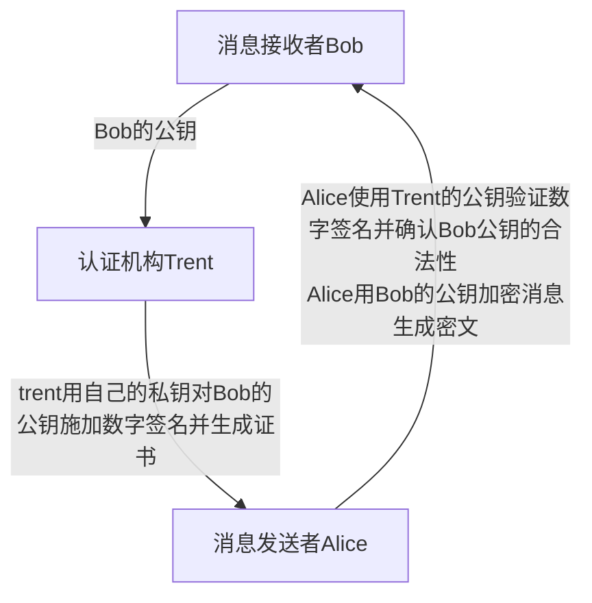

# 文件系统

## 目录结构

- **/bin** #
  bin 是 Binaries (二进制文件) 的缩写, 这个目录存放着最经常使用的命令。

- **/boot #**
  这里存放的是启动 Linux 时使用的一些核心文件，包括一些连接文件以及镜像文件。

- **/dev #**
  dev 是 Device(设备) 的缩写, 该目录下存放的是 Linux 的外部设备，在 Linux 中访问设备的方式和访问文件的方式是相同的。

- **/etc #**
  etc 是 Etcetera(等等) 的缩写,这个目录用来存放所有的系统管理所需要的配置文件和子目录。

- **/home** #
  用户的主目录，在 Linux 中，每个用户都有一个自己的目录，一般该目录名是以用户的账号命名的，如上图中的 alice、bob 和 eve。

- **/lib** #
  lib 是 Library(库) 的缩写这个目录里存放着系统最基本的动态连接共享库，其作用类似于 Windows 里的 DLL 文件。几乎所有的应用程序都需要用到这些共享库。

- **/lost+found** #
  这个目录一般情况下是空的，当系统非法关机后，这里就存放了一些文件。

- **/media** #
  linux 系统会自动识别一些设备，例如 U 盘、光驱等等，当识别后，Linux 会把识别的设备挂载到这个目录下。

- **/mnt** #
  系统提供该目录是为了让用户临时挂载别的文件系统的，我们可以将光驱挂载在 /mnt/ 上，然后进入该目录就可以查看光驱里的内容了。

- **/opt** #
  opt 是 optional(可选) 的缩写，这是给主机额外安装软件所摆放的目录。比如你安装一个 ORACLE 数据库则就可以放到这个目录下。默认是空的。

- **/proc** #
  proc 是 Processes(进程) 的缩写，/proc 是一种伪文件系统（也即虚拟文件系统），存储的是当前内核运行状态的一系列特殊文件，这个目录是一个虚拟的目录，它是系统内存的映射，我们可以通过直接访问这个目录来获取系统信息。
  这个目录的内容不在硬盘上而是在内存里，我们也可以直接修改里面的某些文件，比如可以通过下面的命令来屏蔽主机的 ping 命令，使别人无法 ping 你的机器 #

  ```sh
  echo 1 > /proc/sys/net/ipv4/icmp_echo_ignore_all
  ```

- **/root** #
  该目录为系统管理员，也称作超级权限者的用户主目录。

- **/sbin** #
  s 就是 Super User 的意思，是 Superuser Binaries (超级用户的二进制文件) 的缩写，这里存放的是系统管理员使用的系统管理程序。

- **/selinux** #
  这个目录是 Redhat/CentOS 所特有的目录，Selinux 是一个安全机制，类似于 windows 的防火墙，但是这套机制比较复杂，这个目录就是存放 selinux 相关的文件的。

- **/srv** #
  该目录存放一些服务启动之后需要提取的数据。

- **/sys** #

  这是 Linux2.6 内核的一个很大的变化。该目录下安装了 2.6 内核中新出现的一个文件系统 sysfs 。

  sysfs 文件系统集成了下面 3 种文件系统的信息 #针对进程信息的 proc 文件系统、针对设备的 devfs 文件系统以及针对伪终端的 devpts 文件系统。

  该文件系统是内核设备树的一个直观反映。

  当一个内核对象被创建的时候，对应的文件和目录也在内核对象子系统中被创建。

- **/tmp** #
  tmp 是 temporary(临时) 的缩写这个目录是用来存放一些临时文件的。

- **/usr** #
  usr 是 unix shared resources(共享资源) 的缩写，这是一个非常重要的目录，用户的很多应用程序和文件都放在这个目录下，类似于 windows 下的 program files 目录。

- **/usr/bin #**
  系统用户使用的应用程序。

- **/usr/sbin #**
  超级用户使用的比较高级的管理程序和系统守护程序。

- **/usr/src #**
  内核源代码默认的放置目录。

- **/var** #
  var 是 variable(变量) 的缩写，这个目录中存放着在不断扩充着的东西，我们习惯将那些经常被修改的目录放在这个目录下。包括各种日志文件。

- **/run** #
  是一个临时文件系统，存储系统启动以来的信息。当系统重启时，这个目录下的文件应该被删掉或清除。如果你的系统上有 /var/run 目录，应该让它指向 run。

## 文件处理

### pwd

显示当前目录

```
pwd
```

### cd

前往目录 home

```
cd  {dir}
```

### ls

查看目录中的文件

```sh
ls [option] [filename]

 -a,   --all   #不隐藏任何以“.” 字符开始的项目。
 -A,   --almost -all   #列出除了“ . ”及 “.. ”以外的任何项目。
  --author   #印出每个文件著作者。
 -b,   --escape   #以八进制溢出序列表示不可打印的字符。
  --block -size=大小   #块以指定的字节为单位。
 -B,   --ignore -backups   #不列出任何以 ~ 字符结束的项目。
 -f   #不进行排序， -aU参数生效， -lst参数失效。
 -F,   --classify   #加上文件类型的指示符号 (*/=@| 其中一个)。
 -g   #like  -l, but do not list owner。
 -G,   --no -group   #inhibit display of group information。
 -i,   --inode   #列出每个文件的inode号。
 -I,   --ignore=样式   #不印出任何符合Shell万用字符的项目。
 -k   #即  --block -size=1K。
 -l   #使用较长格式列出信息。
 -L,   --dereference   #当显示符号链接的文件信息时，显示符号链接所指示的对象，而并非符号链接本身的信息。
 -m   #所有项目以逗号分隔，并填满整行行宽。
 -n,   --numeric -uid -gid   #类似 -l，但列出UID及GID号。
 -N,   --literal   #列出未经处理的项目名称，例如不特别处理控制字符。
 -p,   --file -type   #加上文件类型的指示符号 (/=@| 其中一个)。
 -Q,   --quote -name   #将项目名称括上双引号。
 -r,   --reverse   #依相反次序排列。
 -R,   --recursive   #同时列出所有子目录层。
 -s,   --size   #以块大小为序。

 # 使用ls命令时会有几种不同的颜色，其中
 	蓝色表示是目录，
 	绿色表示是可执行文件，
 	红色表示是压缩文件，
 	浅蓝色表示是链接文件，
 	加粗的黑色表示符号链接，
 	灰色表示是其它格式文件。
```

在 Linux 中第一个字符代表这个文件是目录、文件或链接文件等等。

- 当为 **d** 则是目录
- 当为 **-** 则是文件；
- 若是 **l** 则表示为链接文档(link file)；
- 若是 **b** 则表示为装置文件里面的可供储存的接口设备(可随机存取装置)；
- 若是 **c** 则表示为装置文件里面的串行端口设备，例如键盘、鼠标(一次性读取装置)。

### mkdir

```sh
# 新建目录
mkdir {dir}

-m {权限} ,--mode {权限}# 用于对新建目录设置存取权限
-p,--parents # 需要时创建上层文件夹(或目录)，如果文件夹(或目录)已经存在，则不视为错误。
-v,--verbose #每次创建新目录都显示信息。
--version
```

### rmdir

```
删除空文件夹
```

### chown

```sh
修改所属用户与组
chown  {user}  {dir}
chown [选项]用户或组文件

--dereference          #受影响的是符号链接所指示的对象，而非符号链接本身。
-h, --no-dereference          #会影响符号链接本身，而非符号链接所指示的目的地(当系统支持更改符号链接的所有者，此选项才有效)。
--from=目前所有者:目前组只当每个文件的所有者和组符合选项所指定的，才会更改所有者和组。其中一个可以省略，这已省略的属性就不需要符合原有的属性。
-f, --silent, --quiet          #去除大部分的错误信息。
-R, --recursive          #递归处理所有的文件及子目录。
-v, --verbose          #处理任何文件都会显示信息。
```

chown 将指定文件的拥有者改为指定的用户或组，用户可以是用户名或用户 ID；组可以是组名或组 ID；文件是以空格分开的要改变权限的文件列表，支持通配符。

系统管理员经常使用 chown 命令，在将文件拷贝到另一个用户的目录下以后，让用户拥有使用该文件的权限。

```sh
应用实例
1.把文件shiyan.c的所有者改为wan
$ chown wan shiyan.c
2.把目录/hi及其下的所有文件和子目录的属主改成wan，属组改成users。
$ chown -R wan.users /hi
```

### chmod

```sh
# 更改目的的读写权限
chmod {权限}   {file/dir}
chmod [who] [+ | - | =] [mode] 文件名
who:
	u          #表示用户，即文件或目录的所有者。
	g          #表示同组用户，即与文件属主有相同组ID的所有用户。
	o          #表示其它用户。
	a          #表示所有用户，它是系统默认值。
# 权限   #rwx
# r(Read，读取)   #对文件而言，具有读取文件内容的权限；对目录来说，具有浏览目 录的权限。
# w(Write,写入)   #对文件而言，具有新增、修改文件内容的权限；对目录来说，具有删除、移动目录内文件的权限。
# x(eXecute，执行)   #对文件而言，具有执行文件的权限；对目录了来说该用户具有进入目录的权限。
	r: 对应数值4
	w: 对应数值2
	x   #对应数值1
	-   #对应数值0
9为二进制数   #rwx rwx rwx  自己 同组用户 其他用户
```

### mv

```sh
mv[options] {old} {new}

-i #交互方式操作。如果mv操作将导致对已存在的目标文件的覆盖，此时系统询问是否重写，要求用户回答“y”或“n”，这样可以避免误覆盖文件。
-f #禁止交互操作。mv操作要覆盖某个已有的目标文件时不给任何指示，指定此参数后i参数将不再起作用。


# 修改文件名
```

### rm

```sh
rm [option] {file}

-i 删除前逐一询问确认。
-f 即使原档案属性设为唯读，亦直接删除，无需逐一确认。
-r 将目录及以下之档案亦逐一删除。


# 注   #在linux没有回收站，在试用rm命令的时候，一定要小心些，删除之后就无法再恢复了。

# 删除目录及以下所有文件
rm -rf 目录名字
```

### file

```sh
#通过探测文件内容判断文件类型
file [options] 文件名

-v   #在标准输出后显示版本信息，并且退出。
-z   #探测压缩过的文件类型。
-L   #允许符合连接。
-f name   #从文件namefile中读取要分析的文件名列表。

#file命令不能探测包括图形、音频、视频等多媒体文件类型。
#file能识别的文件类型有目录、Shell脚本、英文文本、二进制可执行文件、C语言源文件、文本文件、DOS的可执行文件。
```

### diff

```sh
diff命令用于两个文件之间的比较，并指出两者的不同，它的使用权限是所有用户。

格式
diff [options] 源文件目标文件
[options]主要参数
-a     #将所有文件当作文本文件来处理。
-b     #忽略空格造成的不同。
-B     #忽略空行造成的不同。
-c     #使用纲要输出格式。
-H     #利用试探法加速对大文件的搜索。
-I     #忽略大小写的变化。
-n --rcs     #输出RCS格式。
```

### cmp

```sh
cmp（“compare”的缩写）命令用来简要指出两个文件是否存在差异，它的使用权限是所有用户。
cmp[options] 文件名

-l: 将字节以十进制的方式输出，并方便将两个文件中不同的以八进制的方式输出。
```

## 密码文件

密码(password)文件是系统的主要文件之一。
用户信息一般保存在 /etc/passwd

```sh
# 查看密码文件
$ cat /etc/passwd
# 修改密码
$ passwd
```

密码文件中的每一行是一个用户登录名的所有有关信息的记录。
每一条记录用冒号:分隔成 7 个字段(field)，具体格式如下

```
name:password:uid:gid:comment:home:shell

自左至右，7个字段的用途如下:
name  		此字段包含用户登录名。这是用户登录时必须正确地敲入的名称。
password  	这是用户的密码。该密码显示已经过加密，如果为空则表示该用户不需要密码。
uid   		这是系统用来分配用户识别号的字段。一旦用户登录后，系统将用uid而不是用登录名来查找用户。
gid   		有时候，一批用户需要在一个组内共同完成同一个项目。在这种情况下，允许他们共同访问一组特定的目录和文件是很有用的。这可以在这个字段内给小组的全体成员分配同一个组识别号(gid)来实现。
comment  	这是注释字段。常用来保存用户的真实姓名和个人细节。
home   		这一字段用来保存用户的起始目录的绝对路径名。当用户登录时，系统从这一字段取得用户起始目录路径名。
shell   	如果这一用户登录成功，要执行的命令的绝对路径名就放在这一字段。这可以是任何命令。但是对普通用户帐号讲，这将是shell的路径名。如果此字段没有给出路径名，它的默认值是/bin/sh。
```

## 搜索

### find

```sh
find {path} [option] [expression]

[option] :
-depth #使用深度级别的查找过程方式，在某层指定目录中优先查找文件内容。
-maxdepth {levels} # 表示至多查找到开始目录的第level层子目录。level是一个非负数，如果level是0的话表示仅在当前目录中查找。
-mindepth levels #表示至少查找到开始目录的第level层子目录。
-mount #不在其它文件系统（如Msdos、Vfat等）的目录和文件中查找。
-version  #打印版本。

[expression]:
-name {filename:可以为正则表达式}  #支持统配符*和?。
-atime n #搜索在过去n天读取过的文件。
-ctime n #搜索在过去n天修改过的文件。
-group grpoupname #搜索所有组为grpoupname的文件。
-user 用户名 #搜索所有文件属主为用户名（ID或名称）的文件。
-size n #搜索文件大小是n个block的文件。
-print #输出搜索结果，并且打印。
```

### whereis

```
whereis {file/dir}
```


## 复制

### cp

```sh
cp [选项]  源文件或目录   目的文件或目录

-b 同名,备分原来的文件
-a   #此参数的效果和同时指定"-dpR"参数相同；
-d   #当复制符号连接时，把目标文件或目录也建立为符号连接，并指向与源文件或目录连接的原始文件或目录；
-f   #强行复制文件或目录，不论目标文件或目录是否已存在；
-i   #对源文件建立硬连接，而非复制文件；
-p   #覆盖既有文件之前先询问用户；
-l   #保留源文件或目录的属性；
-R/r   #递归处理，将指定目录下的所有文件与子目录一并处理；
-s   #对源文件建立符号连接，而非复制文件；
-u   #使用这项参数后只会在源文件的更改时间较目标文件更新时或是名称相互对应的目标文件并不存在时，才复制文件；
-S   #在备份文件时，用指定的后缀“SUFFIX”代替文件的默认后缀；
-b   #覆盖已存在的文件目标前将目标文件备份；
-v   #详细显示命令执行的操作。

# 如果把一个文件复制到一个目标文件中，而目标文件已经存在，那么，该目标文件的内容将被破坏
cp ../mary/homework/assign .
将文件file复制到目录`/usr/men/tmp`下，并改名为file1
cp file /usr/men/tmp/file1

默认cp命令是有别名(alias cp='cp -i')的,无法强制覆盖,即使你用 -f 参数也无法强制覆盖文件。
可以使用\cp 执行cp命令时不走alias

\cp -f
\cp -f -b -S _bak  test.sh ./temp # 复制test.sh到temp,重名备份,后缀 _bak
```

### dd

```sh
#用来复制文件，并根据参数将数据转换和格式化。
#dd命令常常用来制作Linux启动盘。
dd [options]
[opitions]主要参数
bs=字节 #强迫 ibs=及obs=。
cbs=字节 #每次转换指定的。
conv=关键字 #根据以逗号分隔的关键字表示的方式来转换文件。
count=块数目 #只复制指定的输入数据。
ibs=字节 #每次读取指定的。
if=文件 #读取内容，而非标准输入的数据。
obs=字节 #每次写入指定的。
of=文件 #将数据写入，而不在标准输出显示。
seek=块数目 #先略过以obs为单位的指定的输出数据。
skip=块数目 #先略过以ibs为单位的指定的输入数据。
```

### scp

```
scp [-r] 本地文件 root@ip:path
```

## 打印

### lp

```sh
lp [-c][-d][-m][-number][-title][-p]
主要参数
-c          #先拷贝文件再打印。
-d          #打印队列文件。
-m          #打印结束后发送电子邮件到用户。
-number          #打印份数。
-title          #打印标题。
-p          #设定打印的优先级别，最高为100。

应用实例
（1）使用lp命令打印多个文件
# lp 2 3 4
request id is 11 (3 file(s))
其中2、3、4分别是文件名；“request id is 11 (3 file(s)) ”表示这是第11个打印命令，依次打印这三个文件。
（2）设定打印优先级别
# lp lp -d LaserJet -p 90 /etc/aliases
通过添加“-p 90”，规定了打印作业的优先级为90。它将在优先级低于90的打印作业之前打印，包括没有设置优先级的作业，缺省优先级是50
```

## 文件挂载

### mount

```sh
mount  -a [ -fv] [ -t vfstype] [ -n] [ -rw] [ -F] device dir
主要参数
 -h #显示辅助信息。
 -v #显示信息，通常和 -f用来除错。
 -a #将/etc/fstab中定义的所有文件系统挂上。
 -F #这个命令通常和 -a一起使用，它会为每一个mount的动作产生一个行程负责执行。在系统需要挂上大量NFS文件系统时可以加快加载的速度。
 -f #通常用于除错。它会使mount不执行实际挂上的动作，而是模拟整个挂上的过程，通常会和 -v一起使用。
 -t vfstype #显示被加载文件系统的类型。
 -n #一般而言，mount挂上后会在/etc/mtab中写入一笔资料，在系统中没有可写入文件系统的情况下，可以用这个选项取消这个动作。
```

Linux 可以识别的文件系统

◆ Windows 95/98 常用的 FAT 32 文件系统 #vfat ；
◆ Win NT/2000 的文件系统 #ntfs ；
◆ OS/2 用的文件系统 #hpfs；
◆ Linux 用的文件系统 #ext2、ext3；
◆ CD-ROM 光盘用的文件系统 #iso9660。
虽然 vfat 是指 FAT 32 系统，但事实上它也兼容 FAT 16 的文件系统类型。

### umount

umount 命令的作用是卸载一个文件系统，它的使用权限是超级用户或/etc/fstab 中允许的使用者。

```
unmount  -a [ -fFnrsvw] [ -t vfstype] [ -n] [ -rw] [ -F] device dir
```

## 链接

```sh
ln [options] 源文件 [链接名]

-f : 链结时先将与 dist 同档名的档案删除
-d : 允许系统管理者硬链结自己的目录
-i : 在删除与 dist 同档名的档案时先进行询问
-n : 在进行软连结时，将 dist 视为一般的档案
-s : 进行软链结(symbolic link)
-v : 在连结之前显示其档名
-b : 将在链结时会被覆写或删除的档案进行备份
-S SUFFIX : 将备份的档案都加上 SUFFIX 的字尾
-V METHOD : 指定备份的方式
--help : 显示辅助说明
--version : 显示版本
　　
#软链接
	软链接实质上保存的是链接文件的路径，当访问软链接时，自动将访问路径替换为链接文件的路径。`ls -li `时，文件类型为`l`
删除软链接所连接的的文件，再次访问软链接，则无法访问；恢复原文件，则可以继续访问。
软链接的创建   #`ln -s 源文件 目标文件`
## 硬链接
	硬链接实质上保存的是原文件在硬盘上的指针，与原文件是一个文件，当改变其中之一，则都将改变；但删除掉原文件，不删除硬链接，则文件依旧可以访问。
硬链接的创建   #`ln  源文件 目标文件`
```

# 用户管理

## su

su 的作用是变更为其它使用者的身份，超级用户除外，需要键入该使用者的密码。

```sh
su [选项]... [-] [USER [ARG]...]
主要参数
-f ， --fast          #不必读启动文件（如 csh.cshrc等），仅用于csh或tcsh两种Shell。
-l ， --login          #加了这个参数之后，就好像是重新登陆为该使用者一样，大部分环境变量（例如HOME、SHELL和USER等）都是以该使用者（USER）为主，并且工作目录也会改变。如果没有指定USER，缺省情况是root。
-m， -p ，--preserve-environment          #执行su时不改变环境变数。
-c command          #变更账号为USER的使用者，并执行指令（command）后再变回原来使用者。
USER          #欲变更的使用者账号，
ARG: #传入新的Shell参数。


# 切换用户
su {user}
# 切换为root
su -


useradd tomx -g docker
passwd tomx 设置密码
su tomx 切换用户
#将tomx添加到docker组  /etc/group
sudo usermod -aG docker $USER && newgrp docker
```

## useradd

useradd 命令用来建立用户帐号和创建用户的起始目录，使用权限是超级用户。

```sh
useradd [-d home] [-s shell] [-c comment] [-m [-k template]] [-f inactive] [-e expire ] [-p passwd] [-r] name

-c          #加上备注文字，备注文字保存在passwd的备注栏中。　
-d          #指定用户登入时的启始目录。
-D          #变更预设值。
-e          #指定账号的有效期限，缺省表示永久有效。
-f          #指定在密码过期后多少天即关闭该账号。
-g          #指定用户所属的群组。
-G          #指定用户所属的附加群组。
-m          #自动建立用户的登入目录。
-M          #不要自动建立用户的登入目录。
-n          #取消建立以用户名称为名的群组。
-r          #建立系统账号。
-s          #指定用户登入后所使用的shell。
-u          #指定用户ID号。

	useradd可用来建立用户账号，它和adduser命令是相同的。

账号建好之后，再用passwd设定账号的密码。

使用useradd命令所建立的账号，实际上是保存在/etc/passwd文本文件中。
```

## groupadd

```sh
groupadd [-g gid] [-o]] [-r] [-f] groupname
主要参数
-g gid          #指定组ID号。
-o          #允许组ID号，不必惟一。
-r          #加入组ID号，低于499系统账号。
-f          #加入已经有的组时，发展程序退出。
```

## passwd

passwd 命令原来修改账户的登陆密码，使用权限是所有用户。

```sh
passwd [选项]账户名称
主要参数
-l          #锁定已经命名的账户名称，只有具备超级用户权限的使用者方可使用。
-u          #解开账户锁定状态，只有具备超级用户权限的使用者方可使用。
-x, --maximum=DAYS          #最大密码使用时间（天），只有具备超级用户权限的使用者方可使用。
-n, --minimum=DAYS          #最小密码使用时间（天），只有具备超级用户权限的使用者方可使用。
-d          #删除使用者的密码,只有具备超级用户权限的使用者方可使用。
-S          #检查指定使用者的密码认证种类,只有具备超级用户权限的使用者方可使用。
```

## umask

umask 设置用户文件和目录的文件创建缺省屏蔽值，若将此命令放入 profile 文件，就可控制该用户后续所建文件的存取许可。

它告诉系统在创建文件时不给谁存取许可。使用权限是所有用户。

```
umask [-p] [-S] [mode]
参数
-S          #确定当前的umask设置。
-p          #修改umask设置。
[mode]          #修改数值。
```

传统 Unix 的 umask 值是 022，这样就可以防止同属于该组的其它用户及别的组的用户修改该用户的文件。

既然每个用户都拥有并属于一个自己的私有组，那么这种“组保护模式”就不在需要了。

严密的权限设定构成了 Linux 安全的基础，在权限上犯错误是致命的。

需要注意的是，umask 命令用来设置进程所创建的文件的读写权限，最保险的值是 0077，即关闭创建文件的进程以外的所有进程的读写权限，表示为-rw-------。

在～/.bash_profile 中，加上一行命令 umask 0077 可以保证每次启动 Shell 后,进程的 umask 权限都可以被正确设定。

```sh
$ umask -S
u=rwx,g=rx,o=rx

$ umask -p 177

$ umask -S
u=rw,g=,o=
```

上述 5 行命令，首先显示当前状态，然后把 umask 值改为 177，结果只有文件所有者具有读写文件的权限，其它用户不能访问该文件。这显然是一种非常安全的设置。

## chgrp

作用

chgrp 表示修改一个或多个文件或目录所属的组。使用权限是超级用户。

格式

```sh
chgrp [选项]...组文件...
或
chgrp [选项]... --reference=参考文件文件...
将每个的所属组设定为。
参数
-c, --changes           #像 --verbose，但只在有更改时才显示结果。
--dereference          #会影响符号链接所指示的对象，而非符号链接本身。
-h, --no-dereference          #会影响符号链接本身，而非符号链接所指示的目的地(当系统支持更改符号链接的所有者，此选项才有效)。
-f, --silent, --quiet          #去除大部分的错误信息。
--reference=参考文件          #使用的所属组，而非指定的。
-R, --recursive          #递归处理所有的文件及子目录。
-v, --verbose          #处理任何文件都会显示信息。
```

应用说明

该命令改变指定指定文件所属的用户组。

其中 group 可以是用户组 ID，也可以是/etc/group 文件中用户组的组名。

文件名是以空格分开的要改变属组的文件列表，支持通配符。

如果用户不是该文件的属主或超级用户，则不能改变该文件的组。

应用实例

改变/opt/local /book/及其子目录下的所有文件的属组为 book，命令如下 #

```sh
$ chgrp - R book /opt/local /book
```

## sudo

sudo 是一种以限制配置文件中的命令为基础，在有限时间内给用户使用，并且记录到日志中的命令，权限是所有用户。

```
sudo [-bhHpV] [-s ] [-u ] [指令]
sudo [-klv]
主要参数
-b          #在后台执行命令。
-h          #显示帮助。
-H          #将HOME环境变量设为新身份的HOME环境变量。
-k          #结束密码的有效期，即下次将需要输入密码。
-l          #列出当前用户可以使用的命令。
-p          #改变询问密码的提示符号。
-s           #执行指定的Shell。
-u           #以指定的用户为新身份，不使用时默认为root。
-v          #延长密码有效期5分钟。
```

sudo 命令的配置在/etc/sudoers 文件中。

当用户使用 sudo 时，需要输入口令以验证使用者身份。

随后的一段时间内可以使用定义好的命令，当使用配置文件中没有的命令时，将会有报警的记录。

sudo 是系统管理员用来允许某些用户以 root 身份运行部分/全部系统命令的程序。

一个明显的用途是增强了站点的安全性，如果需要每天以超级用户的身份做一些日常工作，经常执行一些固定的几个只有超级用户身份才能执行的命令，那么用 sudo 是非常适合的。

## who

作用

who 显示系统中有哪些用户登陆系统，显示的资料包含了使用者 ID、使用的登陆终端、上线时间、呆滞时间、CPU 占用，以及做了些什么。使用权限为所有用户。

格式

```sh
who - [husfV] [user]
主要参数
-h          #不要显示标题列。
-u          #不要显示使用者的动作/工作。
-s          #使用简短的格式来显示。
-f          #不要显示使用者的上线位置。
-V          #显示程序版本。
```

说明

该命令主要用于查看当前在线上的用户情况。

如果用户想和其它用户建立即时通信，比如使用 talk 命令，那么首先要确定的就是该用户确实在线上,不然 talk 进程就无法建立起来。

又如，系统管理员希望监视每个登录的用户此时此刻的所作所为，也要使用 who 命令。who 命令应用起来非常简单，可以比较准确地掌握用户的情况,所以使用非常广泛

# 系统

## 配置

```sh
#系统版本号
cat /etc/*-release

#cpu信息
cat /proc/cpuinfo
```

## 登陆

### login

```sh
login [name][ -p ][ -h 主机名称]

主要参数
-p:通知login保持现在的环境参数。
-h:用来向远程登录的之间传输用户名。

	虚拟控制台的切换可以通过按下Alt键和一个功能键来实现，通常使用F1-F6 。
	例如，用户登录后，按一下“Alt+F2”键，用户就可以看到上面出现的“login:”提示符，说明用户看到了第二个虚拟控制台。然后只需按“Alt+F1”键，就可以回到第一个虚拟控制台。
	一个新安装的Linux系统允许用户使用“Alt+F1”到“Alt+F6”键来访问前六个虚拟控制台。
	虚拟控制台最有用的是，当一个程序出错造成系统死锁时，可以切换到其它虚拟控制台工作，关闭这个程序。
```

### ssh

```sh
# 开启ssh服务
apt install openssh-server
vi /etc/ssh/sshd_config
 LoginGraceTime 2m
 PermitRootLogin yes
 StrictModes yes
 #MaxAuthTries 6
 #MaxSessions 10
# 重启
service sshd restart
# 连接
ssh {user}@{ip} [-p 22]
```

## 关机

### shutdown

```sh
shutdown命令的作用是关闭计算机，它的使用权限是超级用户
shutdown [-h][-i][-k][-m][-t]
重要参数
-t   #在改变到其它运行级别之前，告诉init程序多久以后关机。
-k   #并不真正关机，只是送警告信号给每位登录者。
-h   #关机后关闭电源。
-c   #cancel current process取消目前正在执行的关机程序。所以这个选项当然没有时间参数，但是可以输入一个用来解释的讯息，而这信息将会送到每位使用者。
-F   #在重启计算机时强迫fsck。
-time   #设定关机前的时间。
-m: 将系统改为单用户模式。
-i   #关机时显示系统信息。
```

### halt

```sh
halt命令的作用是关闭系统，它的使用权限是超级用户。
halt [-n] [-w] [-d] [-f] [-i] [-p]
主要参数说明
-n   #防止sync系统调用，它用在用fsck修补根分区之后，以阻止内核用老版本的超级块覆盖修补过的超级块。
-w   #并不是真正的重启或关机,只是写wtmp（/var/log/wtmp）纪录。
-f   #没有调用shutdown，而强制关机或重启。
-i   #关机（或重启）前，关掉所有的网络接口。
-f   #强迫关机，不呼叫shutdown这个指令。
-p: 当关机的时候顺便做关闭电源的动作。
-d   #关闭系统，但不留下纪录。

# halt就是调用shutdown  -h。
```

### reboot

```
reboot [ -n] [ -w] [ -d] [ -f] [ -i]
主要参数
 -n: 在重开机前不做将记忆体资料写回硬盘的动作。
 -w: 并不会真的重开机，只是把记录写到/var/log/wtmp文件里。
 -d: 不把记录写到/var/log/wtmp文件里（ -n这个参数包含了 -d）。
 -i: 在重开机之前先把所有与网络相关的装置停止。
```


## shell

### chsh

```
chsh命令的作用是更改使用者shell设定，它的使用权限是所有使用者。
格式
chsh [  -s ] [  -list] [  - -help ] [  -v ] [ username ]

主要参数
 -l   #显示系统所有Shell类型。
 -v   #显示Shell版本号。
```

### exit

退出系统，它的使用权限是所有用户。

### last

```sh
last命令的作用是显示近期用户或终端的登录情况，它的使用权限是所有用户。通过last命令查看该程序的log，管理员可以获知谁曾经或企图连接系统。

last[—n][ -f file][ -t tty] [—h 节点][ -I —IP][—1][ -y][1D]
主要参数
 -n   #指定输出记录的条数。
 -f file   #指定用文件file作为查询用的log文件。
 -t tty   #只显示指定的虚拟控制台上登录情况。
 -h 节点   #只显示指定的节点上的登录情况。
 -i IP   #只显示指定的IP上登录的情况。
 -1   #用IP来显示远端地址。
 -y   #显示记录的年、月、日。
 -ID   #知道查询的用户名。
 -x   #显示系统关闭、用户登录和退出的历史。
```

## 磁盘占用

### df

​ df 命令被广泛地用来生成文件系统的使用统计数据，它能显示系统中所有的文件系统的信息，包括总容量、可用的空闲空间、目前的安装点等。
​ 超级权限用户使用 df 命令时会发现这样的情况 #某个分区的容量超过了 100％。

​ 这是因为 Linux 系统为超级用户保留了 10％的空间，由其单独支配。

​ 也就是说，对于超级用户而言，他所见到的硬盘容量将是 110％。

​ 这样的安排对于系统管理而言是有好处的，当硬盘被使用的容量接近 100％时系统管理员还可以正常工作。

```sh
来检查文件系统的磁盘空间占用情况
df [options]

 -s     #对每个Names参数只给出占用的数据块总数。
 -a     #递归地显示指定目录中各文件及子目录中各文件占用的数据块数。若既不指定 -s，也不指定 -a，则只显示Names中的每一个目录及其中的各子目录所占的磁盘块数。
 -k     #以1024字节为单位列出磁盘空间使用情况。
 -x     #跳过在不同文件系统上的目录不予统计。
 -l     #计算所有的文件大小，对硬链接文件则计算多次。
 -i     #显示inode信息而非块使用量。
 -h     #以容易理解的格式印出文件系统大小，例如136KB、254MB、21GB。
 -P     #使用POSIX输出格式。
 -T     #显示文件系统类型。
```

### top

显示执行中的程序进程

```sh
top [-] [d delay] [q] [c] [S] [s] [n]
主要参数
d          #指定更新的间隔，以秒计算。
q          #没有任何延迟的更新。如果使用者有超级用户，则top命令将会以最高的优先序执行。
c          #显示进程完整的路径与名称。
S          #累积模式，会将己完成或消失的子行程的CPU时间累积起来。
s          #安全模式。
i          #不显示任何闲置(Idle)或无用(Zombie)的行程。
n          #显示更新的次数，完成后将会退出top。
```

​ top 命令的显示**第一行**表示的项目依次为当前时间、系统启动时间、当前系统登录用户数目、平均负载。

​ **第二行**显示的是所有启动的进程、目前运行的、挂起(Sleeping)的和无用(Zombie)的进程。

​ **第三行**显示的是目前 CPU 的使用情况，包括系统占用的比例、用户使用比例、闲置(Idle)比例。

​ **第四行**显示物理内存的使用情况，包括总的可以使用的内存、已用内存、空闲内存、缓冲区占用的内存。

​ **第五行**显示交换分区使用情况，包括总的交换分区、使用的、空闲的和用于高速缓存的大小。

​ **第六行**显示的项目最多，下面列出了详细解释。

```
PID（Process ID）          #进程标示号。
USER          #进程所有者的用户名。
PR          #进程的优先级别。
NI          #进程的优先级别数值。
VIRT          #进程占用的虚拟内存值。
RES          #进程占用的物理内存值。
SHR          #进程使用的共享内存值。
S          #进程的状态，其中S表示休眠，R表示正在运行，Z表示僵死状态，N表示该进程优先值是负数。
%CPU          #该进程占用的CPU使用率。
%MEM          #该进程占用的物理内存和总内存的百分比。
TIME＋          #该进程启动后占用的总的CPU时间。
Command          #进程启动的启动命令名称，如果这一行显示不下，进程会有一个完整的命令行。
```

top 命令使用过程中，还可以使用一些交互的命令来完成其它参数的功能。这些命令是通过快捷键启动的。

```sh
          #立刻刷新。
P          #根据CPU使用大小进行排序。
T          #根据时间、累计时间排序。
q          #退出top命令。
m          #切换显示内存信息。
t          #切换显示进程和CPU状态信息。
c          #切换显示命令名称和完整命令行。
M          #根据使用内存大小进行排序。
W          #将当前设置写入~/.toprc文件中。这是写top配置文件的推荐方法。
U: 在终端中按“U”键，然后输入用户名，系统就会切换为指定用户的进程运行界面。
q    #退出 top
```

可以看到，top 命令是一个功能十分强大的监控系统的工具，对于系统管理员而言尤其重要。但是，它的缺点是会消耗很多系统资源。

### free

​ free 命令是用来查看内存使用情况的主要命令。

​ 和 top 命令相比，它的优点是使用简单，并且只占用很少的系统资源。

​ 通过-s 参数可以使用 free 命令不间断地监视有多少内存在使用，这样可以把它当作一个方便实时监控器。

```sh
free [-b|-k|-m] [-o] [-s delay] [-t] [-V]
主要参数
-b -k -m -h          #分别以字节（B,KB,MB,GB）为单位显示内存使用情况。
-s delay          #显示每隔多少秒数来显示一次内存使用情况。
-t          #显示内存总和列。
-o          #不显示缓冲区调节列。

结果显示信息：
total：总共的内存大小
used：已经被使用的内存
free：空闲的内存
shared：共享的内存大小
buffers：用来做缓冲的内存
cached：用来做cache的内存
```

### quota

​ quota 命令用来显示磁盘使用情况和限制情况,使用权限超级用户

```
quota [-g][-u][-v][-p]用户名组名
参数
-g          #显示用户所在组的磁盘使用限制。
-u          #显示用户的磁盘使用限制。
-v          #显示没有分配空间的文件系统的分配情况。
-p          #显示简化信息。
```

## 时间

### date

获取当前时间

```shell
$(date) # 2018年 09月 30日 星期日 15:55:15 CST
$(date "+%Y%m%d%H%M%S") # 20180930155515
$(date "+%Y-%m-%d %H:%M:%S") # 2018-09-30 15:55:15
$(date "+%Y.%m.%d") #2018.09.30
```

### at

```sh
at命令用来在指定时刻执行指定的命令序列。

at [-v [-q x] [-f file] [-m] time
主要参数
-V          #显示标准错误输出。
-q          #许多队列输出。
-f          #从文件中读取作业。
-m          #执行完作业后发送电子邮件到用户。
time          #设定作业执行的时间。

time格式有严格的要求，由小时、分钟、日期和时间的偏移量组成，其中日期的格式为MM.DD.YY，MM是分钟，DD是日期，YY是指年份。偏移量的格式为时间＋偏移量，单位是minutes、hours和days。

# at -f data 15:30 +2 days
上面命令表示让系统在两天后的15          #30执行文件data中指明的作业。
```

### crontab

​ 使用 crontab 命令可以修改 crontab 配置文件，然后该配置由 cron 公用程序在适当的时间执行，该命令使用权限是所有用户。

```
crontab [-u user ]文件
crontab [ -u user ] {-l |-r | -e }
主要参数
-e          #执行文字编辑器来设定时程表，内定的文字编辑器是vi。
-r          #删除目前的时程表。
-l          #列出目前的时程表。

crontab文件的格式为“M H D m d cmd”。其中，M代表分钟（0～59），H代表小时（0～23），D代表天（1～31），m代表月（1～12），d代表一星期内的天（0～6，0为星期天）。cmd表示要运行的程序，它被送入sh执行，这个Shell只有USER、HOME、SHELL三个环境变量。
```

## 环境变量

​ 环境变量包括系统级和用户级，**系统级的环境变量**是每个登录到系统的用户都要读取的系统变量，而**用户级的环境变量**则是该用户使用系统时加载的环境变量。
所以管理环境变量的文件也分为系统级和用户级的.

1.系统级：

```
（1）/etc/environment: 是系统在登录时读取的第一个文件，用于为所有进程设置环境变量。系统使用此文件时并不是执行此文件中的命令，而是根据KEY=VALUE模式的代码，对KEY赋值以VALUE，因此文件中如果要定义PATH环境变量，只需加入一行形如PATH=$PATH:/xxx/bin的代码即可。
（2）/etc/profile：是系统登录时执行的第二个文件，可以用于设定针对全系统所有用户的环境变量。该文件一般是调用/etc/bash.bashrc文件。
/etc/bash.bashrc：系统级的bashrc文件，为每一个运行bash shell的用户执行此文件。此文件会在用户每次打开shell时执行一次。

注意：　/etc/environment是设置整个系统的环境，而/etc/profile是设置所有用户的环境，前者与登录用户无关，后者与登录用户有关。 这两个文件修改后一般都要重启系统才能生效。
```

2.用户级

```
（1）~/.profile: 是对应当前登录用户的profile文件，用于定制当前用户的个人工作环境。
每个用户都可使用该文件输入专用于自己使用的shell信息,当用户登录时,该文件仅仅执行一次!默认情况下,他设置一些环境变量,执行用户的.bashrc文件。这里是推荐放置个人设置的地方
（2）~/.bashrc: 是对应当前登录用户的bash初始化文件，当用户每次打开shell时，系统都会执行此文件一次。平时设置这个文件就可以了。
```

那么根据以上描述，这几个文件的执行先后顺序应当是：
/etc/enviroment –>/etc/profile –>~/.profile –>/etc/bash.bashrc–> ~/.bashrc

3.临时

```
可以直接在shell下用set或export命令设定环境变量。只能在当前shell脚本下可用.,切换到另一个终端就会失效。
```

采用 export 添加新的路径到环境变量 PATH 中

_#比如添加搜索路径/home/cc/path1 和/home/cc/path2 路径到 PATH 中,采用:来分隔,冒号左右不需要空格_

_#若需要将路径放在优先搜索位置，将$PATH 放在后面_

4.生效

```
source ~/.bashrc
source /etc/profile
```

```sh
export JAVA_HOME=/home/java_home/jdk1.8.0_311
export JRE_HOME=${JAVA_HOME}/jre
# export CLASSPATH=/usr/local/java/jre1.8.0_251//lib/rt.jar:/usr/local/java/jre1.8.0_251//lib/ext
export CLASSPATH=${JAVA_HOME}/lib:${JRE_HOME}/lib:$CLASSPATH
# export PATH=$PATH:$JRE_HOME/bin
export JAVA_PATH=${JAVA_HOME}/bin:${JRE_HOME}/bin
export PATH=$PATH:${JAVA_PATH}
export JAVA_OPTS='-Xms512m -Xmx4096m -XX:MaxPermSize=128m -XX:-UseGCOverheadLimit -XX:+UseConcMarkSweepGC'

export CATALINA_HOME=/home/java_ext/apache-tomcat-9.0.56
export MAVEN_HOME=/home/java_ext/apache-maven-3.8.4
export PATH=$PATH:$MAVEN_HOME/bin:$CATALINA_HOME/bin:$CATALINA_HOME/lib

```

## 操作日志

```sh
history # 显示在命令行输入的命令
```

# 网络操作

## dns 配置

最主要是 nameserver 关键字，如果没指定 nameserver 就找不到 DNS 服务器，其它关键字是可选的。
nameserver 表示解析域名时使用该地址指定的主机为域名服务器。其中域名服务器是按照文件中出现的顺序来查询的,且只有当第一个 nameserver 没有反应时才查询下面的 nameserver，一般不要指定超过 3 个服务器。

domain 声明主机的域名 很多程序用到它，如邮件系统；当为没有域名的主机进行 DNS 查询时，也要用到。如果没有域名，主机名将被使用，删除所有在第一个点( .)前面的内容。

search 它的多个参数指明域名查询顺序 当要查询没有域名的主机，主机将在由 search 声明的域中分别查找。
domain 和 search 不能共存；如果同时存在，后面出现的将会被使用。

sortlist 允许将得到域名结果进行特定的排序 它的参数为网络/掩码对，允许任意的排列顺序。

“search domainname.com”表示当提供了一个不包括完全域名的主机名时，在该主机名后添加 domainname.com 的后 缀；“nameserver”表示解析域名时使用该地址指定的主机为域名服务器。其中域名服务器是按照文件中出现的顺序来查询的。
其中 domainname 和 search 可同时存在，也可只有一个

```shell
# /etc/resolv.conf
nameserver 8.8.8.8      //google服务器
nameserver 8.8.4.4      //google备用服务器
nameserver 114.114.114.114      //电信
# 关键字
nameserver    //定义DNS服务器的IP地址
domain       //定义本地域名
search        //定义域名的搜索列表
sortlist        //对返回的域名进行排序
```

## 重启网络

```sh
#CentOS 修改hosts文件
vim /etc/hosts
# 相同的域名，从第一个IP开始获取，如果解析第一个IP失败，才会解析下一个IP
#修改完成后生效命令
/etc/init.d/network restart    # 重启网络
# or
/etc/init.d/net.eth0 restart   # 这个就是重启网卡了
```

## ifconfig

```
ifconfig用于查看和更改网络接口的地址和参数，包括IP地址、网络掩码、广播地址，使用权限是超级用户。

ifconfig -interface [options] address
主要参数
-interface          #指定的网络接口名，如eth0和eth1。
up          #激活指定的网络接口卡。
down          #关闭指定的网络接口。
broadcast address          #设置接口的广播地址。
pointopoint          #启用点对点方式。
address          #设置指定接口设备的IP地址。
netmask address          #设置接口的子网掩码。
```

ifconfig 是用来设置和配置网卡的命令行工具。

为了手工配置网络，这是一个必须掌握的命令。

使用该命令的好处是无须重新启动机器。

要赋给 eth0 接口 IP 地址 207.164.186.2，并且马上激活它，使用下面命令 #
`#fconfig eth0 210.34.6.89 netmask 255.255.255.128 broadcast 210.34.6.127`

该命令的作用是设置网卡 eth0 的 IP 地址、网络掩码和网络的本地广播地址。

若运行不带任何参数的 ifconfig 命令，这个命令将显示机器所有激活接口的信息。

带有“-a”参数的命令则显示所有接口的信息，包括没有激活的接口。

注意，用 ifconfig 命令配置的网络设备参数，机器重新启动以后将会丢失。

如果要暂停某个网络接口的工作，可以使用 down 参数 #

```
# ifconfig eth0 down
```

## ip

ip 是 iproute2 软件包里面的一个强大的网络配置工具，它能够替代一些传统的网络管理工具，例如 ifconfig、route 等，使用权限为超级用户。

几乎所有的 Linux 发行版本都支持该命令。

```sh
ip [OPTIONS] OBJECT [COMMAND [ARGUMENTS]]
主要参数
OPTIONS是修改ip行为或改变其输出的选项。所有的选项都是以-字符开头，分为长、短两种形式。目前，ip支持如表1所示选项。

OBJECT是要管理者获取信息的对象。目前ip认识的对象见表2所示。
表1 ip支持的选项
-V,-Version 打印ip的版本并退出。
-s,-stats,-statistics 输出更为详尽的信息。如果这个选项出现两次或多次，则输出的信息将更为详尽。
-f,-family 这个选项后面接协议种类，包括inet、inet6或link，强调使用的协议种类。

如果没有足够的信息告诉ip使用的协议种类，ip就会使用默认值inet或any。link比较特殊，它表示不涉及任何网络协议。

-4是-family inet的简写。
-6 是-family inet6的简写。
-0 是-family link的简写。
-o,-oneline 对每行记录都使用单行输出，回行用字符代替。如果需要使用wc、grep等工具处理ip的输出，则会用到这个选项。
-r,-resolve 查询域名解析系统，用获得的主机名代替主机IP地址

COMMAND

设置针对指定对象执行的操作，它和对象的类型有关。

一般情况下，ip支持对象的增加(add)、删除(delete)和展示(show或list)。

有些对象不支持这些操作，或者有其它的一些命令。

对于所有的对象，用户可以使用help命令获得帮助。

这个命令会列出这个对象支持的命令和参数的语法。

如果没有指定对象的操作命令，ip会使用默认的命令。

一般情况下，默认命令是list，如果对象不能列出，就会执行help命令。

ARGUMENTS
是命令的一些参数，它们倚赖于对象和命令。

ip支持两种类型的参数          #flag和parameter。

flag由一个关键词组成；parameter由一个关键词加一个数值组成。

为了方便，每个命令都有一个可以忽略的默认参数。

例如，参数dev是ip link命令的默认参数，因此ip link ls  eth0等于ip link ls dev eth0。

我们将在后面的详细介绍每个命令的使用，命令的默认参数将使用default标出。

添加IP地址192.168.2.2/24到eth0网卡上          #
#ip addr add 192.168.1.1/24 dev eth0
丢弃源地址属于192.168.2.0/24网络的所有数据报          #
#ip rule add from 192.168.2.0/24 prio 32777 reject
```

## iptables

iptables 是 Linux 防火墙系统的重要组成部分，iptables 的主要功能是实现对网络数据包进出设备及转发的控制。当数据包需要进入设备、从设备中流出或者由该设备转发、路由时，都可以使用 iptables 进行控制。

```sh
#查看当前所有的iptables配置
iptables -L -n
# 开启常用端口,如果需要拒绝访问，则将ACCEPT改为DROP即可
#SSH
iptables -A INPUT -p tcp --dport 22 -j ACCEPT
#HTTP
iptables -A INPUT -p tcp --dport 80 -j ACCEPT
iptables -A INPUT -p tcp --dport 8080 -j ACCEPT
#HTTPS
iptables -A INPUT -p tcp --dport 443 -j ACCEPT
#POP3
iptables -A INPUT -p tcp --dport 110 -j ACCEPT
#SMTP
iptables -A INPUT -p tcp --dport 25 -j ACCEPT
#FTP
iptables -A INPUT -p tcp --dport 21 -j ACCEPT
iptables -A INPUT -p tcp --dport 20 -j ACCEPT
#DNS
iptables -A INPUT -p tcp --dport 53 -j ACCEPT

# 添加使用IP限制INPUT访问规则,这里拿SSH为例,192.168.0.100为允许的IP
#DELETE
iptables -D INPUT -p tcp --dport 22 -j ACCEPT
#ADD
iptables -A INPUT -s 192.168.0.100 -p tcp --dport 22 -j ACCEPT

#保存iptables的设置，修改完规则后记得保存
/etc/rc.d/init.d/iptables save
#重启iptables
service iptables restart
# 开启/关闭 开机启动
chkconfig iptables on
chkconfig iptables off
# 配置文件
vi /etc/sysconfig/iptables
# 关闭/开启/重启防火墙
/etc/init.d/iptables stop/start/restart
# 永久性关闭防火墙
iptables -P INPUT DROP
```

## ping

```sh
ping检测主机网络接口状态，使用权限是所有用户。

ping [-dfnqrRv][-c][-i][-I][-l][-p][-s][-t] IP地址
主要参数
-d          #使用Socket的SO_DEBUG功能。
-c          #设置完成要求回应的次数。
-f          #极限检测。
-i          #指定收发信息的间隔秒数。
-I          #网络界面使用指定的网络界面送出数据包。
-l          #前置载入，设置在送出要求信息之前，先行发出的数据包。
-n          #只输出数值。
-p          #设置填满数据包的范本样式。
-q          #不显示指令执行过程，开头和结尾的相关信息除外。
-r          #忽略普通的Routing Table，直接将数据包送到远端主机上。
-R          #记录路由过程。
-s          #设置数据包的大小。
-t          #设置存活数值TTL的大小。
-v          #详细显示指令的执行过程。
ping命令是使用最多的网络指令，通常我们使用它检测网络是否连通，它使用ICMP协议。

但是有时会有这样的情况，我们可以浏览器查看一个网页，但是却无法ping通，这是因为一些网站处于安全考虑安装了防火墙。

另外，也可以在自己计算机上试一试，通过下面的方法使系统对ping没有反应          #

# echo 1 > /proc/sys/net/ipv4/icmp_echo_ignore_all
```

## netstat

检查整个 Linux 网络状态。

```sh
netstat [-acCeFghilMnNoprstuvVwx][-A][--ip]
主要参数
-a --all          #显示所有连线中的Socket。
-A          #列出该网络类型连线中的IP相关地址和网络类型。
-c --continuous          #持续列出网络状态。
-C --cache          #显示路由器配置的快取信息。
-e --extend          #显示网络其它相关信息。
-F --fib          #显示FIB。
-g --groups          #显示多重广播功能群组组员名单。
-h --help          #在线帮助。
-i --interfaces          #显示网络界面信息表单。
-l --listening          #显示监控中的服务器的Socket。
-M --masquerade          #显示伪装的网络连线。
-n --numeric          #直接使用IP地址，而不通过域名服务器。
-N --netlink--symbolic          #显示网络硬件外围设备的符号连接名称。
-o --timers          #显示计时器。
-p --programs          #显示正在使用Socket的程序识别码和程序名称。
-r --route          #显示Routing Table。
-s --statistice          #显示网络工作信息统计表。
-t --tcp          #显示TCP传输协议的连线状况。
-u --udp          #显示UDP传输协议的连线状况。
-v --verbose          #显示指令执行过程。
-V --version          #显示版本信息。
-w --raw          #显示RAW传输协议的连线状况。
-x --unix          #和指定“-A unix”参数相同。
--ip --inet          #和指定“-A inet”参数相同。
```

​ 主要用于 Linux 察看自身的网络状况，如开启的端口、在为哪些用户服务，以及服务的状态等。此外，它还显示系统路由表、网络接口状态等。

​ 在默认情况下，netstat 只显示已建立连接的端口。

​ 如果要显示处于监听状态的所有端口，使用-a 参数即可

## telnet

​ telnet 表示开启终端机阶段作业，并登入远端主机。telnet 是一个 Linux 命令，同时也是一个协议（远程登陆协议）。

```sh
telnet [-8acdEfFKLrx][-b][-e][-k][-l][-n][-S][-X][主机名称IP地址]
主要参数
-8          #允许使用8位字符资料，包括输入与输出。
-a          #尝试自动登入远端系统。
-b          #使用别名指定远端主机名称。
-c          #不读取用户专属目录里的.telnetrc文件。
-d          #启动排错模式。
-e          #设置脱离字符。
-E          #滤除脱离字符。
-f          #此参数的效果和指定“-F”参数相同。
-F          #使用Kerberos V5认证时，加上此参数可把本地主机的认证数据上传到远端主机。
-k          #使用Kerberos认证时，加上此参数让远端主机采用指定的领域名，而非该主机的域名。
-K          #不自动登入远端主机。
-l          #指定要登入远端主机的用户名称。
-L          #允许输出8位字符资料。
-n          #指定文件记录相关信息。
-r          #使用类似rlogin指令的用户界面。
-S          #服务类型，设置telnet连线所需的IP TOS信息。
-x          #假设主机有支持数据加密的功能，就使用它。
-X          #关闭指定的认证形态。
```

用户使用 telnet 命令可以进行远程登录，并在远程计算机之间进行通信。

用户通过网络在远程计算机上登录，就像登录到本地机上执行命令一样。

为了通过 telnet 登录到远程计算机上，必须知道远程机上的合法用户名和口令。

虽然有些系统确实为远程用户提供登录功能，但出于对安全的考虑，要限制来宾的操作权限，因此，这种情况下能使用的功能是很少的。

telnet 只为普通终端提供终端仿真，而不支持 X-Window 等图形环境。

当允许远程用户登录时，系统通常把这些用户放在一个受限制的 Shell 中，以防系统被怀有恶意的或不小心的用户破坏。

用户还可以使用 telnet 从远程站点登录到自己的计算机上，检查电子邮件、编辑文件和运行程序，就像在本地登录一样。

## ftp

ftp 命令进行远程文件传输。FTP 是 ARPANet 的标准文件传输协议，该网络就是现今 Internet 的前身，所以 ftp 既是协议又是一个命令。

```
ftp [-dignv][主机名称IP地址]
主要参数
-d          #详细显示指令执行过程，便于排错分析程序执行的情形。
-i          #关闭互动模式，不询问任何问题。
-g          #关闭本地主机文件名称支持特殊字符的扩充特性。
-n          #不使用自动登陆。
-v          #显示指令执行过程。

ftp内部命令有72个，下面列出主要几个内部命令          #

ls          #列出远程机的当前目录。
cd          #在远程机上改变工作目录。
lcd          #在本地机上改变工作目录。
close          #终止当前的ftp会话。
hash          #每次传输完数据缓冲区中的数据后就显示一个#号。
get（mget）          #从远程机传送指定文件到本地机。
put（mput）          #从本地机传送指定文件到远程机。
quit          #断开与远程机的连接，并退出ftp。
```

ftp 命令是标准的文件传输协议的用户接口，是在 TCP/IP 网络计算机之间传输文件简单有效的方法，它允许用户传输 ASCⅡ 文件和二进制文件。

为了使用 ftp 来传输文件，用户必须知道远程计算机上的合法用户名和口令。

这个用户名/口令的组合用来确认 ftp 会话，并用来确定用户对要传输的文件进行什么样的访问。
另外，用户需要知道对其进行 ftp 会话的计算机名字的 IP 地址。
用户可以通过使用 ftp 客户程序，连接到另一台计算机上；

可以在目录中上下移动、列出目录内容；

可以把文件从远程计算机机拷贝到本地机上；

还可以把文件从本地机传输到远程系统中。

## route

route 表示手工产生、修改和查看路由表。

```sh
route [-add][-net|-host] targetaddress [-netmask Nm][dev]If]

route [-delete][-net|-host] targetaddress [gw Gw][-netmask Nm] [dev]If]

主要参数
-add          #增加路由。
-delete          #删除路由。
-net          #路由到达的是一个网络，而不是一台主机。
-host          #路由到达的是一台主机。
-netmask Nm          #指定路由的子网掩码。
gw          #指定路由的网关。
[dev]If          #强迫路由链指定接口。
```

route 命令是用来查看和设置 Linux 系统的路由信息，以实现与其它网络的通信。

要实现两个不同的子网之间的通信，需要一台连接两个网络的路由器，或者同时位于两个网络的网关来实现。
在 Linux 系统中，设置路由通常是为了解决以下问题 #该 Linux 系统在一个局域网中，局域网中有一个网关，能够让机器访问 Internet，那么就需要将这台机器的 IP 地址设置为 Linux 机器的默认路由。

使用下面命令可以增加一个默认路由 #
`route add 0.0.0.0 192.168.1.1`

## rlogin

rlogin 用来进行远程注册。

```sh
rlogin [ -8EKLdx ] [ -e char ] [-k realm ] [ - l username ] host
主要参数
-8          #此选项始终允许8位输入数据通道。该选项允许发送格式化的ANSI字符和其它的特殊代码。如果不用这个选项，除非远端的不是终止和启动字符，否则就去掉奇偶校验位。
-E          #停止把任何字符当作转义字符。当和-8选项一起使用时，它提供一个完全的透明连接。
-K          #关闭所有的Kerberos确认。只有与使用Kerberos确认协议的主机连接时才使用这个选项。
-L          #允许rlogin会话在litout模式中运行。要了解更多信息，请查阅tty联机帮助。
-d          #打开与远程主机进行通信的TCP sockets的socket调试。要了解更多信息，请查阅setsockopt的联机帮助。
-e          #为rlogin会话设置转义字符，默认的转义字符是“～”。
-k          #请求rlogin获得在指定区域内远程主机的Kerberos许可，而不是获得由krb_realmofhost(3)确定的远程主机区域内的远程主机的Kerberos许可。
-x          #为所有通过rlogin会话传送的数据打开DES加密。这会影响响应时间和CPU利用率，但是可以提高安全性。
```

如果在网络中的不同系统上都有账号，或者可以访问别人在另一个系统上的账号，那么要访问别的系统中的账号，首先就要注册到系统中，接着通过网络远程注册到账号所在的系统中。

rlogin 可以远程注册到别的系统中，它的参数应是一个系统名。

## rcp

rcp 代表远程文件拷贝，用于计算机之间文件拷贝，使用权限是所有用户。

```sh
rcp [-px] [-k realm] file1 file2 rcp [-px] [-r] [-k realm] file
主要参数
-r          #递归地把源目录中的所有内容拷贝到目的目录中。要使用这个选项，目的必须是一个目录。
-p          #试图保留源文件的修改时间和模式，忽略umask。
-k          #请求rcp获得在指定区域内的远程主机的Kerberos许可，而不是获得由krb_relmofhost(3)确定的远程主机区域内的远程主机的Kerberos许可。
-x          #为传送的所有数据打开DES加密。
```

## finger

finger 用来查询一台主机上的登录账号的信息，通常会显示用户名、主目录、停滞时间、登录时间、登录 Shell 等信息，使用权限为所有用户。

```
finger [选项] [使用者] [用户@主机]
主要参数
-s          #显示用户注册名、实际姓名、终端名称、写状态、停滞时间、登录时间等信息。
-l          #除了用-s选项显示的信息外，还显示用户主目录、登录Shell、邮件状态等信息，以及用户主目录下的.plan、.project和.forward文件的内容。
-p          #除了不显示.plan文件和.project文件以外，与-l选项相同。
```

在计算机上使用 finger #

```sh
[root@localhost root]# Finger
Login Name Tty Idle Login Time Office Office Phone
root root tty1 2 Dec 15 11
root root pts/0 1 Dec 15 11
root root *pts/1 Dec 15 11
```

如果要查询远程机上的用户信息，需要在用户名后面接“@主机名”，采用[用户名@主机名]的格式，不过要查询的网络主机需要运行 finger 守护进程的支持。

## mail

mail 作用是发送电子邮件，使用权限是所有用户。此外，mail 还是一个电子邮件程序。

```
mail [-s subject] [-c address] [-b address]
mail -f [mailbox]mail [-u user]
主要参数
-b address          #表示输出信息的匿名收信人地址清单。
-c address          #表示输出信息的抄送（）收信人地址清单。
-f [mailbox]          #从收件箱者指定邮箱读取邮件。
-s subject          #指定输出信息的主体行。
[-u user]          #端口指定优化的收件箱读取邮件。
```

## nslookup

nslookup 命令的功能是查询一台机器的 IP 地址和其对应的域名。使用权限所有用户。

它通常需要一台域名服务器来提供域名服务。如果用户已经设置好域名服务器，就可以用这个命令查看不同主机的 IP 地址对应的域名。

```
nslookup［IP地址/域名］
```

### 应用实例

（1）在本地计算机上使用 nslookup 命令
$ nslookup
Default Server: [name.cao.com.cn](http://name.cao.com.cn/)
Address: 192.168.1.9

>

在符号“>”后面输入要查询的 IP 地址域名，并回车即可。如果要退出该命令，输入“exit”，并回车即可。
（2）使用 nslookup 命令测试 named
输入下面命令 #
nslookup
然后就进入交换式 nslookup 环境。

如果 named 正常启动，则 nslookup 会显示当前 DNS 服务器的地址和域名，否则表示 named 没能正常启动。
下面简单介绍一些基本的 DNS 诊断。
◆ 检查正向 DNS 解析，在 nslookup 提示符下输入带域名的主机名，[如 hp712.my.com](http://xn--hp712-gv5i.my.com/)，nslookup 应能显示该主机名对应的 IP 地址。

如果只输入 hp712，nslookup 会根据/etc/resolv.conf 的定义，自动添加 my.com 域名，并回答对应的 IP 地址。

◆ 检查反向 DNS 解析，在 nslookup 提示符下输入某个 IP 地址，如 192.22.33.20，nslookup 应能回答该 IP 地址所对应的主机名。

◆ 检查 MX 邮件地址记录在 nslookup 提示符下输入 #
set q=mx
然后输入某个域名，[输入 my.com 和 mail.my.com](http://xn--my-cz4c617u.xn--commail-bs4l.my.com/)，nslookup 应能够回答对应的邮件服务器地址，[即 support.my.com 和 support2.my.com](http://xn--support-zx2l.my.xn--comsupport2-904s.my.com/)。

# 程序安装

## yum

### 常用命令

```shell
yum check-update	列出所有可更新的软件清单命令
yum update	更新所有软件命令
yum install <package_name>	仅安装指定的软件命令
yum update <package_name>	仅更新指定的软件命令
yum list	列出所有可安裝的软件清单命令
yum remove <package_name>	删除软件包命令
yum search <keyword>	查找软件包命令:如 yum list pam*

yum clean packages: 清除缓存目录下的软件包
yum clean headers: 清除缓存目录下的 headers
yum clean oldheaders: 清除缓存目录下旧的 headers
yum clean / yum clean all	清除缓存目录下的软件包及旧的 heade
```

### 切换 yum 源

```sh
yum install wget -y \
&& cd /etc/yum.repos.d/ \
&&  mkdir repo_bak \
&&  mv *.repo repo_bak/ \
&&  wget http://mirrors.aliyun.com/repo/Centos-7.repo \
&&  wget http://mirrors.163.com/.help/CentOS7-Base-163.repo \
&& yum clean all \
&& yum makecache \
&& yum install -y epel-release \
&& wget -O /etc/yum.repos.d/epel-7.repo http://mirrors.aliyun.com/repo/epel-7.repo \
&& yum clean all \
&& yum makecache
```

### 仓库

**概述** #仓库文件服务器包括如下几种 #

```
http://        http  服务仓库
https://        https 服务仓库
ftp://          ftp  服务仓库
file://        本地  服务仓库
```

指定仓库目录

```
mkdir -p /home/im_user/repo
yum install createrepo
creatrepo /home/im_user/repo  #将该目录制作成软件仓库
```

**配置\*.repo 文件**

方式一: 本地仓库
`vim /etc/yum.repos.d/im_user.repo`

```
[coding3min]
name=coding3min
baseurl=file:///home/im_user/repo
enabled=1
gpgcheck=0
```

方式二: http 仓库
用 apache 或 nginx 起一个服务目录为 xxx/html,把仓库映射到 `html/centos/7/os/x86_64`
`vim /etc/yum.repos.d/im_user.repo`

```
[coding3min]
name=coding3min
baseurl=http://192.168.0.130/centos/$releaserver/os/$basearch/
enabled=1
gpgcheck=0
```

# wget

```sh
https://cdn.mysql.com//Downloads/MySQL-5.7/mysql-5.7.35-linux-glibc2.12-x86_64.tar.gz
https://github.com/git/git/archive/refs/tags/v2.33.0-rc1.tar.gz
https://github.com/git/git/archive/refs/tags/v2.32.0.tar.gz
(3)使用   #
1. wget一般的使用方法是: wget + 空格 + 要下载文件的url路径，即 wget [OPTION]… [URL]…

例如: $ wget http://www.linuxsense.org/xxxx/xxx.tar.gz
2. 进阶使用方法   #

2.1 断点续传, 如果不小心终止了, 可以继续使用命令接着下载
      $ wget -c http://www.linuxsense.org/xxxx/xxx.tar.gz

2.2 用wget做站点镜像
      $ wget -m http://www.tldp.org/LDP/abs/html/

2.3 在不稳定的网络上下载一个部分下载的文件，以及在空闲时段下载
      $ wget -t 0 -w 31 -c http://www.linuxsense.org/xxxx/xxx.tar.gz -o down.log &
2.4 从filelist读入要下载的文件列表

      $ wget -t 0 -w 31 -c -B http://www.linuxsense.org/xxxx/ -i filelist.txt -o down.log &
2.5 使用代理下载
首先设置代理，两种方法   #

# 在环境变量中设定代理

$ export PROXY=http://211.90.168.94:8080/

# 在~/.wgetrc中添加

vi ~/.wgetrc
http_proxy = http://proxy.yoyodyne.com:18023/

ftp_proxy = http://proxy.yoyodyne.com:18023/

使用代理下载
wget -Y on -p -k https://sourceforge.net/projects/wvware/
```

# 压缩

## zip

格式 #

```sh
zip [options] 目标压缩包名称 待压缩源文件
unzip [-Z] [options] 待压缩源文件 [list] [-x xlist] [-d exdir]
```

常用命令 #

```sh
# 压缩文件
zip myfile.zip myfile
# 压缩文件夹（包含子目录）
zip -r mydir.zip mydir
# 压缩当前目录所有文件
zip mydir.zip *
# 解压文件
unzip mydir.zip
```

zip 更多参数 #

```
-v 显示操作详细信息
-d 从压缩包里删除文件
-m 将文件剪切到压缩包里，源文件将被删除
-r 递归压缩
-x 排除文件
-c 加一行备注
-z 加备注
-T 测试压缩包完整性
-e 加密
-q 安静模式
-1, --fast 更快的压缩速度
-9, --best 更好的压缩率
--help 查看帮助
-h2 查看更多帮助
```

unzip 更多参数 #

```
-v 显示操作详细信息
-l 查看压缩包内容
-d 解压到指定文件夹
-x 排除压缩包内文件
-t 测试压缩包文件内容
-z 查看备注
-o 覆盖文件无需提示
-q 安静模式
--help 查看帮助
```

示例 #

```sh
$ ls
t.md  t.php t.php.zip
# 创建压缩包
$ zip -v myfile.zip t.*
  adding: t.md  (in=8121) (out=1051) (deflated 87%)
  adding: t.php (in=740) (out=319) (deflated 57%)
  adding: t.php.zip     (in=1666) (out=1666) (stored 0%)
total bytes=10527, compressed=3036 -> 71% savings
# 测试压缩包完整性
$ zip -T myfile.zip
test of myfile.zip OK
# 测试压缩包文件内容
$ unzip -t myfile.zip
Archive:  myfile.zip
​    testing: t.md                     OK
​    testing: t.php                    OK
​    testing: t.php.zip                OK
No errors detected in compressed data of myfile.zip.
# 查看压缩包里内容
$ unzip -l myfile.zip
Archive:  myfile.zip
  Length      Date    Time    Name
---------  --------- ------   ----
​     8121  06-08-2016 17:03   t.md
​      740  06-08-2016 17:02   t.php
​     1666  07-30-2016 17:38   t.php.zip
---------                     -------
​    10527                     3 files
# 从压缩包里删除文件t.php.zip
$ zip -d myfile.zip t.php.zip
deleting: t.php.zip
# 从压缩包里删除文件t.php
$ zip -d myfile.zip t.php
deleting: t.php
# 添加文件到压缩包里
$ zip -u myfile.zip t.php
  adding: t.php (deflated 57%)
# 给压缩包添加注释
$ zip -z myfile.zip
enter new zip file comment (end with .):
test
.
# 查看压缩包注释
$ unzip -z myfile.zip
Archive:  myfile.zip
test
\# 解压到指定文件夹
$ unzip myfile.zip -d my
Archive:  myfile.zip
test .
  inflating: my/t.md
  inflating: my/t.php
\# 排除文件不解压
$ unzip myfile.zip  -x t.php -d my
Archive:  myfile.zip
test .
  inflating: my/t.md
```

## gz

格式 #

```sh
gzip [options] 待压缩源文件
gunzip [options]  待解压文件
```

不用写最终的压缩文件名，会自动在后面加.gz 后缀，同时删除源文件。

常用命令 #

```sh
# 压缩1.log，同时会自动删除源文件
gzip 1.log
# 解压1.log.gz，同时会自动删除压缩包
gzip -d 1.log.gz
# 压缩1.log，保留源文件
gzip -k 1.log
# 解压1.log.gz，保留压缩包
gzip -dk 1.log.gz
# 查看压缩包信息
gzip -l 1.log.gz
# 递归的对目录里的每个文件单独压缩
gzip -r mydir
注意   #gunzip与gzip -d等效，都可以解压gz文件。
```

更多参数 #

```
-c, --stdout 将压缩后的内容在标准输出显示出来，保留原文件
-1, --fast 更快的压缩速度
-9, --best 更好的压缩率
```

示例 #

```
# 压缩1.log为1.log.gz，保留源文件
gzip -c 1.log > 1.log.gz
```

## bz2

格式 #

```
bzip2 [options] 待压缩源文件
bunzip2 [options]  待解压文件
```

常用命令 #

```sh
# 压缩1.log
bzip2 1.log
bzip2 -k 1.log
# 解压1.log.bz2
bzip2 -d 1.log.bz2
bzip2 -dk 1.log.bz2
bunzip2 1.log.bz2
bunzip2 -k 1.log.bz2
```

更多参数 #

```
-c, --stdout 将压缩后的内容在标准输出显示出来，保留原文件
-1, --fast 更快的压缩速度
-9, --best 更好的压缩率
```

## tar

格式

```sh
tar [options] 目标压缩包名称 待压缩源文件
```

常用命令

```sh
# 打包后，以gzip 压缩
tar -zcvf test.tar.gz /test  #压缩/test为test.tar.gz
# 解压test.tar.gz
tar -zxvf test.tar.gz
# 打包后，以bzip2 压缩
tar -jcvf test.tar.bz2 /test  #压缩/test为test.tar.bz2
# 解压test.tar.bz2
tar -jxvf test.tar.bz2
# 仅打包，不压缩
tar -cvf test.tar /test  #压缩/test为test.tar
# 解压test.tar
tar -xvf test.tar
# 查看压缩包内容列表
tar -tvf test.tar.gz
# 解压到指定文件夹（目标文件夹必须存在）
$ tar -zxvf all.tar.gz -C my/
# 压缩时排除某些目录
$ tar -zcvf tomcat.tar.gz --exclude=tomcat/logs tomcat
$ tar -zcvf tomcat.tar.gz --exclude=tomcat/logs --exclude=tomcat/libs --exclude=tomcat/xiaoshan.txt tomcat
# 压缩多个文件
tar czvf my.tar.gz file1 file2,...（file*）
```

常用参数说明 #

```sh
-c, --create: 建立压缩档案
-x, --extract, --get   #解压
-t, --list   #查看内容
-r, --append   #向压缩归档文件末尾追加文件
-u, --update   #更新原压缩包中的文件
-d, --diff, --compare 将压缩包里的文件与文件系统进行对比
​    --delete 从压缩包里删除
```

这几个是独立的命令，压缩解压都要用到其中一个，可以和别的命令连用但只能用其中一个。下面的参数是根据需要在压缩或解压档案时可选的:

```sh
-z, --gzip, --gunzip, --ungzip   #有gzip属性的
-j, --bzip2   #有bz2属性的
-Z, --compress, --uncompress   #有compress属性的
-v, --verbose   #显示所有过程
-O, --to-stdout   #将文件解开到标准输出
-C, --directory=DIR   #解压到指定文件夹
```

最后的参数-f 是必须的:

```sh
-f, --file=ARCHIVE: 使用档案名字，切记，这个参数是最后一个参数，后面只能接档案名。
```

查看命令帮助 #

```sh
tar --help
tar -?
tar --usage
```

更多示例 #

```sh
# 比较压缩包里文件与源文件变动
$ tar --diff -vf 1.log.tar 1.log
1.log
1.log: Mod time differs
1.log: Size differs
# 删除压缩包里的1.log
$ tar --delete -vf 1.log.tar 1.log
# 向压缩归档文件里追加文件
$ tar rvf 1.log.tar 1.log 2.log
1.log
2.log
# 向压缩归档文件里更新文件
$ tar uvf 1.log.tar 1.log 2.log
```

说明 #不能向 tar.gz 和 tar.bz2 里追加或者更新文件 #

```sh
$ tar zrvf all.tar.gz 3.log
tar: Cannot update compressed archives
Try 'tar --help' or 'tar --usage' for more information.
```

## unarj

unarj 解压缩格式为.arj 格式的文件，使用权限是所有用户。

```sh
unarj [eltx][.arj压缩文件]
主要参数
e          #解压缩.arj文件。
l          #显示压缩文件内所包含的文件。
t          #检查压缩文件是否正确。
x          #解压缩时保留原有的路径。
```


# curl

## 命令参数

| 命令                                    | 说明                                                       |
| :-------------------------------------- | :--------------------------------------------------------- |
| -a/--append                             | 上传文件时，附加到目标文件                                 |
| -A/--user-agent                         | 设置用户代理发送给服务器                                   |
| -anyauth                                | 可以使用“任何”身份验证方法                                 |
| -b/--cookie <name=string/file>          | cookie 字符串或文件读取位置                                |
| --basic                                 | 使用 HTTP 基本验证                                         |
| -B/--use-ascii                          | 使用 ASCII /文本传输                                       |
| -c/--cookie-jar                         | 操作结束后把 cookie 写入到这个文件中                       |
| -C/--continue-at                        | 断点续转                                                   |
| -d/--data                               | HTTP POST 方式传送数据                                     |
| --data-ascii                            | 以 ascii 的方式 post 数据                                  |
| --data-binary                           | 以二进制的方式 post 数据                                   |
| --negotiate                             | 使用 HTTP 身份验证                                         |
| --digest                                | 使用数字身份验证                                           |
| --disable-eprt                          | 禁止使用 EPRT 或 LPRT                                      |
| --disable-epsv                          | 禁止使用 EPSV                                              |
| -D/--dump-header                        | 把 header 信息写入到该文件中                               |
| --egd-file                              | 为随机数据(SSL)设置 EGD socket 路径                        |
| --tcp-nodelay                           | 使用 TCP_NODELAY 选项                                      |
| -e/--referer                            | 来源网址                                                   |
| -E/--cert <cert[:passwd]>               | 客户端证书文件和密码 (SSL)                                 |
| --cert-type                             | 证书文件类型 (DER/PEM/ENG) (SSL)                           |
| --key                                   | 私钥文件名 (SSL)                                           |
| --key-type                              | 私钥文件类型 (DER/PEM/ENG) (SSL)                           |
| --pass                                  | 私钥密码 (SSL)                                             |
| --engine                                | 加密引擎使用 (SSL). "--engine list" for list               |
| --cacert                                | CA 证书 (SSL)                                              |
| --capath                                | CA 目录 (made using c_rehash) to verify peer against (SSL) |
| --ciphers                               | SSL 密码                                                   |
| --compressed                            | 要求返回是压缩的形势 (using deflate or gzip)               |
| --connect-timeout                       | 设置最大请求时间                                           |
| --create-dirs                           | 建立本地目录的目录层次结构                                 |
| --crlf                                  | 上传是把 LF 转变成 CRLF                                    |
| -f/--fail                               | 连接失败时不显示 http 错误                                 |
| --ftp-create-dirs                       | 如果远程目录不存在，创建远程目录                           |
| --ftp-method [multicwd/nocwd/singlecwd] | 控制 CWD 的使用                                            |
| --ftp-pasv                              | 使用 PASV/EPSV 代替端口                                    |
| --ftp-skip-pasv-ip                      | 使用 PASV 的时候,忽略该 IP 地址                            |
| --ftp-ssl                               | 尝试用 SSL/TLS 来进行 ftp 数据传输                         |
| --ftp-ssl-reqd                          | 要求用 SSL/TLS 来进行 ftp 数据传输                         |
| -F/--form <name=content>                | 模拟 http 表单提交数据                                     |
| --form-string <name=string>             | 模拟 http 表单提交数据                                     |
| -g/--globoff                            | 禁用网址序列和范围使用{}和[]                               |
| -G/--get                                | 以 get 的方式来发送数据                                    |
| -H/--header                             | 自定义头信息传递给服务器                                   |
| --ignore-content-length                 | 忽略的 HTTP 头信息的长度                                   |
| -i/--include                            | 输出时包括 protocol 头信息                                 |
| -I/--head                               | 只显示请求头信息                                           |
| -j/--junk-session-cookies               | 读取文件进忽略 session cookie                              |
| --interface                             | 使用指定网络接口/地址                                      |
| --krb4                                  | 使用指定安全级别的 krb4                                    |
| -k/--insecure                           | 允许不使用证书到 SSL 站点                                  |
| -K/--config                             | 指定的配置文件读取                                         |
| -l/--list-only                          | 列出 ftp 目录下的文件名称                                  |
| --limit-rate                            | 设置传输速度                                               |
| --local-port                            | 强制使用本地端口号                                         |
| -m/--max-time                           | 设置最大传输时间                                           |
| --max-redirs                            | 设置最大读取的目录数                                       |
| --max-filesize                          | 设置最大下载的文件总量                                     |
| -M/--manual                             | 显示全手动                                                 |
| -n/--netrc                              | 从 netrc 文件中读取用户名和密码                            |
| --netrc-optional                        | 使用 .netrc 或者 URL 来覆盖-n                              |
| --ntlm                                  | 使用 HTTP NTLM 身份验证                                    |
| -N/--no-buffer                          | 禁用缓冲输出                                               |
| -o/--output                             | 把输出写到该文件中                                         |
| -O/--remote-name                        | 把输出写到该文件中，保留远程文件的文件名                   |
| -p/--proxytunnel                        | 使用 HTTP 代理                                             |
| --proxy-anyauth                         | 选择任一代理身份验证方法                                   |
| --proxy-basic                           | 在代理上使用基本身份验证                                   |
| --proxy-digest                          | 在代理上使用数字身份验证                                   |
| --proxy-ntlm                            | 在代理上使用 ntlm 身份验证                                 |
| -P/--ftp-port                           | 使用端口地址，而不是使用 PASV                              |
| -q                                      | 作为第一个参数，关闭 .curlrc                               |
| -Q/--quote                              | 文件传输前，发送命令到服务器                               |
| -r/--range                              | 检索来自 HTTP/1.1 或 FTP 服务器字节范围                    |
| --range-file                            | 读取（SSL）的随机文件                                      |
| -R/--remote-time 在                     | 本地生成文件时，保留远程文件时间                           |
| --retry                                 | 传输出现问题时，重试的次数                                 |
| --retry-delay                           | 传输出现问题时，设置重试间隔时间                           |
| --retry-max-time                        | 传输出现问题时，设置最大重试时间                           |
| -s/--silent                             | 静默模式。不输出任何东西                                   |
| -S/--show-error                         | 显示错误                                                   |
| --socks4 <host[:port]>                  | 用 socks4 代理给定主机和端口                               |
| --socks5 <host[:port]>                  | 用 socks5 代理给定主机和端口                               |
| --stderr                                |                                                            |
| -t/--telnet-option <OPT=val>            | Telnet 选项设置                                            |
| --trace                                 | 对指定文件进行 debug                                       |
| --trace-ascii                           | Like --跟踪但没有 hex 输出                                 |
| --trace-time                            | 跟踪/详细输出时，添加时间戳                                |
| -T/--upload-file                        | 上传文件                                                   |
| --url                                   | Spet URL to work with                                      |
| -u/--user <user[:password]>             | 设置服务器的用户和密码                                     |
| -U/--proxy-user <user[:password]>       | 设置代理用户名和密码                                       |
| -w/--write-out [format]                 | 什么输出完成后                                             |
| -x/--proxy <host[:port]>                | 在给定的端口上使用 HTTP 代理                               |
| -X/--request                            | 指定什么命令                                               |
| -y/--speed-time                         | 放弃限速所要的时间，默认为 30                              |
| -Y/--speed-limit                        | 停止传输速度的限制，速度时间                               |

## 常用场景

### 输出到文件

获取网站源码
`curl -o ~/demo.html www.baodu.com`

### post 请求

//传 json
`curl -d '{"user_name":"idcpj","pwd":"12345"}' http://127.0.0.1:8000/user`
//传表单
`curl -d 'name=idcpj&pwd=123456' http://127.0.0.1:8000/user`

### 携带头信息

```
curl -H "Content-Type:application/json"
```

### 添加 referer

```
curl --referer "http://www.example.com"
```

### 携带 cookie

```
curl -b "name=xxx"
```

### 文件上传

```
curl -F "key=value" -F "file=@./video/test1.mp4" http://localhost/upload`
`file 为input:name 的值
```

### 从文件读取 cookie 传递

```
curl -b cookies http://example.com
```

### wget 实现

```
curl -sSL http://www.download.com/file -o new_file
```

### HTTP 认证

```
curl --user name:password example.com
```

```
curl localhost:port -v #查看日志
```

```
curl -v --cacert ca.pem --cert cert.pem --key key.pem https://192.168.10.184:4243/v
```

# NFS

1. 关闭防火墙

   ```shell
   $ systemctl stop firewalld.service
   $ systemctl disable firewalld.service
   ```

2. 安装配置 nfs

   ```shell
   $ yum -y install nfs-utils rpcbind
   ```

共享目录设置权限 #

```shell
$ chmod 755 /data/k8s/
```

配置 nfs，nfs 的默认配置文件在 /etc/exports 文件下，在该文件中添加下面的配置信息 #

```shell
$ vi /etc/exports
/data/k8s  *(rw,sync,no_root_squash)
```

配置说明 #

- /data/k8s #是共享的数据目录
- `*` #表示任何人都有权限连接，当然也可以是一个网段，一个 IP，也可以是域名
- rw #读写的权限
- sync #表示文件同时写入硬盘和内存
- no_root_squash #当登录 NFS 主机使用共享目录的使用者是 root 时，其权限将被转换成为匿名使用者，通常它的 UID 与 GID，都会变成 nobody 身份

1. 启动服务 nfs 需要向 rpc 注册，rpc 一旦重启了，注册的文件都会丢失，向他注册的服务都需要重启

> 注意启动顺序，先启动 rpcbind

```shell
$ systemctl start rpcbind.service
$ systemctl enable rpcbind
$ systemctl status rpcbind
```

然后启动 nfs 服务 #

```shell
$ systemctl start nfs.service
$ systemctl enable nfs
$ systemctl status nfs
```

还可以通过下面的命令确认下 #

```shell
$ rpcinfo -p|grep nfs
```

查看具体目录挂载权限 #

```shell
$ cat /var/lib/nfs/etab
```

首先检查下 nfs 是否有共享目录 #

```
$ showmount -e 10.151.30.57
```

将 nfs 共享目录挂载到上面的目录 #

```shell
$ mount -t nfs 10.151.30.57:/data/k8s /root/course/kubeadm/data
```

# 编码

## base64 编码

### **编码**

（1）`base64 file`
功能 #从指定的文件 file 中读取数据，编码为 base64 的字符串然后输出；

（2）`echo “string” | base64`
功能 #将字符串 string+换行编码为 base64 的字符串然后输出；

（3）`echo -n “string” | base64`
功能 #将字符串 string 编码为 base64 的字符串然后输出；

### 解码

（1）`base64 -d file`
功能 #从指定的文件 file 中读取已经过 base64 编码的数据，然后进行解码，并输出解码后的字符串；

（2）`echo “str” | base64 -d`
功能 #对 base64 编码的字符串 str 和空行进行解码，然后将解码后的字符串输出；

（3）`echo -n “str” | base -d`
功能 #对 base64 编码的字符串 str 进行解码，然后将解码后的字符串输出；

## unencode

作用

unencode 命令可以把一个二进制文件表编码为一个文本文件，使用权限是所有用户。

格式

```
unencode [-hv] [源文件]目标文件

主要参数
-h          #列出指令使用格式(help)。
-v          #列出版本信息。
```

应用说明

unencode 指令可以将二进制文件转化成可使用电子邮件发送的 ASCII 编码形式。

unencode 编码后的资料都以 begin 开始，以 end 作为结束，且通常其中的每一行的开始均为“M”，中间部分是编码过的文件，编码后的文件比源文件要大一些。

## uudecode

作用

uudecode 命令用来将 uuencode 编码后的档案还原，uudecode 只会将 begin 与 end 标记之间的编码资料还原，程序会跳过标记以外的资料。它的使用权限为所有用户。

格式

```sh
uuencode [-hv] [file1 ...]
主要参数
-h          #列出指令使用格式(help)。
-v          #列出版本信息。
```

应用实例

使用下面命令一次还原几个文件

```
uuencode file1.uud file2.uud file3.uud
```

# 后台运行`nohup/tail`

```sh
nohup go run cbppServer.go &  # 在后台运行 go 文件，在此目录下生成nohup.out
tail -f nohup.out
netstat -anp | grep 8083
ps -ef |grep nohup
kill -9 xx
```

# openssl

OpenSSL 是一个开源项目，其组成主要包括一下三个组件 #

- openssl #多用途的命令行工具
- libcrypto #加密算法库
- libssl #加密模块应用库，实现了 ssl 及 tls

openssl 可以实现 #秘钥证书管理、对称加密和非对称加密 。

## 对称加密

​ 对称加密需要使用的标准命令为 enc ，用法如下 #

```sh
openssl enc -ciphername \
	[-in filename] \   # 指定要加密的文件存放路径
	[-out filename] \   # 指定加密后的文件存放路径
	[-pass arg] \
	[-e] \  # 加密，可以指明一种加密算法，若不指的话将使用默认加密算法
	[-d] \  # 解密，解密时也可以指定算法，若不指定则使用默认算法，但一定要与加密时的算法一致
	[-a]\  # 使用base64编码
	[-base64]\ # 使用base64解码
	[-A] \
	[-k password] \
	[-kfile filename] \
	[-K key] \ #输入密码
	[-iv IV] \ #输入一个向量
	[-S salt] \
	[-salt] \   # 自动插入一个随机数作为文件内容加密，默认选项
	[-nosalt] \
	[-z] \
	[-md]\
	[-p] \
	[-P] \
	[-bufsize number] \
	[-nopad] \
	[-debug] \
	[-none] \
	[-engine id]

示例   #
加密   #]# openssl enc -e -des3 -a -salt -in fstab -out jiami
解密   #]# openssl enc -d -des3 -a -salt -in fstab -out jiami
```

## 单向加密

单向加密需要使用的标准命令为 dgst ，用法如下 #

```sh
openssl dgst \
	[-md5|-md4|-md2|-sha1|-sha|-mdc2|-ripemd160|-dss1] \ # 指定一种加密算法
	[-c] \ #以冒号分隔输出摘要
	[-d] \ # 输出调试日志
	[-hex] \ #输出为十六进制转储
	[-hmac key] \
	[-binary]\ #输出为二进制
	[-out filename] \ # 将加密的内容保存到指定文件中
	[-sign filename] \
	[-keyform arg] \ #密钥文件格式(PEM或ENGINE)
	[-passin arg] \
	[-verify filename] \ #使用文件中的公钥验证签名
	[-prverify filename] \ #使用文件中的私钥验证签名
	[-signature filename] \ #签名验证
	[file_path...]

	加密算法   #
	-md4            to use the md4 message digest algorithm
	-md5            to use the md5 message digest algorithm
	-ripemd160      to use the ripemd160 message digest algorithm
	-sha            to use the sha message digest algorithm
	-sha1           to use the sha1 message digest algorithm
	-sha224         to use the sha224 message digest algorithm
	-sha256         to use the sha256 message digest algorithm
	-sha384         to use the sha384 message digest algorithm
	-sha512         to use the sha512 message
	单向加密除了 openssl dgst 工具还有   # md5sum，sha1sum，sha224sum，sha256sum ，sha384sum，sha512sum

$ cat test.txt | openssl dgst -sha256 -hex -out hash.txt
```

## 生成密码

一般基于口令的密钥为了防止字典攻击会使用一串随机数加入单向散列函数

生成密码需要使用的标准命令为 passwd ，用法如下 #

```sh
Usage: passwd [options] [passwords]
openssl passwd \
	[-crypt] \ #标准Unix密码算法(默认)
	[-1] \ #使用md5加密算法
	[-apr1] \ #基于md5的密码算法，Apache的变种

	[-salt string] \ #加入随机数，最多8位随机数
	[-in file] \ # 对输入的文件内容进行加密
	[-stdin] \ # 对标准输入的内容进行加密
	[-noverify] \ #当从终端读取密码时，永远不要验证
	[-quiet] \ # 没有警告
	[-table] \ # format output as table
	[-reverse] \ #switch table columns
	{password}
```

## 生成随机数

生成随机数需要用到的标准命令为 rand ，用法如下 #

```sh
openssl rand [option] 字节数
openssl rand
	[-out file] \ #写入文件
	[-rand file(s)] \ # file:file:... seed PRNG from file
	[-base64] \ #base64 encode output
	[-hex] \ # hex encode output
	[-engine e]\ #使用引擎e，可能是硬件设备。
	num
```

## 生成秘钥对

首先需要先使用 genrsa 标准命令生成私钥，然后再使用 rsa 标准命令从私钥中提取公钥。

genrsa 的用法如下 #

```sh
usage: genrsa [args] [numbits]
openssl genrsa \
	[-out filename] \ #将生成的私钥保存至指定的文件中
	[-passout arg] \
	[-des/-des3/-idea] \ #不同的加密算法
	[-seed] \ #使用CBC种子加密PEM输出
	[-aes128/-aes192/-aes256] \ # 使用CBC AES加密PEM输出
	[-f4] \ #使用F4（0x10001）为e值
	[-3] \ #使用3为e值
	[-rand file(s)] \
	[-engine id] \ #使用引擎e，可能是硬件设备。
	[numbits] #指定生成私钥的大小，默认是2048

$ openssl genrsa -out rsa.key 2048
```

一般情况下秘钥文件的权限一定要控制好，只能自己读写，因此可以使用 umask 命令设置生成的私钥权限，示例如下 #

```sh
# (umask 077; openssl genrsa -out 123.txt 4096)
```

ras 的用法如下 #

```sh
openssl rsa \
	[-inform PEM|NET|DER] \
	[-outform PEM|NET|DER] \
	[-in filename] \ #指明私钥文件
	[-passin arg] \
	[-out filename] \ #指明将提取出的公钥保存至指定文件中
	[-passout arg]\
	[-sgckey] \
	[-des] \
	[-des3] \
	[-idea] \
	[-text] \
	[-noout] \
	[-modulus] \
	[-check] \
	[-pubin] \
	[-pubout] \ #根据私钥提取出公钥
	[-engine id]

$ openssl rsa -in 123.txt -out 123.pub -pubout
```

## 创建 CA 和申请证书

1. PKC #Public-Key Certificate，公钥证书，简称证书。
2. CA #Certification Authority，认证机构。对证书进行管理，负责
3. 生成密钥对
4. 注册公钥时对身份进行认证
5. 颁发证书
6. 作废证书。其中负责注册公钥和身份认证的，称为 RA（Registration Authority 注册机构）
7. PKI #Public-Key Infrastructure，公钥基础设施，是为了更高效地运用公钥而制定的一系列规范和规格的总称。比较著名的有 PKCS（Public-Key Cryptography Standards，公钥密码标准，由 RSA 公司制定）、X.509 等。PKI 是由使用者、认证机构 CA、仓库（保存证书的数据库）组成。 CRL #Certificate Revocation List 证书作废清单，是 CA 宣布作废的证书一览表，会带有 CA 的数字签名。一般由处理证书的软件更新 CRL 表，并查询证书是否有效。
8. 证书的编码格式:pem,der

证书的申请签署步骤



使用 openssl 工具创建 CA 证书和申请证书时，需要先查看配置文件，因为配置文件中对证书的名称和存放位置等相关信息都做了定义，具体可参考 /etc/pki/tls/openssl.cnf 文件。

```sh
1. 生成申请请求
2. RA验证
3. CA签署
4. 获取证书

# (1)创建所需要的文件
touch /etc/pki/CA/index.txt 生成证书索引数据库文件
echo 01 > /etc/pki/CA/serial 指定第一个颁发证书的序列号

# (2)CA自签证书
#   生成私钥
   $ cd /etc/pki/CA/
   $ (umask 066; openssl genrsa -out /etc/pki/CA/private/cakey.pem 2048)
#	生成自签名证书
   $ openssl req -new -x509 –key /etc/pki/CA/private/cakey.pem -days 7300 -out /etc/pki/CA/cacert.pem

    -new: 生成新证书签署请求
    -x509: 专用于CA生成自签证书
    -key: 生成请求时用到的私钥文件
    -days n   #证书的有效期限
    -out /PATH/TO/SOMECERTFILE: 证书的保存路径

# (3)颁发证书

# 在需要使用证书的主机生成证书请求,给web服务器生成私钥
	$ (umask 066; openssl genrsa -out /etc/pki/tls/private/test.key 2048)
# 生成证书申请文件
	$ openssl req -new -key /etc/pki/tls/private/test.key -days 365 -out etc/pki/tls/test.csr

# 将证书请求文件传输给CA
# CA签署证书，并将证书颁发给请求者
	$ openssl ca -in /tmp/test.csr –out /etc/pki/CA/certs/test.crt -days 365
# 注意   #默认国家，省，公司名称三项必须和CA一致

# D 查看证书中的信息   #
	$ openssl x509 -in /PATH/FROM/CERT_FILE -noout -text|issuer|subject|serial|dates
	$ openssl ca -status SERIAL 查看指定编号的证书状态

# (4) 吊销证书
# A 在客户端获取要吊销的证书的serial
	$ openssl x509 -in /PATH/FROM/CERT_FILE -noout -serial -subject
# B 在CA上，根据客户提交的serial与subject信息，对比检验是否与index.txt文件中的信息一致，吊销证书   #
	$ openssl ca -revoke /etc/pki/CA/newcerts/SERIAL.pem
# C 指定第一个吊销证书的编号 ,注意   #第一次更新证书吊销列表前，才需要执行
	$ echo 01 > /etc/pki/CA/crlnumber
# D 更新证书吊销列表
	$ openssl ca -gencrl -out /etc/pki/CA/crl/crl.pem
# 查看crl文件   #
	$ openssl crl -in /etc/pki/CA/crl/crl.pem -noout -text
```

# 参考资料

1. https://linuxtools-rst.readthedocs.io/zh_CN/latest/tool/index.html
2. Linux 命令大全https://man.linuxde.net/
3. https://www.kancloud.cn/digest/linux-world/
4. [centos 镜像下载](http://mirrors.aliyun.com/centos/7/isos/x86_64/)
