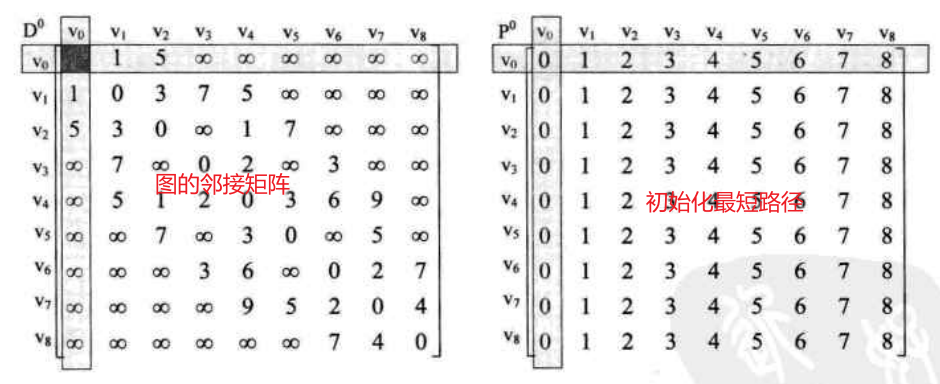
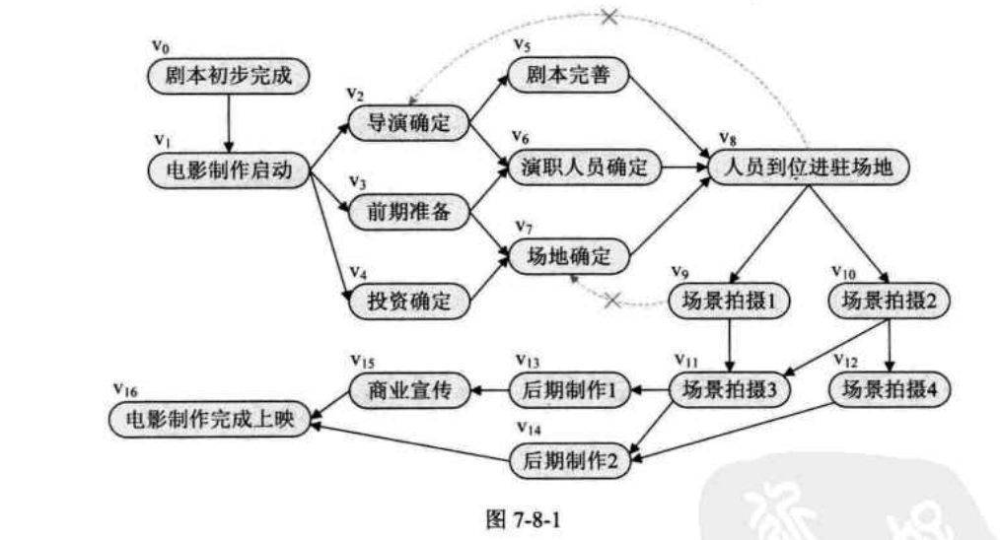

# 绪论

## 基本术语

**数据结构**,是存储数据的编程方式,是一种组织数据以有效使用数据的系统方法
**数据**:是描述客观事物的符号,是计算机中可以操作的对象,是能被计算机识别,并输入给计算机处理的符号集合.比如数值,声音,图片等等
**数据元素**:是组成数据的,有一定意义的基本单位,在计算机中通常作为整体处理,也被称为记录.比如一个人,一头猪
**数据项** - 一个元素可以由若干个数据项组成,是数据不可分割的最小单位
**数据对象**: 是性质相同的数据元素的集合,是数据的子集

## 逻辑结构与物理结构

**逻辑结构**: 数据对象中的数据元素之间的相互关系

1. 集合结构: 元素除同属一个集合之外,没有其他关系
2. 线性结构: 数据元素是一对一的关系
3. 树形结构: 数据元素之间存在一种一对多的关系
4. 图形结构: 数据元素之间存在多对多的关系

**物理结构**: 数据的逻辑结构在计算机内的存储形式

1. 顺序存储结构: 是把数据元素存放在地址连续的存储单元里,其数据间的逻辑关系和物理关系是一致的
2. 链式存储结构: 是把数据元素存放在任意的存储单元里,这组存储单元可以是连续的,也可以是不连续的

## 算法效率表示

算法执行步数: f(n),n 表示循环次数,随着 n 的不断增大,f(n)的大小一般只跟最高次幂的 n 有关,可以省略其他项

时间复杂度: `T(n)=O(f(n)))`

# 线性表

## 数组 Array

数组是一种连续存储线性结构
元素 - 存储在数组中的每个项目称为元素。
索引 - 数组中元素的每个位置都有一个数字索引，用于标识元素。

**优点**

-   查找元素速度快

**缺点**

-   插入删除元素很慢
-   空间通常是有限制的

## 栈 Stack

栈：stack,又称堆栈，栈（stack）是限定仅在表尾进行插入和删除操作的线性表。我们把允许插入和删除的一端称为栈顶，另一端称为栈底，不含任何数据元素的栈称为空栈。栈又称为先进后出的线性表 。

-   先进后出
-   顺序表
-   栈的入口、出口的都是栈的顶端位置。
-   压栈：存元素 push
-   弹栈：取元素 pop


## 队列 Queue

队列：queue,简称队，队列是一种特殊的线性表，是运算受到限制的一种线性表，只允许在表的 一端进行插入，而在另一端进行删除元素的线性表。队尾(rear)是允许插入的一端。队头(front)是允许删除的一端。空队列是不含元素的空表。 简单的说，采用该结构的集合，对元素的存取有如下的特点：

-   先进先出
-   队列的入口、出口各占一侧。


## 链表 Link List

链表 [Linked List]：链表是由一组不必相连（不必相连：可以连续也可以不连续）的内 存结构（节点），按特定的顺序链接在一起的抽象数据类型。

链表是离散存储线性结构 n 个节点离散分配，彼此通过指针相连，每个节点只有一个前驱节点，每个节点只有一 个后续节点，首节点没有前驱节点，尾节点没有后续节点。

```
链表优点： 空间没有限制 插入删除元素很快

链表缺点： 查找元素速度很慢
```


### 单向链表

单链表 [Linked List]：由各个内存结构通过一个 Next 指针链接在一起组成，每一个内存结构都存在后继内存结构(链尾除外），内存结构由数据域和 Next 指针域组成。

```java
//节点
class Node {
  Object data;
  Node next;
}
//单向列表
class List{
	Node element;
	int size;
}
```

Data 数据 + Next 指针，组成一个单链表的内存结构 ； 第一个内存结构称为 链头，最后一个内存结构称为 链尾； 链尾的 Next 指针设置为 NULL [指向空]； 单链表的遍历方向单一（只能从链头一直遍历到链尾）

### 双向链表

双向链表 [Double Linked List]：由各个内存结构通过指针 Next 和指针 Prev 链接在一 起组成，每一个内存结构都存在前驱内存结构和后继内存结构(链头没有前驱，链尾没有后 继），内存结构由数据域、Prev 指针域和 Next 指针域组成。

Data 数据 + Next 指针 + Prev 指针，组成一个双向链表的内存结构； 第一个内存结构称为 链头，最后一个内存结构称为 链尾； 链头的 Prev 指针设置为 NULL， 链尾的 Next 指针设置为 NULL； Prev 指向的内存结构称为 前驱， Next 指向的内存结构称为 后继； 双向链表的遍历是双向的，即如果把从链头的 Next 一直到链尾的[NULL] 遍历方向定 义为正向，那么从链尾的 Prev 一直到链头 [NULL ]遍历方向就是反向；

### 循环链表

单向循环链表 [Circular Linked List] : 由各个内存结构通过一个指针 Next 链接在一起组成，每一个内存结构都存在后继内存结构，内存结构由数据域和 Next 指针域组成。在单链表的基础上，把链尾的 Next 指针直接指向链头，形成一个闭环；

双向循环链表 [Double Circular Linked List] : 由各个内存结构通过指针 Next 和指针 Prev 链接在一起组成，每一个内存结构都存在前驱内存结构和后继内存结构，内存结构由数据域、Prev 指针域和 Next 指针域组成。双向的实现就是在双向链表的基础上，把链尾的 Next 指针指向链头，再把链头的 Prev 指针指向链尾，形成一个闭环；

循环链表没有链头和链尾的说法，因为是闭环的，所以每一个内存结构都可以充当链头 和链尾；

# 树 Tree

## 概念

-   **树(tree)** 是 **n(n>=0)**个结点的**有限**集
-   n=0 为**空树**
-   任意**非空树**都有且只有一个**根结点(root)**,其余结点可分为 m 个不相交的有限集,且结点不相交,则为根结点的 m 个**子树(subTree)**
-   结点拥有的子树数称为**度(degree)**,度为 0 的结点称为**叶结点(leaf)**或**终端结点**,度不为 0 的节点称为**非终端结点**或**分支节点**;除根结点外,分支结点也被称为**内部节点**;树的度为树内结点度的最大值。
-   结点的子树的根称为该结点的**孩子（child）**，相应的，该结点称为孩子的**双亲（parent）**，同一个双亲的孩子之间互称**兄弟（sibling）**，结点的祖宗为从根到该结点所经分支上的所有结点。
-   结点的**层次**从根开始计算，根为第 1 层，根的孩子为第 2 层，...；双亲同层的结点互为堂兄弟；结点的最大层次称为**树的深度（depth）或高度**。
-   **有序树**： 树的孩子结点位置不能互换；反之，称为**无序树**。
-   **森林(forest)**： n （n>=0） 棵互不相交的树的集合

## 常用操作

1. 创建一个空树
2. 销毁
3. 清空为空树
4. 获取树的根节点，深度，度
5. 获取一个节点的左孩子，右孩子，父母，
6. 插入一个结点，结点赋值
7. 删除一个结点

## 存储结构

### 双亲表示法

可以通过孩子快速获取父母及其他祖宗结点，但是获取其孩子需要遍历整个树；

如果需要获取孩子，可以改造结点结构，增加长子等结点位置

```java
class Node<T>{
    T value;// 结点的值
    int parent;// 父母结点的位置
}
class Tree{
    Node[] nodes;//结点数组，结点位置等同于数组下标；基于线性存储
    int r; // 根节点位置
    int len;// 结点数量
}

```


树的数据

| 下标 | 数据 | 父母位置 |
| ---- | ---- | -------- |
| 0    | A    | -1       |
| 1    | B    | 0        |
| 2    | C    | 0        |
| 3    | D    | 1        |
| 4    | E    | 2        |
| 5    | F    | 2        |
| 6    | G    | 3        |
| 7    | H    | 3        |
| 8    | I    | 3        |
| 9    | J    | 4        |

### 孩子表示法

```java
// 方案一： 这种表示法比较浪费空间，因为不是每个结点的度都为树的度
class Node<T>{
    T value;// 结点的值
    Node[] childs; // 长度为树的度
}
// 方案二：空间利用率高了，但是节点结构不一致，不易维护
class Node<T>{
    T value;// 结点的值
    int len; //记录孩子数量
    Node[] childs; // 长度=len
}

// 最终方案：树的孩子表示法，将结点的孩子从左往右组成一条单链
class ChildNode<T>{
    int index; //Tree.nodes 的下标
    ChildNode next; // 下一个孩子的指针
}
// 孩子链结构
class LinkedList<T>{
    T data;// 当前结点数据
    ChildNode<T> first; // 长子指针
}
class Tree{
    LinkedList[] nodes;//头结点数组，结点位置等同于数组下标；基于线性存储
    int r; // 根节点位置
    int len;// 结点数量
}

// 树的孩子表示法缺陷为：无法直接确定孩子的父母，还需要遍历全树
// 树的父母孩子表示法
// 孩子链结构
class LinkedList<T>{
    T data;// 当前结点数据
    ChildNode<T> first; // 长子指针
    int parent;//记录孩子的父母下标
}
```

### 孩子兄弟表示法


```java
class Node<T>{
    int index; //Tree.nodes 的下标
    Node next; // 下一个孩子的指针
}
// 记录长子与右兄弟
class LinkedList<T>{
    T data;// 当前结点数据
    Node<T> first; // 长子指针
    Node<T> right; // 右兄弟指针
}
class Tree{
    LinkedList[] nodes;//头结点数组，结点位置等同于数组下标；基于线性存储
    int r; // 根节点位置
    int len;// 结点数量
}
```

缺陷： 无法快速确定父母，只能遍历；可以结合父母表示法，LinkedList 增加父母位置下标。

特点： 将一棵复杂的树转变为二叉树表示

## 二叉树

1. **二叉树 （binary tree）**，度<=2 的有序树。
2. 五种基本形态： 空树，只有根，只有左子树，只有右子树，具有左右子树
3. 斜树： 所有结点都只有左子树或都只有右子树
4. 满二叉树： 除叶结点外，所有结点的度都等于二叉树的度，且所有叶子节点都在同一层
5. 完全二叉树：从上到下，从左到右，结点依次插入每一层的二叉树；满二叉树是完全二叉树

性质：

1. 在二叉树的第 i 层上至多有$2^{i-1}$个结点，i>=1
2. 深度为 k 的二叉树至多有$2^k-1$个结点
3. 对于任何一棵二叉树 T，如果其终端结点数为$n_0$，度为 2 的结点数为$n_2$，则 $n_0=n_2+1$
4. 具有 n 个结点的完全二叉树的深度为$\lfloor\log_2n\rfloor + 1$,其中$\lfloor x \rfloor$表示不超过 x 的最大整数
5. 如果对一棵有 n 个结点的完全二叉树（其深度为$\lfloor \log_2n \rfloor+1$）的结点按层序编号（从第 1 层到第$\lfloor \log_2n \rfloor+1$层，每层从左到右），对任一结点 i（1<=i<=n）有：
    1. 如果 i=1，则结点 i 是二叉树的根，无双亲；如果 i>1，则其双亲是结点$\lfloor i/2 \rfloor$
    2. 如果 2i>n，则结点 i 无左孩子（结点 i 为叶子结点）；否则，其左孩子为结点 2i。
    3. 如果 2i+1>n，则结点 i 无右孩子；否则，右孩子是结点 2i+1。

### 存储结构

#### 顺序存储

1. 因为二叉树的特殊结构，顺序存储也是可以实现的：
    1. 建立一个数组，长度为同层满二叉树的结点数
    2. 以满二叉树各结点的位置，从上到下，从左到右的顺序为数组的下标
    3. 将二叉树相对应位置的值填入数组，没有就置空。
2. 缺陷： 比如右斜二叉树，是对空间的极大浪费，所以常只在在完全二叉树时使用

#### 链式存储

```java
class Node<T>{
    T data;
    Node<T> leftChild;
    Node<T> rightChild;
    Node<T> parent;//可以在增加一个双亲结点
}
class BinaryTree<T>{
    Node<T> root;
    Node<T> ptr;
}
```

### 二叉树遍历

二叉树的遍历： 从根节点出发，以某种顺序依次访问二叉树的所有结点，使每个结点被访问一次且仅被访问一次。

#### 前序遍历


```java
// 根->左->右
void preOrderTyaverse(Node<T> root){
    if(root == null){
        return;
    }
    System.out.plrintln(root.data);// 打印结点信息
    preOrderTyaverse(root.leftChild); // 遍历左子树
    preOrderTyaverse(root.rightChild);
}
```

#### 中序遍历


```java
// 左->根->右
void inOrderTyaverse(Node<T> root){
    if(root == null){
        return;
    }
    preOrderTyaverse(root.leftChild); // 遍历左子树
    System.out.plrintln(root.data);// 打印结点信息
    preOrderTyaverse(root.rightChild);
}
```

#### 后序遍历


```java
// 左->右->根
void postOrderTyaverse(Node<T> root){
    if(root == null){
        return;
    }
    preOrderTyaverse(root.leftChild); // 遍历左子树
    preOrderTyaverse(root.rightChild);
    System.out.plrintln(root.data);// 打印结点信息
}
```

#### 层序遍历


#### 从遍历结果倒推树结构

1. 前序+中序
2. 中序+后序

### 创建二叉树


1. 扩展二叉树
2. 遍历扩展的二叉树，比如前序遍历：AB#D##C##
3. 根据结果创建

```java
void createPreTree(Node<T> root,String nodes,int i){
    if(nodes.charAt(i) == '#'){
        return;
    }else{
        root = new Node();
        root.data = nodes.charAt(i);
        createPreTree(root.leftChild,nodes,++i);
        createPreTree(root.rightChild,nodes,++i);
    }
}
```

### 线索二叉树，更高的空间利用率


一个二叉树正常存储

右子树为空时，以某种遍历顺序比如中序遍历，右子树指向直接后继

左子树为空时，以某种遍历顺序比如中序遍历，左子树指向直接前驱

我们把这种指向前驱和后继的指针称为线索，加上线索的二叉链表称为线索链表，相应的二叉树称为线索二叉树（Threaded Binary Tree）

对二叉树以某种次序遍历使其变为线索二叉树的过程称作线索化。线索化的过程就是在遍历的过程修改空指针的过程。

怎么知道结点的左子树指向前驱还是指向左孩子？需要增加一个标志位；右子树也一样。

```java
//线索二叉树的结点结构
public class ThreadTreeNode<T> {
    T data;
    ThreadTreeNode leftChild;
    ThreadTreeNode rightChild;
    boolean lTag; //为true时，leftChild指向左孩子；false时指向直接前驱
    boolean rTag;//为true时，rightChild指向右孩子；false时指向直接后继

    ThreadTreeNode pre; //始终指向上一个遍历的结点

    /**
     * 创建中序遍历的线索二叉树
     *
     * @param ptr 当前结点
     */
    void inOrderTyaverse(ThreadTreeNode<T> ptr) {
        if (ptr == null) {
            return;
        }
        inOrderTyaverse(ptr.leftChild); // 遍历左子树
        if (ptr.leftChild == null) {
            ptr.lTag = false;
            ptr.leftChild = pre;
        }
        if (ptr.rightChild == null) {
            ptr.rTag = false;
            pre.rightChild = ptr;
        }
        pre = ptr;
        inOrderTyaverse(ptr.rightChild);
    }
}
```

## 树、森连、二叉树之间的转换

### 树转二叉树


1. 加线。兄弟之间连线
2. 去线。父子间只保留长子连线
3. 调整层次。以根为轴心，旋转一定角度。

### 森林转化为二叉树


1. 每棵树转换为二叉树
2. 第一棵树不动，从第二棵树开始，依次把后一棵树的根节点作为前树根节点的有孩子，用线连接起来

### 二叉树转换为树

1. 加线。某结点的左孩子存在，则将这个左孩子的右孩子结点、右孩子的有孩子结点、右孩子的右孩子的右孩子结点...，作为此节点的孩子
2. 去线。删除原二叉树中所有结点与其右孩子结点的连线。
3. 层次调整。


### 二叉树转换为森林

1. 从根节点开始，右孩子不存在，则只有一棵树；右孩子存在，则删除右孩子连线，分离的二叉树若右孩子还存在，则连线删除······，直到所有右孩子连线都删除为止，得到分离的二叉树
2. 二叉树转换为树


## 赫夫曼树


从树中的一个结点到另一个结点之间的分支构成的两个结点之间的路径，路径上的分支数目称作**路径长度**。**树的路径长度**就是树根到每一结点的路径之和。

考虑带权路径，结点的带权路径的路径长度为从该结点到树根之间的路径长度与结点上权的成绩。树的带权路径 长度为树中所有叶子结点的带权路径长度之和。

假设右 n 个权值{$w_1,w_2,...,w_n$}，构造一棵有 n 个叶子节点的二叉树，每个叶子结点带权$w_i$，每个叶子路径长度为 $k_i$，则树的带权路径$WPL = \sum_{i=1}^n {w_i*k_i}$，带权路径长度 WPL 最小二叉树称作赫夫曼树。

### 创建哈夫曼树

1. 将权值从小到大排列，
2. 选择前两项相加，使用和替代前两项，组成一个三个节点的完全二叉树
3. 重复 1，直到只剩一项

### 哈夫曼编码：数据压缩

场景：双方发送数据 ABCDEF，通过二进制编码 001010011100101110 发送，然后按照这种编码方式解码。

使用哈夫曼编码：

1. 计算各字母的使用频率，极为权值
2. 将权值集合编为哈夫曼树
3. 将哈夫曼树左 0 右 1 编码，得到各叶子结点的编码

解码：

1. 从根结点出发，0 则指向左孩子，1 则指向右孩子（与编码方式相同）
2. 当指针指向叶子结点时，输出叶子结点
3. 指针重新指向根节点，重复 1

# 图

图（Graph）是由顶点的有穷非空集合和顶点之间边的集合组成，通常表示为：G(V,E)，其中，G 表示一个图，V 表示图 G 中顶点的集合，E 是图 G 中边的集合。


**顶点**（Vertex）： 图的数据元素，有穷且非空；

-   **边**：任意两个顶点之间都可能有关系，顶点之间的逻辑关系用边表示，边集可能为空。
-   **无向边 Edge**：顶点$v_i$到$v_j$之间的边没有方向,用无序偶对$(v_i,v_j)$来表示.
-   **无向图**: 图中任意两个顶点之间的边都是无向边
-   **有向边**,也称弧 Arc,用$<v_i,v_j>$表示
-   **简单图**: 不存在到自身顶点的边,且同一条不重复出现;没有必要说明,一般都指简单图
-   **无向完全图**:任意两个顶点之间都有一条边的无向图.含有 n 个顶点的无向完全图有$n*(n-1)/2$条边
-   **有向完全图**:任意两个顶点之间都有互为相反的两条弧的有向图.含有 n 个顶点的有向完全图有$n*(n-1)$条边
-   一条边的两个顶点互为**邻接点**
-   **无向图**,顶点的**度**为与顶点相关联的边的数量,边的总数量为所有顶点的度的和的一半.
-   **有向图,**入度为指向该顶点的弧数,出度为从该顶点出发的弧数,顶点的度为入度与出度之和.出度之和等于入度之和
-   **路径**,一个顶点到另一个顶点所经过的所有边的有序集合;路径的长度为路径上边或弧的数量;
-   **回路或环**:开始顶点与结束顶点为同一个顶点的路径
-   **简单路径**:顶点重复出现的路径;简单回路或简单环:除第一个顶点和最后一个定点外,其余顶点不重复出现的回路.
-   **连通图**: 任意两个顶点之间都存在至少一条路径;连通分量: 无向图的极大联通子图
-   **强连通图**: 有向图中任意两个顶点都可以互相到达;有向图的极大连通子图称为强连通分量
-   连通图的生成树为: 包含图中的所有顶点 n,单只用 n-1 条边,且属于连通图
-   **有向树**: 如果一个有向图恰好有一个顶点的入度为 0,其余顶点的入度均为 1; 一个有向图的生成森林由若干棵有向树组成,含有图中的全部顶点,但只有足以构成若干棵不相交的有向树的弧.
-   每条边上带权的图称为**网**

## 抽象数据类型

```java
/**
 * 顶点类
 */
class Vertex<T> {
    T data;
}

/**
 * 边
 */
class Edge<T> {
    Vertex<T> v1;
    Vertex<T> v2;
}

/**
 * 弧
 */
class Arc<T> {
    Vertex<T> head;//弧头
    Vertex<T> tail;//弧尾
}

/**
 * 图
 */
public class Graph<T> {
    private List<Vertex<T>> v; // 顶点集合
    private List<Edge<T>> e; // 边集
    private List<Arc<T>> a; // 有向图的弧
}
```

## 存储结构

### 邻接矩阵

```java
public class Graph<T> {
    T[] v; // 顶点数组
    T[][] e; // 邻接矩阵,对应的值表示是否连通
}
```


### 邻接表

考虑到邻接矩阵在顶点多,边少的情况下存在的空间浪费问题.


```java
// 顶点
class Vertex<T,K> {
    T data;
    K weight; // 权值,如果有的化
    NextVertex next;//邻接顶点
}
// 顶点的所有邻接点组成的链表
class NextVertex {
    int index; // 索引
    NextVertex next;//下一个
}
public class Graph<T> {
    Vertex<T>[] v;
}
```

### 十字链表(有向图)


```java
// 顶点
class Vertex<T,K> {
    T data;
    Arc firstin;//指向顶点的下一个弧
    Arc firstout;//由顶点出发的下一个弧
}
// 顶点的所有邻接点组成的链表
class Arc {
    int tailIndex; // 弧尾索引
    int headIndex; // 弧头索引
    Arc firstin;//指向顶点的下一个弧
    Arc firstout;//由顶点出发的下一个弧
}
public class Graph<T> {
    Vertex<T>[] v;
}
```


### 邻接多重表(无向图)

问题: 无向图的邻接表比较难以操作边,比如删除边

```java
// 顶点
class Vertex<T,K> {
    T data;
    NextVertex next;//邻接顶点
}
// 顶点index1 与 index2 组成的边
class NextVertex {
    int index1; // 边顶点索引
    NextVertex next1;// index1 下一个邻边
    int index2; // 边顶点索引
    NextVertex next2;// index2 下一个邻边
}
public class Graph<T> {
    Vertex<T>[] v;
}
```


### 边集数组


## 遍历


### 深度优先遍历 DFS（递归）


1. 选择一个方向 A->B->C->D->E->F->A
2. A 重复,返回 F,F->G->B
3. B 重复,返回 G,G->D,D 也重复,选择 G->H
4. H->D,H->E 都重复,返回 G,
5. 开始递归,知道返回起点

```java
public class Graph<T> {
    T[] v; // 顶点数组
    int[][] e; // 邻接矩阵,对应的值表示是否连通

    static Graph getInstance() {
        Graph<String> g = new Graph<String>();
        g.v = new String[]{"A", "B", "C", "D", "E", "F", "G", "H", "I"};
        g.e = new int[][]{
                {0, 1, 0, 0, 0, 1, 0, 0, 0},
                {1, 0, 1, 0, 0, 0, 1, 0, 1},
                {0, 1, 0, 1, 0, 0, 0, 0, 1},
                {0, 0, 1, 0, 1, 0, 1, 1, 1},
                {0, 0, 0, 1, 0, 1, 0, 1, 0},
                {1, 0, 0, 0, 1, 0, 1, 0, 0},
                {0, 1, 0, 1, 0, 1, 0, 1, 0},
                {0, 0, 0, 0, 1, 0, 1, 0, 0},
                {0, 1, 0, 1, 0, 0, 0, 0, 0}
        };
        return g;
    }

    void DFS() {
        boolean[] flags = new boolean[v.length]; // 顶点是否已经遍历
        DFS1(this, flags, 0);
    }

    void DFS1(Graph g, boolean[] flags, int index) {
        System.out.println(g.v[index]);
        flags[index] = true;
        for (int i = 0; i < flags.length; i++) {
            if (e[index][i] == 1 && flags[i] == false) {
                // 查找未遍历过的邻接顶点
                DFS1(g, flags, i);
            }
        }
    }

    public static void main(String[] args) {
        Graph instance = getInstance();
        instance.DFS();
    }
}

```

### 广度优先遍历 BFS (结合队列)

```java
void BFS() {
    ArrayDeque<Integer> deque = new ArrayDeque<>(v.length);
    boolean[] flags = new boolean[v.length]; // 顶点是否已经遍历
    System.out.println(v[0]);
    deque.offer(0);
    flags[0] = true;
    while (deque.peek() != null) {
        int index = deque.remove();
        for (int i = 0; i < v.length; i++) {
            if (e[index][i] == 1 && flags[i] == false) {
                System.out.println(v[i]);
                flags[i] = true;
                deque.offer(i);
            }
        }
    }
}
```

## 最小生成树

最小生成树： 带权的图，n个顶点，用n-1条边把一个连通图连接起来，并且权值的和最小

### 普利姆（Prim）算法

邻接矩阵表示法,常适用于边比较稠密的连通图.

普利姆（Prim）算法是以某顶点为起点,逐步找各顶点上最小权值的边来构建最小生成树的.

1. 选定一个顶点 A
2. 选择距离 A 最近的顶点 B
3. 选择距离 A,B 最近的顶点 C
4. 选择距离 A,B,C 最近的顶点 D
5. ······ 直到选择全部顶点


### 克鲁斯卡尔(Kruskal)算法

使用边集表示法表示图,适用于边比较少的连通图.

将边集按权值从小到大排序,依次选择最小的边,如果边的的顶点位于不同的连通子量上,则选定,否则舍去,选择下一个最小边

## 最短路径

由于非网图边上没有权值,所谓的最短路径其实就是指两顶点之间经过的边数最少的路径;对于网图,最短路径,是指两顶点之间经过的边上权值之和最少的路径,并且我们称路径上的第一个顶点为源点,最后一个顶点是终点.

### 迪杰斯拉特(Dijkstra)算法

这是一个按路径长度递增的次序产生最短路径的算法.

1. 背景: 9顶点的带权值的有向或无相图G,开始源点V0,到达源点V8
2. 记录各顶点到源点V0的路径长度: `dis[8]`
3. 记录源点到终点的路径: `T[8]`,`T[0]=V0`
4. 从源点V0开始,dis数组记录与V0邻接的顶点到V0的路径,不邻接的顶点记为∞,与自身记为0,选择非0路径下最近顶点为下一个顶点V1,并把`T[1]=V1`
5. 从源点V1开始,dis数组记录与V1邻接的顶点(除去之前已经记录的顶点,即除去V0)到V0的路径,不邻接的顶点记为∞,并于已有值比较大小,记录较小的值,选择非0路径下除去之前已经记录顶点的最短路径顶点V3,`T[2]=V3`
6. 重复4,5,得到源点到其他顶点的最短路径数组dis,以及V0->V8的最短路径

V0->V8时间复杂度 $O(n^2)$ ,如果求任意两个顶点之间的最短路径,则再增加一层循环, $O(n^3)$


### 弗罗伊德(Floyd)算法

所有顶点到所有顶点的时间复杂度也是 $O(n^3)$ ,但是更加简洁优雅.
1. 初始化邻接矩阵`D-1[9][9]`,初始化最短路径`P-1[9][9]`

2. 

3.得到结果


三次循环,循环左对角线,循环x轴,循环y轴

## 拓扑排序

在一个表示工程的有向图中,用顶点表示活动,用弧表示活动之间的优先关系,这样的有向图为顶点表示活动的网,我们称为**AOV网**(Activity On Vertex Network).



设G=(V,E)是一个具有n个顶点的有向图,V中的顶点序列v1,v2,......,vn,满足若从顶点vi到vj有一条路径,则在顶点序列中顶点vi必须在顶点vj之前.则我们称这样的顶点序列为一个**拓扑序列**.

拓扑序列条件:

1. 有向图
2. 无环
3. 有顺序,vi能到达vj,则在序列中vi必须在vj之前
4. 包含图中的所有顶点

拓扑排序,其实就是对一个有向图构造拓扑序列的过程.如果顶点全部被输出,则说明这张图是AOV网.AOV网在工程中有很多应用,因此研究拓扑排序很有意义.

对AOV网进行拓扑排序的基本思路是: 

1. 查找AOV网中所有入度为0的顶点,
2. 0入度顶点入栈,
3. 栈顶元素出栈,输出该顶点,然后删除在图中删除该顶点和以此顶点为尾的的弧
4. 重复1,2,3,直到输出所有元素

确定图的数据结构,前面求最小生成树和最短路径时，我们用得都是邻接矩阵，但是由于拓扑排序过程中，需要删除顶点，显然用邻接表更为方便。

考虑到算法过程中始终要查找入度为0的顶点,我们在原有顶点表结点结构中,增加一个入度域in,in就是入度的数字


## 关键路径