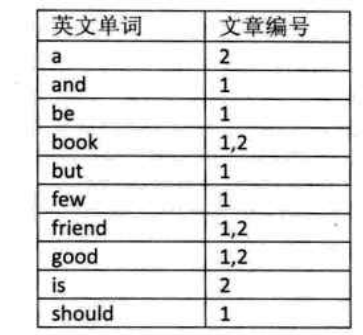
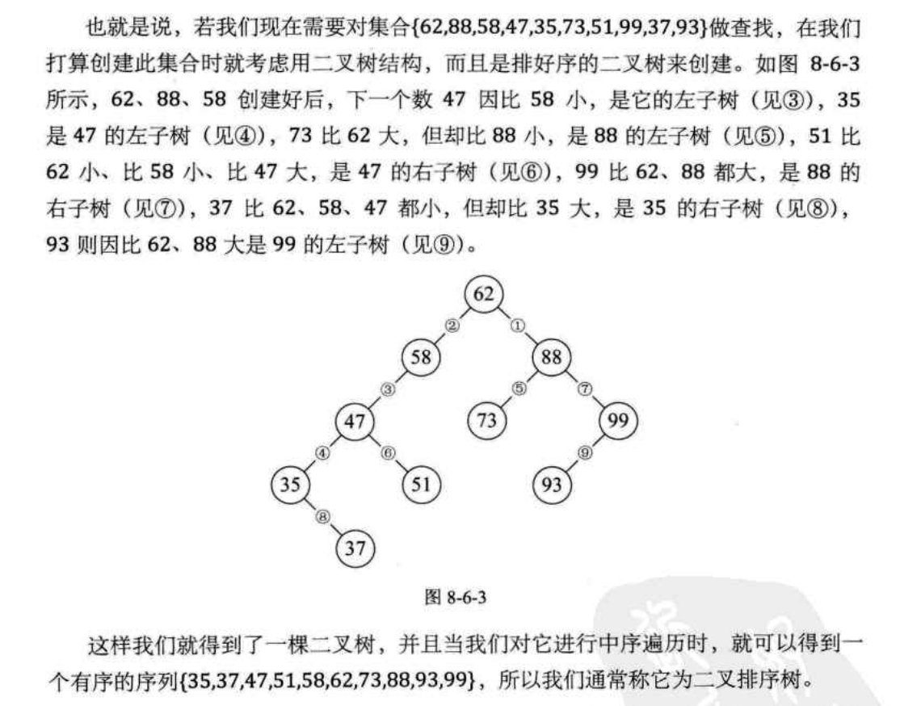
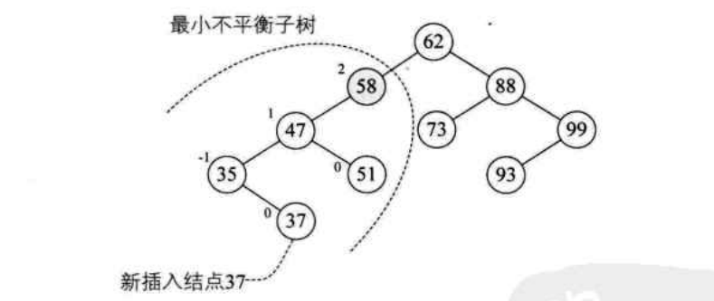
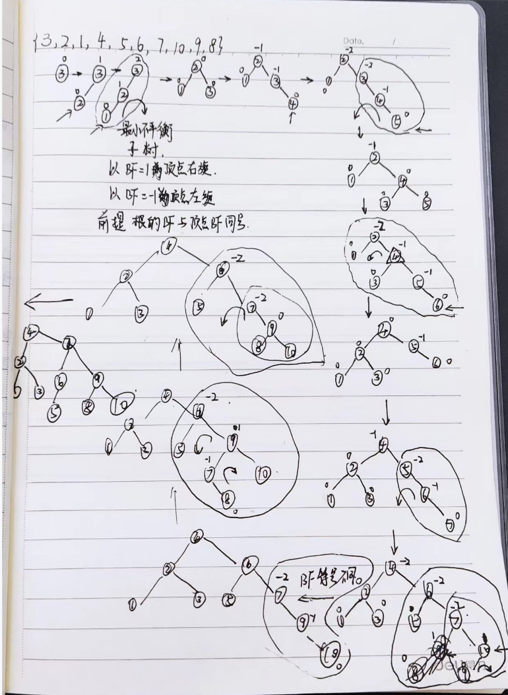
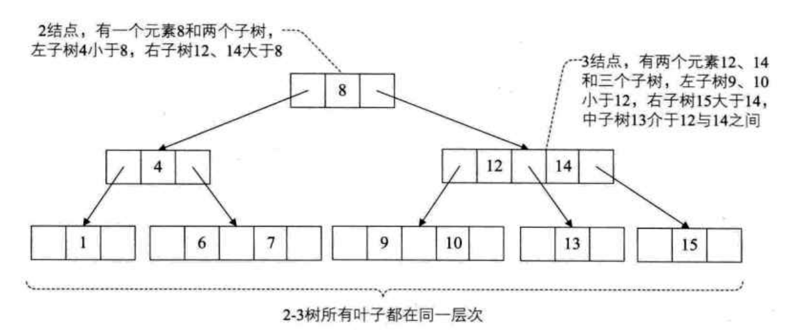
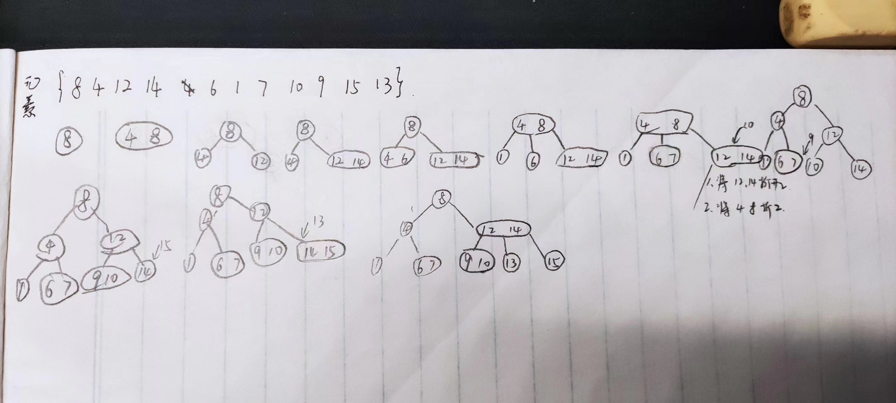

# 线性表一般遍历查找

时间复杂度:O(n)

```java
    /**
     * 一般遍历查找
     * @param origin
     * @param target
     * @return
     */
    public static int orderFind(int[] origin, int target) {
        for (int i = 0; i < origin.length; i++) {
            if (origin[i] == target) {
                return i;
            }
        }
        return -1;
    }
```

# 有序数组查找

## 二分查找

时间复杂度: $O(log_2n)$

也可以改造为非递归

二分查找也称折半查找（Binary Search），它是一种效率较高的查找方法。但是，二分查找要求数组数据必须采用顺序存储结构有序排列。

1. 适用前提：数组有序
2. 首先，假设数组中元素是按升序排列，将数组中间位置的数据与查找数据比较，如果两者相等，则查找成功；否则利用中间位置记录将数组分成前、后两个子数组，如果中间位置数据大于查找数据，则进一步查找前子数组，否则进一步查找后子数组。
3. 重复以上过程，直到找到满足条件的数据，则表示查找成功，直到子数组不存在为止，表示查找不成功

```java
    /**
     * 二分查找
     *
     * @param origin
     * @param target
     * @param start
     * @param end
     * @return
     */
    public static int binarySearch(int[] origin, int target, int start, int end) {
        if (start >= end) {
            return -1;
        }
        int middle = (end + start) / 2;
        if (target == origin[middle]) {
            return middle;
        } else if (target < middle) {
            return binarySearch(origin, target, start, middle - 1);
        } else {
            return binarySearch(origin, target, middle + 1, end);
        }
    }
    public static void main(String[] args) {
        int[] origin = {1, 2, 3, 4, 5, 6, 7, 8, 9};
        int i = binarySearch(origin, 0, 0, origin.length - 1);
        System.out.println(i);
    }
```

## 插值查找

时间复杂度: $O(log_2n)$,但是在表比较长,且元素比较均匀的情况下平均效率比折半法高

```java
    /**
     * 插值查找,
     * 二分法的改进,将1/2改为(target-start)/(end-start)
     * 适用于表比较长,且元素比较均匀的情况,反之,极不均匀不推荐使用
     *
     * @param origin
     * @param target
     * @param start
     * @param end
     * @return
     */
    public static int interpolationSearch(int[] origin, int target, int start, int end) {
        if (start >= end) {
            return -1;
        }
        int middle = (end + start) / 2;
        if (target == origin[middle]) {
            return middle;
        } else if (target < middle) {
            return interpolationSearch(origin, target, start, middle - 1);
        } else {
            return interpolationSearch(origin, target, middle + 1, end);
        }
    }
```

## 斐波那契查找

```java
    /**
     * 获取最大值大于max的斐波那契数列
     *
     * @param max
     * @return
     */
    public static ArrayList<Integer> getFibonacciInstance(int max) {
        if (max < 0) {
            return null;
        }
        ArrayList<Integer> fibonacci = new ArrayList<>();
        fibonacci.add(0);
        fibonacci.add(1);
        int i = 2;
        int first = 1, next = 1;
        while (fibonacci.get(i - 1) < max) {
            fibonacci.add(first + next);
            first = fibonacci.get(i - 1);
            next = fibonacci.get(i);
            i++;
        }
        return fibonacci;
    }

    /**
     * 斐波那契查找,根据斐波那契数列的性质,front2+front1=next,
     * 数组origin的长度为n,
     * 如果n属于斐波那契数列,则front2+front1=n,将数组二分为front1和front2的数组,
     * start = 0,end = n-1;
     * middle = start + front1-1;
     * 如果target == middle,return middle
     * 如果target < middle,end = middle; [start,middle]
     * 如果target > middle,start = middle-1;[middle-1,end]
     * 如果n不属于斐波那契数列,则取大于n的最小斐波那契数列值F[k],并用origin[n-1]扩充数组,使origin.length=F[k]
     *
     * @param origin
     * @param target
     * @return
     */
    public static int fibonacciSearch(int[] origin, int target) {
        ArrayList<Integer> fibonacci = getFibonacciInstance(origin.length);
        int start = 0, end = origin.length - 1;
        int k = fibonacci.size() - 1;
        int[] originCopy = origin;
        if (fibonacci.get(k) > origin.length) {
            originCopy = new int[fibonacci.get(k)];
            for (int i = 0; i < origin.length; i++) {
                originCopy[i] = origin[i];
            }
            for (int i = end + 1; i < fibonacci.get(k); i++) {
                originCopy[i] = origin[end];
            }
        }
        while (start < end) {
            int middle = start + fibonacci.get(k - 1) - 1;
            if (target == originCopy[middle]) {
                return middle;
            } else if (target < originCopy[middle]) {
                end = middle;
                k--;
            } else {
                start = middle + 1;
                k = k - 2;
            }

        }
        return -1;
    }
```

# 线索索引查找

目的: 查找结构复杂且数量巨大的数据时提高效率与减少内存使用.

1. 稠密索引,从数据中筛选唯一标识作为索引,创建索引表与数据条目一一对应,索引表中的索引项一一指向数据记录地址,然后再索引表中排序\二分等方法查找记录
2. 分块索引,把数据集中的记录分成若干块,并且这些块需要要满足两个条件: 1. 块内无序 2. 块间有序;分块索引表一般具有属性:最大关键字,数据记录个数,快首数据指针;平均效率$O(\sqrt{n}+1)$
3. 倒排索引,以下图为例,这张单词表就是索引表,索引项的通用结构是:1.次关键码,例如"英文单词" 2.记录号表,例如"文章编号";其中记录号表存储具有相同次关键字的所有记录的记录号(可以是指向记录的指针或者是该记录的主关键字),这样的索引方法就是倒排索引.



# 二叉查找树

二叉排序树(Binary sort tree),又称为二叉查找树.它或者是一棵空树,或者是具有下列性质的二叉树:

1. 若它的左子树不空,则左子树上所有结点的值均小于它的根结构的值
2. 若它的右子树不空,则右子树上所有结点的值均大于它的根结点的值
3. 它的左右子树也分别为二叉排序树



二叉排序树的中序遍历即为将结点数据排序.

二叉排序的构建或插入:

1. 先构建根节点 root
2. 插入 x,
    1. `x>root`,则 x 为 root 的右孩子
    2. `x<root`,则 x 为 root 的左孩子
3. ....
4. 插入 y,
    1. 比较根节点,
        1. 比 root 大,选择右子树
        2. 比 root 小,选择左子树
    2. 在子树中,重复 1
    3. 直到子树无叶子结点,插入 y

查找操作:

1. 查找根节点
2. 查找根结点的孩子结点
3. 查找孩子的孩子

删除操作:

1. 查找结点
2. 判断结点:
    1. 结点为叶子结点,直接删除:
    2. 结点有单个左子树或右子树,删除结点,并用其孩子结点顶替
    3. 结点既有左子树,又有右子树,则删除结点,使用结点中序遍历的前驱结点或后继结点替换

我们希望二叉排序树是平衡的,深度与完全二叉树相同,均为$log_2n+1$,那么查找的事件复杂度也就为$O(log_2n)$,近似于折半查找;

最坏的情况,二叉排序树为斜树,$O(n)$,与顺序查找效率相同

## 平衡二叉树

平衡二叉树是一种二叉排序树,其中每一个结点的左子树和右子树的高度差至多等于 1.

我们将二叉树上结点的左子树深度减去右子树深度的值称为平衡因子 BF(Balance Factor),则平衡二叉树的 BF 值只能为 1,0,-1.

距离插入结点最近的,且 BF 的绝对值大于 1 的结点为根的子树,我们称为最小不平衡子树.


平衡二叉树的实现原理与步骤:

1. 根 root bf=2,左 left bf=1,root 右旋: left 作为根,root 作为右结点,left 的原右子树作为 root 的左子树
2. 根 root bf=-2,右 right bf=-1,root 左旋:right 为根,root 为 right 的左结点,right 的原左子树为 root 的右子树
3. 根 root bf=-2,右 right=1,先让 right 右旋,再 root 左旋
4. 根 root bf=2,左 left=-1,先让 left 左旋,再让 root 右旋



## 多路查找树-B树

多路查找树,其每个结点的孩子数可以多于2个,且每个结点处可以存储多个元素.
### 2-3 树
1. 多路查找树
2. 每个结点具有2个孩子(称为2结点)或3个孩子(称为3结点)
3. 2结点包含2个孩子与1个元素
4. 3结点包含3个孩子与2个元素
5. 2-3树的所有叶子再同一层次



元素添加与构建


## 红黑树

红黑树本身就是一颗二叉查找树，将节点插入后，该树仍然是一颗二叉查找树。也就意味着，树的键值仍然是有序的。

红黑树的约束:

1. 节点可以是红色的或者黑色的
2. 根节点是黑色的
3. 叶子节点(特指空节点)是黑色的
4. 每个红色节点的子节点都是黑色的
5. 任何一个节点到其每一个叶子节点的所有路径上黑色节点数相同 红黑树的特点: 速度特别快,趋近平衡树,查找叶子元素最少和最多次数不多于二倍
